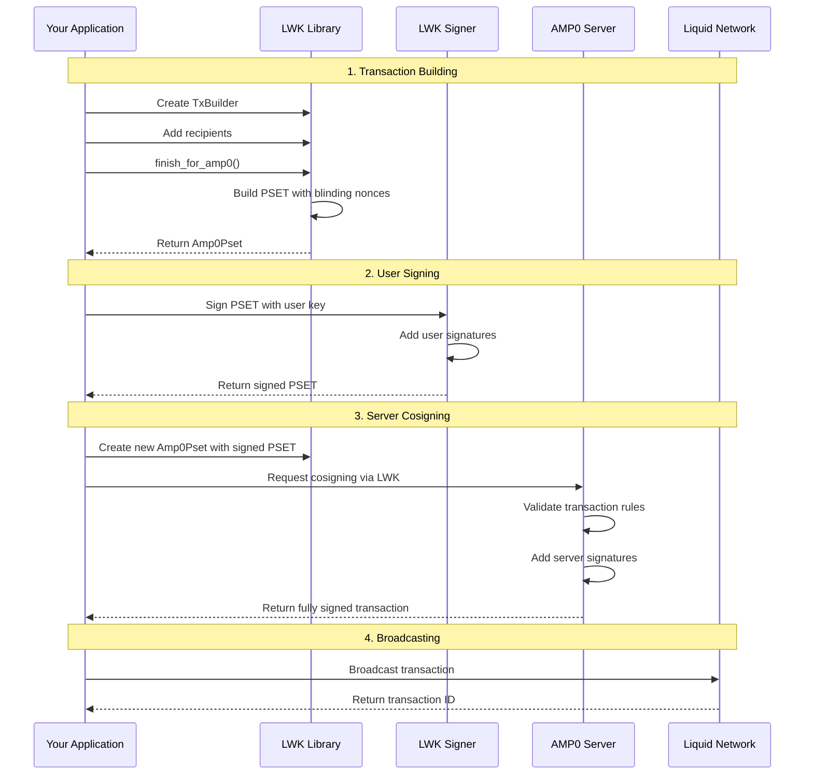

import Tabs from '@theme/Tabs';
import TabItem from '@theme/TabItem';

# Sending AMP Assets

Sending AMP0 assets requires a specialized transaction flow that involves building PSETs with blinding nonces, user signing, server cosigning, and broadcasting. This guide covers the complete process with examples across all supported languages.

## AMP0 Transaction Flow Overview

The AMP0 transaction flow differs from standard LWK transactions due to the 2-of-2 multisig requirement and server-side validation:



## Building AMP0 Transactions

### 1. Create Transaction Builder

Start by creating a transaction builder and adding recipients:

<Tabs groupId="language">
<TabItem value="rust" label="Rust" default>

```rust
use lwk_wollet::{Wollet, TxBuilder};
use lwk_wollet::amp0::{blocking::Amp0, Amp0Pset};
use lwk_signer::SwSigner;
use elements::Address;

// Create AMP0 context and wallet (from previous examples)
let amp0 = Amp0::new(Network::TestnetLiquid, "username", "password", "amp_id")?;
let descriptor = amp0.wollet_descriptor();
let mut wollet = Wollet::without_persist(ElementsNetwork::LiquidTestnet, descriptor)?;

// Sync wallet first
let last_index = amp0.last_index();
let update = client.full_scan_to_index(&wollet, last_index)?;
if let Some(update) = update {
    wollet.apply_update(update)?;
}

// Create transaction builder
let tx_builder = wollet.tx_builder();

// Add L-BTC recipient
let recipient_address = Address::from_str("lq1qq...")?;
let amount_satoshis = 100_000u64; // 0.001 L-BTC

let tx_builder = tx_builder
    .add_lbtc_recipient(&recipient_address, amount_satoshis)?;

// Build AMP0 PSET (with blinding nonces)
let amp0pset = tx_builder.finish_for_amp0()?;

println!("PSET created with {} blinding nonces", amp0pset.blinding_nonces().len());
```

</TabItem>
<TabItem value="python" label="Python">

```python
from lwk import Amp0, Wollet, TxBuilder, Amp0Pset, Signer, Address, Network

# Create AMP0 context and wallet (from previous examples)
amp0 = Amp0(Network.testnet(), "username", "password", "amp_id")
descriptor = amp0.wollet_descriptor()
wollet = Wollet(Network.testnet(), descriptor, None)

# Sync wallet first
last_index = amp0.last_index()
update = client.full_scan_to_index(wollet, last_index)
wollet.apply_update(update)

# Create transaction builder
tx_builder = wollet.tx_builder()

# Add L-BTC recipient
recipient_address = Address("lq1qq...")
amount_satoshis = 100_000  # 0.001 L-BTC

tx_builder = tx_builder.add_lbtc_recipient(recipient_address, amount_satoshis)

# Build AMP0 PSET (with blinding nonces)
amp0pset = tx_builder.finish_for_amp0()

print(f"PSET created with {len(amp0pset.blinding_nonces())} blinding nonces")
```

</TabItem>
<TabItem value="kotlin" label="Kotlin">

```kotlin
import com.blockstream.lwk.*

// Create AMP0 context and wallet (from previous examples)
val amp0 = Amp0(Network.testnet(), "username", "password", "ampId")
val descriptor = amp0.wolletDescriptor()
val wollet = Wollet(Network.testnet(), descriptor, null)

// Sync wallet first
val lastIndex = amp0.lastIndex()
val update = client.fullScanToIndex(wollet, lastIndex)
wollet.applyUpdate(update)

// Create transaction builder
val txBuilder = wollet.txBuilder()

// Add L-BTC recipient
val recipientAddress = Address("lq1qq...")
val amountSatoshis = 100_000uL // 0.001 L-BTC

txBuilder.addLbtcRecipient(recipientAddress, amountSatoshis)

// Build AMP0 PSET (with blinding nonces)
val amp0pset = txBuilder.finishForAmp0()

println("PSET created with ${amp0pset.blindingNonces().size} blinding nonces")
```

</TabItem>
<TabItem value="swift" label="Swift">

```swift
import LiquidWalletKit

// Create AMP0 context and wallet (from previous examples)
let amp0 = try Amp0(network: .testnet, username: "username", password: "password", ampId: "ampId")
let descriptor = try amp0.wolletDescriptor()
let wollet = try Wollet(network: .testnet, descriptor: descriptor, persister: nil)

// Sync wallet first
let lastIndex = try amp0.lastIndex()
let update = try client.fullScanToIndex(wollet: wollet, lastIndex: lastIndex)
try wollet.applyUpdate(update: update)

// Create transaction builder
let txBuilder = try wollet.txBuilder()

// Add L-BTC recipient
let recipientAddress = try Address("lq1qq...")
let amountSatoshis: UInt64 = 100_000 // 0.001 L-BTC

try txBuilder.addLbtcRecipient(address: recipientAddress, satoshi: amountSatoshis)

// Build AMP0 PSET (with blinding nonces)
let amp0pset = try txBuilder.finishForAmp0()

print("PSET created with \(amp0pset.blindingNonces().count) blinding nonces")
```

</TabItem>
<TabItem value="wasm" label="WASM">

```javascript
import { Amp0, TxBuilder, Amp0Pset, Address, Network } from 'lwk-wasm';

// Create AMP0 context and wallet (from previous examples)
const amp0 = await Amp0.newTestnet("username", "password", "ampId");
const wollet = amp0.wollet();

// Sync wallet first
const lastIndex = amp0.lastIndex();
const update = await client.fullScanToIndex(wollet, lastIndex);
if (update) {
    wollet.applyUpdate(update);
}

// Create transaction builder
const txBuilder = new TxBuilder(Network.testnet());

// Add L-BTC recipient
const recipientAddress = new Address("lq1qq...");
const amountSatoshis = 100_000; // 0.001 L-BTC

txBuilder.addLbtcRecipient(recipientAddress, amountSatoshis);

// Build AMP0 PSET (with blinding nonces)
const amp0pset = txBuilder.finishForAmp0(wollet);

console.log(`PSET created with ${amp0pset.blindingNonces().length} blinding nonces`);
```

</TabItem>
</Tabs>

### 2. Advanced Transaction Options

You can also use more advanced transaction building options:

<Tabs groupId="language">
<TabItem value="rust" label="Rust" default>

```rust
// Drain wallet (send all L-BTC to an address)
let drain_address = Address::from_str("lq1qq...")?;
let amp0pset = wollet.tx_builder()
    .drain_lbtc_to(&drain_address)
    .finish_for_amp0()?;

// Or drain to wallet itself (consolidation)
let amp0pset = wollet.tx_builder()
    .drain_lbtc_wallet()
    .finish_for_amp0()?;

// Send multiple assets
let asset_id = AssetId::from_str("6f0279e9...")?;
let amp0pset = wollet.tx_builder()
    .add_lbtc_recipient(&address1, 50_000)?
    .add_recipient(&address2, 1000, asset_id)?
    .fee_rate(Some(100)) // 100 sat/vbyte
    .finish_for_amp0()?;
```

</TabItem>
<TabItem value="python" label="Python">

```python
# Drain wallet (send all L-BTC to an address)
drain_address = Address("lq1qq...")
amp0pset = wollet.tx_builder().drain_lbtc_to(drain_address).finish_for_amp0()

# Or drain to wallet itself (consolidation)
amp0pset = wollet.tx_builder().drain_lbtc_wallet().finish_for_amp0()

# Send multiple assets
asset_id = AssetId("6f0279e9...")
amp0pset = (wollet.tx_builder()
    .add_lbtc_recipient(address1, 50_000)
    .add_recipient(address2, 1000, asset_id)
    .fee_rate(100)  # 100 sat/vbyte
    .finish_for_amp0())
```

</TabItem>
<TabItem value="kotlin" label="Kotlin">

```kotlin
// Drain wallet (send all L-BTC to an address)
val drainAddress = Address("lq1qq...")
val amp0pset = wollet.txBuilder().drainLbtcTo(drainAddress).finishForAmp0()

// Or drain to wallet itself (consolidation)
val amp0pset = wollet.txBuilder().drainLbtcWallet().finishForAmp0()

// Send multiple assets
val assetId = AssetId("6f0279e9...")
val amp0pset = wollet.txBuilder()
    .addLbtcRecipient(address1, 50_000uL)
    .addRecipient(address2, 1000uL, assetId)
    .feeRate(100uL) // 100 sat/vbyte
    .finishForAmp0()
```

</TabItem>
<TabItem value="swift" label="Swift">

```swift
// Drain wallet (send all L-BTC to an address)
let drainAddress = try Address("lq1qq...")
let amp0pset = try wollet.txBuilder().drainLbtcTo(address: drainAddress).finishForAmp0()

// Or drain to wallet itself (consolidation)
let amp0pset = try wollet.txBuilder().drainLbtcWallet().finishForAmp0()

// Send multiple assets
let assetId = try AssetId("6f0279e9...")
let amp0pset = try wollet.txBuilder()
    .addLbtcRecipient(address: address1, satoshi: 50_000)
    .addRecipient(address: address2, satoshi: 1000, assetId: assetId)
    .feeRate(rate: 100) // 100 sat/vbyte
    .finishForAmp0()
```

</TabItem>
<TabItem value="wasm" label="WASM">

```javascript
// Drain wallet (send all L-BTC to an address)
const drainAddress = new Address("lq1qq...");
const amp0pset = txBuilder.drainLbtcTo(drainAddress).finishForAmp0(wollet);

// Or drain to wallet itself (consolidation)
const amp0pset = txBuilder.drainLbtcWallet().finishForAmp0(wollet);

// Send multiple assets
const assetId = new AssetId("6f0279e9...");
const amp0pset = txBuilder
    .addLbtcRecipient(address1, 50_000)
    .addRecipient(address2, 1000, assetId)
    .feeRate(100) // 100 sat/vbyte
    .finishForAmp0(wollet);
```

</TabItem>
</Tabs>

## Signing Process

### 3. User Signing

Sign the PSET with your private key (hardware wallet or software signer):

<Tabs groupId="language">
<TabItem value="rust" label="Rust" default>

```rust
use lwk_signer::SwSigner;
use lwk_common::Signer;

// Extract PSET from Amp0Pset
let mut pset = amp0pset.pset().clone();
let blinding_nonces = amp0pset.blinding_nonces().to_vec();

// Create signer (software signer example)
let mnemonic = "your twelve word mnemonic phrase here...".parse()?;
let signer = SwSigner::new(mnemonic, false)?;

// Sign the PSET
let signature_count = signer.sign(&mut pset)?;
println!("Added {} signatures", signature_count);

// Reconstruct Amp0Pset with signed PSET
let signed_amp0pset = Amp0Pset::new(pset, blinding_nonces)?;
```

</TabItem>
<TabItem value="python" label="Python">

```python
from lwk import Signer, Mnemonic, Amp0Pset

# Extract PSET from Amp0Pset
pset = amp0pset.pset()
blinding_nonces = amp0pset.blinding_nonces()

# Create signer (software signer example)
mnemonic = Mnemonic("your twelve word mnemonic phrase here...")
signer = Signer(mnemonic, Network.testnet())

# Sign the PSET
pset = signer.sign(pset)
print("PSET signed successfully")

# Reconstruct Amp0Pset with signed PSET
signed_amp0pset = Amp0Pset(pset, blinding_nonces)
```

</TabItem>
<TabItem value="kotlin" label="Kotlin">

```kotlin
import com.blockstream.lwk.*

// Extract PSET from Amp0Pset
val pset = amp0pset.pset()
val blindingNonces = amp0pset.blindingNonces()

// Create signer (software signer example)
val mnemonic = Mnemonic("your twelve word mnemonic phrase here...")
val signer = Signer(mnemonic, Network.testnet())

// Sign the PSET
val signedPset = signer.sign(pset)
println("PSET signed successfully")

// Reconstruct Amp0Pset with signed PSET
val signedAmp0pset = Amp0Pset(signedPset, blindingNonces)
```

</TabItem>
<TabItem value="swift" label="Swift">

```swift
import LiquidWalletKit

// Extract PSET from Amp0Pset
let pset = try amp0pset.pset()
let blindingNonces = try amp0pset.blindingNonces()

// Create signer (software signer example)
let mnemonic = try Mnemonic("your twelve word mnemonic phrase here...")
let signer = try Signer(mnemonic: mnemonic, network: .testnet)

// Sign the PSET
let signedPset = try signer.sign(pset: pset)
print("PSET signed successfully")

// Reconstruct Amp0Pset with signed PSET
let signedAmp0pset = try Amp0Pset(pset: signedPset, blindingNonces: blindingNonces)
```

</TabItem>
<TabItem value="wasm" label="WASM">

```javascript
import { Signer, Mnemonic, Amp0Pset, Network } from 'lwk-wasm';

// Extract PSET from Amp0Pset
const pset = amp0pset.pset();
const blindingNonces = amp0pset.blindingNonces();

// Create signer (software signer example)
const mnemonic = new Mnemonic("your twelve word mnemonic phrase here...");
const signer = new Signer(mnemonic, Network.testnet());

// Sign the PSET
const signedPset = signer.sign(pset);
console.log("PSET signed successfully");

// Reconstruct Amp0Pset with signed PSET
const signedAmp0pset = new Amp0Pset(signedPset, blindingNonces);
```

</TabItem>
</Tabs>

## Server Cosigning

### 4. AMP0 Server Cosigning

Request the AMP0 server to cosign the transaction:

<Tabs groupId="language">
<TabItem value="rust" label="Rust" default>

```rust
// Request AMP0 server to cosign
let finalized_tx = amp0.sign(&signed_amp0pset)?;

println!("Transaction cosigned by AMP0 server");
println!("Transaction ID: {}", finalized_tx.txid());
println!("Transaction size: {} bytes", finalized_tx.weight() / 4);

// The transaction is now fully signed and ready to broadcast
```

</TabItem>
<TabItem value="python" label="Python">

```python
# Request AMP0 server to cosign
finalized_tx = amp0.sign(signed_amp0pset)

print("Transaction cosigned by AMP0 server")
print(f"Transaction ID: {finalized_tx.txid()}")
print(f"Transaction weight: {finalized_tx.weight()}")

# The transaction is now fully signed and ready to broadcast
```

</TabItem>
<TabItem value="kotlin" label="Kotlin">

```kotlin
// Request AMP0 server to cosign
val finalizedTx = amp0.sign(signedAmp0pset)

println("Transaction cosigned by AMP0 server")
println("Transaction ID: ${finalizedTx.txid()}")
println("Transaction weight: ${finalizedTx.weight()}")

// The transaction is now fully signed and ready to broadcast
```

</TabItem>
<TabItem value="swift" label="Swift">

```swift
// Request AMP0 server to cosign
let finalizedTx = try amp0.sign(amp0pset: signedAmp0pset)

print("Transaction cosigned by AMP0 server")
print("Transaction ID: \(finalizedTx.txid())")
print("Transaction weight: \(finalizedTx.weight())")

// The transaction is now fully signed and ready to broadcast
```

</TabItem>
<TabItem value="wasm" label="WASM">

```javascript
// Request AMP0 server to cosign
const finalizedTx = await amp0.sign(signedAmp0pset);

console.log("Transaction cosigned by AMP0 server");
console.log(`Transaction ID: ${finalizedTx.txid()}`);
console.log(`Transaction weight: ${finalizedTx.weight()}`);

// The transaction is now fully signed and ready to broadcast
```

</TabItem>
</Tabs>

## Broadcasting

### 5. Transaction Broadcasting

Broadcast the finalized transaction to the Liquid network:

<Tabs groupId="language">
<TabItem value="rust" label="Rust" default>

```rust
// Broadcast the transaction
let txid = client.broadcast(&finalized_tx)?;
println!("Transaction broadcast successfully!");
println!("Transaction ID: {}", txid);

// Apply the transaction to the wallet for immediate balance update
wollet.apply_transaction(finalized_tx)?;

// Check updated balance
let new_balance = wollet.balance()?;
let lbtc_asset = wollet.policy_asset();
let lbtc_balance = new_balance.get(&lbtc_asset).unwrap_or(&0);
println!("Updated L-BTC balance: {} satoshis", lbtc_balance);
```

</TabItem>
<TabItem value="python" label="Python">

```python
# Broadcast the transaction
txid = client.broadcast(finalized_tx)
print("Transaction broadcast successfully!")
print(f"Transaction ID: {txid}")

# Apply the transaction to the wallet for immediate balance update
wollet.apply_transaction(finalized_tx)

# Check updated balance
new_balance = wollet.balance()
lbtc_asset = wollet.policy_asset()
lbtc_balance = new_balance.get(lbtc_asset, 0)
print(f"Updated L-BTC balance: {lbtc_balance} satoshis")
```

</TabItem>
<TabItem value="kotlin" label="Kotlin">

```kotlin
// Broadcast the transaction
val txid = client.broadcast(finalizedTx)
println("Transaction broadcast successfully!")
println("Transaction ID: $txid")

// Apply the transaction to the wallet for immediate balance update
wollet.applyTransaction(finalizedTx)

// Check updated balance
val newBalance = wollet.balance()
val lbtcAsset = wollet.policyAsset()
val lbtcBalance = newBalance[lbtcAsset] ?: 0uL
println("Updated L-BTC balance: $lbtcBalance satoshis")
```

</TabItem>
<TabItem value="swift" label="Swift">

```swift
// Broadcast the transaction
let txid = try client.broadcast(transaction: finalizedTx)
print("Transaction broadcast successfully!")
print("Transaction ID: \(txid)")

// Apply the transaction to the wallet for immediate balance update
try wollet.applyTransaction(transaction: finalizedTx)

// Check updated balance
let newBalance = try wollet.balance()
let lbtcAsset = try wollet.policyAsset()
let lbtcBalance = newBalance[lbtcAsset] ?? 0
print("Updated L-BTC balance: \(lbtcBalance) satoshis")
```

</TabItem>
<TabItem value="wasm" label="WASM">

```javascript
// Broadcast the transaction
const txid = await client.broadcast(finalizedTx);
console.log("Transaction broadcast successfully!");
console.log(`Transaction ID: ${txid}`);

// Apply the transaction to the wallet for immediate balance update
wollet.applyTransaction(finalizedTx);

// Check updated balance
const newBalance = wollet.balance();
const lbtcAsset = wollet.policyAsset();
const lbtcBalance = newBalance.get(lbtcAsset) || 0;
console.log(`Updated L-BTC balance: ${lbtcBalance} satoshis`);
```

</TabItem>
</Tabs>

## Next Steps

- [Transactions Overview](../transactions/psets.md) - Learn about PSET fundamentals
- [Hardware Wallets](../core-components/hardware-wallets/hardware-wallets-overview.md) - Integrate hardware signers
- [Blockchain Backends](../blockchain-backends/blockchain-backends-overview.md) - Different broadcasting options
