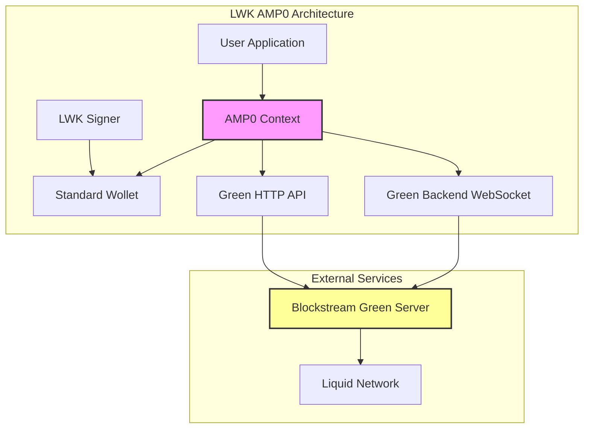
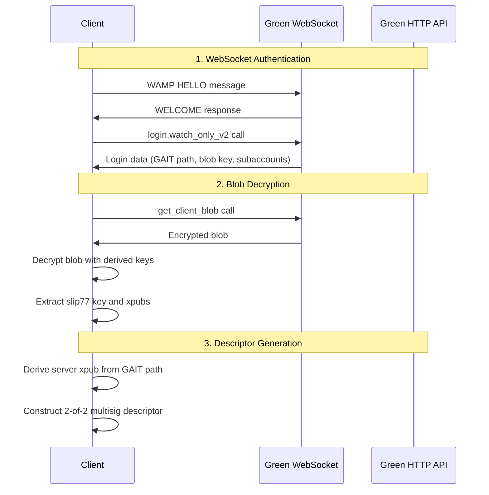
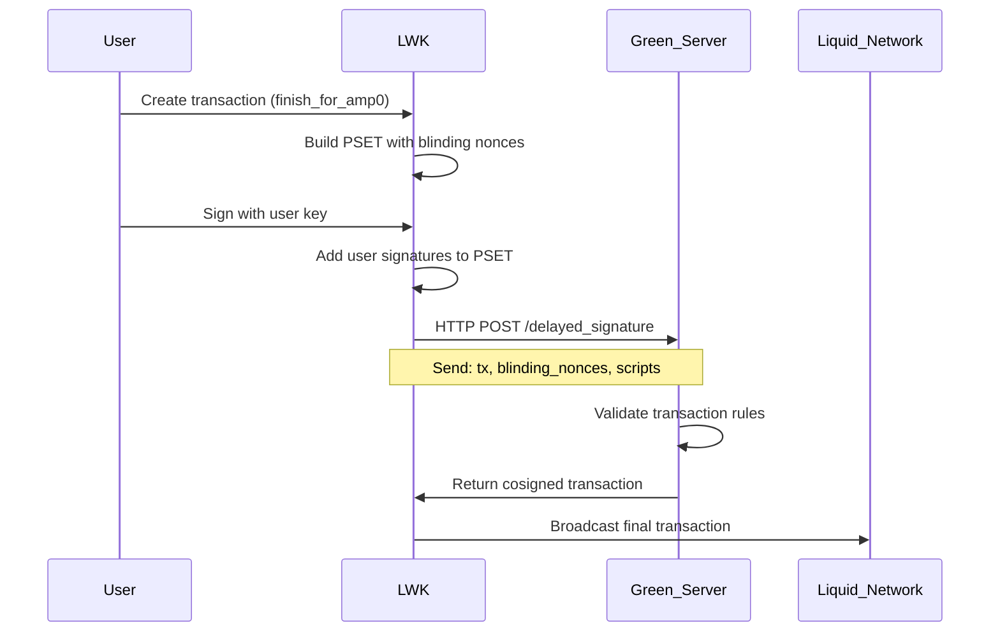
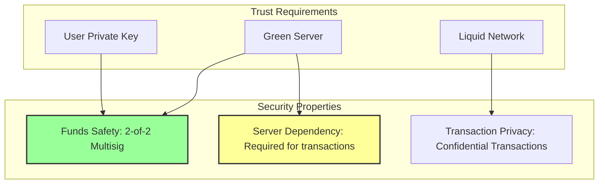

# AMP0 Technical Integration in LWK 0.11.0

## Overview

AMP0 (Asset Management Platform version 0) is a legacy service for issuers that allows enforcement of specific rules on certain Liquid assets. In LWK 0.11.0, partial AMP0 support was introduced, providing essential capabilities for interacting with AMP0-managed assets while maintaining the security model of separating signing from watching operations.

## AMP0 vs Standard LWK Model

AMP0 integration represents a unique challenge because it's based on a legacy system that doesn't perfectly align with LWK's standard watch-only wallet model. Here's what's supported:

| Capability | LWK AMP0 | GDK | AMP0 API |
|------------|----------|-----|----------|
| Create AMP0 accounts | ❌ | ✅ | ❌ |
| Receive on AMP0 accounts | ✅ | ✅ | ❌ |
| Monitor AMP0 accounts | ✅ | ✅ | ❌ |
| Issue, reissue, burn AMP0 assets | ❌ | ❌ | ✅ |
| Set restriction for AMP0 assets | ❌ | ❌ | ✅ |

## Architecture Overview



## Core Components

### 1. AMP0 Context Structure

Located in `lwk_wollet/src/amp0.rs`, the main `Amp0` struct manages the connection to Green backend:

```rust
pub struct Amp0<S: Stream> {
    /// LWK watch-only wallet descriptor for the AMP0 subaccount
    wollet_descriptor: WolletDescriptor,
    
    /// Green backend WebSocket connection
    amp0: Amp0Inner<S>,
    
    /// Network (Liquid/Testnet/Regtest)
    network: Network,
    
    /// AMP subaccount pointer
    amp_subaccount: u32,
    
    /// AMP ID (Green Address ID)
    amp_id: String,
    
    /// Index of the last returned address
    last_index: u32,
}
```

### 2. Key Fingerprints

AMP0 descriptors are identified by specific server key fingerprints:

```rust
pub const AMP0_FINGERPRINT_MAINNET: &str = "0557d83a";
pub const AMP0_FINGERPRINT_TESTNET: &str = "98c379b9";
pub const AMP0_FINGERPRINT_REGTEST: &str = "b5281696";
```

### 3. Descriptor Format

AMP0 wallets use a 2-of-2 multisig descriptor format:

```
ct(slip77({master_blinding_key}),elsh(wsh(multi(2,{server_key}/*,{user_key}/1/*))))
```

**Example (Testnet):**
```
ct(slip77(64321fcf13c2d181ef890ecaf05e973141aa1805949f566232ea52519b35049f),elsh(wsh(multi(2,[98c379b9/3/64185/12352/.../*,[a803afe3/3'/1']tpubDA9GDAo3JyS2TTixDwx3w6bwZBTani1wvBvh5ckjR7PAyvUGvd7z8sHYtd9wh23ExhUqq3F3p3tgJr68LVJK2fkdqmdhxjeSWy8oP261Q1y/1/*))))
```

## Technical Implementation

### 1. Authentication Flow

AMP0 uses a complex authentication system involving:



### 2. Credential Hashing

```rust
fn encrypt_credentials(username: &str, password: &str) -> (String, String) {
    let entropy = get_entropy(username, password);
    
    // PBKDF2-HMAC-SHA512-256 with different seeds
    let mut u_blob = [0u8; 32];
    let mut p_blob = [0u8; 32];
    
    pbkdf2::<Hmac<Sha512>>(&entropy, &WO_SEED_U, 2048, &mut u_blob);
    pbkdf2::<Hmac<Sha512>>(&entropy, &WO_SEED_P, 2048, &mut p_blob);
    
    (hex::encode(&u_blob), hex::encode(&p_blob))
}
```

The entropy generation uses scrypt with specific parameters:
- **N**: 2^14 (16384 iterations)
- **r**: 8 (block size)
- **p**: 8 (parallelization)
- **Output**: 64 bytes

### 3. Address Management

**Critical Warning:** AMP0 address generation differs from standard LWK:

```rust
impl Amp0<S> {
    pub async fn address(&mut self, index: Option<u32>) -> Result<AddressResult, Error> {
        match index {
            Some(i) => {
                // Use existing address (must be ≤ last_index)
                if i == 0 || i > self.last_index {
                    return Err(Error::Generic("Invalid address index".into()));
                }
                self.wollet_descriptor.amp0_address(i, self.network.address_params())
            }
            None => {
                // Get NEW address from Green server
                let (pointer, script) = self.amp0.get_new_address(self.amp_subaccount).await?;
                self.last_index = pointer;
                // Validate the address matches server expectations
                let address = self.wollet_descriptor.amp0_address(pointer, self.network.address_params())?;
                Ok(AddressResult::new(address, pointer))
            }
        }
    }
}
```

**Key Points:**
- Address index 0 is never used
- Addresses must be requested from Green server first
- Using `Wollet::address()` directly can lead to **fund loss**
- Server only monitors addresses it has generated

### 4. Transaction Building

AMP0 transactions require special handling through `Amp0Pset`:

```rust
// Standard transaction
let pset = wollet.tx_builder()
    .add_lbtc_recipient(&address, 1000)?
    .finish()?;

// AMP0 transaction
let amp0pset = wollet.tx_builder()
    .add_lbtc_recipient(&address, 1000)?
    .finish_for_amp0()?;  // Returns Amp0Pset with blinding nonces
```

The `Amp0Pset` struct encapsulates both the PSET and blinding nonces required for server cosigning:

```rust
pub struct Amp0Pset {
    pset: PartiallySignedTransaction,
    blinding_nonces: Vec<String>,
}
```

### 5. Cosigning Process



### 6. Cosigning Request Format

```rust
#[derive(serde::Serialize)]
struct DelayedSignatureRequest {
    tx: String,                    // Hex-encoded transaction
    blinding_nonces: Vec<String>,  // Blinding nonces for outputs
    scripts: Vec<String>,          // Witness scripts for inputs
}

#[derive(serde::Deserialize)]
struct DelayedSignatureResponse {
    result: bool,
    error: String,
    tx: Option<String>,  // Hex-encoded fully signed transaction
}
```

## Language Bindings Support

### 1. Rust (Native)

```rust
use lwk_wollet::amp0::blocking::Amp0;

let mut amp0 = Amp0::new(network, username, password, amp_id)?;
let wd = amp0.wollet_descriptor();
let mut wollet = Wollet::without_persist(elements_network, wd)?;

// Get address
let addr = amp0.address(None)?;

// Create transaction
let amp0pset = wollet.tx_builder()
    .drain_lbtc_wallet()
    .finish_for_amp0()?;

// Sign and cosign
let mut pset = amp0pset.pset().clone();
signer.sign(&mut pset)?;
let amp0pset = Amp0Pset::new(pset, amp0pset.blinding_nonces().to_vec())?;
let tx = amp0.sign(&amp0pset)?;
```

### 2. Python Bindings

Located in `lwk_bindings/src/amp0.rs` and exposed via UniFFI:

```python
from lwk import Amp0, Amp0Pset, Signer, Wollet

# Create AMP0 context
amp0 = Amp0(network, username, password, amp_id)

# Get descriptor and create wallet
wollet_descriptor = amp0.wollet_descriptor()
wollet = Wollet(network, wollet_descriptor, None)

# Transaction flow
amp0pset = wollet.tx_builder().drain_lbtc_wallet().finish_for_amp0()
pset = signer.sign(amp0pset.pset())
amp0pset = Amp0Pset(pset, amp0pset.blinding_nonces())
tx = amp0.sign(amp0pset)
```

### 3. WebAssembly Support

Located in `lwk_wasm/src/amp0.rs`:

```javascript
import { Amp0, Amp0Pset, TxBuilder } from 'lwk-wasm';

// Create AMP0 context
const amp0 = await Amp0.newTestnet(username, password, ampId);

// Get wallet
const wollet = amp0.wollet();

// Create transaction
const amp0pset = TxBuilder.new(network)
    .drainLbtcWallet()
    .finishForAmp0(wollet);

// Sign and cosign
const signedPset = signer.sign(amp0pset.pset());
const finalAmp0pset = new Amp0Pset(signedPset, amp0pset.blindingNonces());
const tx = await amp0.sign(finalAmp0pset);
```

## Wallet Synchronization

AMP0 wallets require special synchronization due to gaps in address usage:

```rust
// Standard wallet sync (DON'T use for AMP0)
let update = client.full_scan(&wollet)?;

// AMP0 wallet sync (REQUIRED)
let last_index = amp0.last_index();
let update = client.full_scan_to_index(&wollet, last_index)?;
```

**Why this matters:**
- AMP0 doesn't follow the standard gap limit concept
- Can have many unused addresses in sequence
- Standard `full_scan` may stop too early and miss transactions

## Security Considerations

### 1. Trust Model



### 2. Key Security

- **User Key**: Protected by standard BIP39/BIP87 security
- **Server Key**: Controlled by Blockstream Green service
- **Multisig Safety**: Funds cannot move without both signatures
- **Server Risk**: Transactions can be censored by server refusal

### 3. Privacy Trade-offs

- **Address Privacy**: Server sees all address requests
- **Transaction Privacy**: Server sees all transaction attempts
- **Metadata**: Green backend logs all interactions
- **CT Benefits**: Amount and asset confidentiality maintained

## Error Handling

### Common Error Patterns

```rust
// Address generation errors
if let Err(e) = amp0.address(Some(0)) {
    // Error: "Invalid address index for AMP0"
}

if let Err(e) = amp0.address(Some(last_index + 1)) {
    // Error: "Address index too high"
}

// Wrong wallet sync
if let Err(e) = wollet_descriptor.address(1, params) {
    // Error: "Cannot generate address for AMP0 wallets using this call, use Amp0::address()"
}

// Cosigning failures
if let Err(e) = amp0.sign(&invalid_amp0pset) {
    // Error: "delayed_signature: error: {server_error_message}"
}
```

### Network Connectivity

```rust
// WebSocket connection timeout
const RESPONSE_TIMEOUT: Duration = Duration::from_secs(10);

// HTTP request with proper error handling
let response: DelayedSignatureResponse = reqwest::Client::new()
    .post(format!("{}/delayed_signature", self.http_url()))
    .json(&body)
    .send()
    .await?
    .json()
    .await?;

if !response.result {
    return Err(Error::Generic(format!("delayed_signature: error: {}", response.error)));
}
```

## Performance Considerations

### 1. Credential Hashing

Credential hashing is computationally expensive (hundreds of milliseconds):

```rust
// Cache hashed credentials for subsequent logins
let (hashed_username, hashed_password) = encrypt_credentials(username, password);
// Store these for reuse instead of re-hashing each time
```

### 2. WebSocket Connection Management

```rust
// Persistent connection for multiple operations
let amp0 = Amp0::new_with_network(network, username, password, amp_id).await?;

// Reuse connection for multiple addresses/transactions
for i in 1..10 {
    let addr = amp0.address(None).await?;
    // Process address...
}
```

### 3. Blocking vs Async

```rust
// Async version (recommended for servers)
use lwk_wollet::amp0::Amp0;
let amp0 = Amp0::new_with_network(network, username, password, amp_id).await?;

// Blocking version (convenience wrapper)
use lwk_wollet::amp0::blocking::Amp0;
let amp0 = Amp0::new(network, username, password, amp_id)?;
```

## Testing Infrastructure

### 1. Network Endpoints

```rust
fn http_url(&self) -> &'static str {
    match self.network {
        Network::Liquid => "https://green-liquid-mainnet.blockstream.com",
        Network::TestnetLiquid => "https://green-liquid-testnet.blockstream.com", 
        Network::LocaltestLiquid => "http://127.0.0.1:9908",
    }
}

fn default_url(network: Network) -> Result<&'static str, Error> {
    match network {
        Network::Liquid => Ok("wss://green-liquid-mainnet.blockstream.com/v2/ws/"),
        Network::TestnetLiquid => Ok("wss://green-liquid-testnet.blockstream.com/v2/ws/"),
        Network::LocaltestLiquid => Ok("ws://localhost:8080/v2/ws"),
    }
}
```

### 2. Test Credentials

The codebase includes test credentials for development:

```rust
// Mainnet test account
username: "userleo456"
password: "userleo456" 
amp_id: "GA2zxWdhAYtREeYCVFTGRhHQmYMPAP"

// Testnet test account
username: "userleo3456"
password: "userleo3456"
amp_id: "GA2g7wuT1j4PMPriUGRWhHTcGxMEWV"
```

### 3. Integration Tests

```rust
#[cfg(all(feature = "amp0", not(target_arch = "wasm32")))]
#[tokio::test]
#[ignore] // Requires network connectivity
async fn test_amp0_full_flow() {
    let mut amp0 = Amp0::new_with_network(network, username, password, amp_id).await?;
    
    // Test address generation
    let addr = amp0.address(None).await?;
    
    // Test wallet sync
    let wd = amp0.wollet_descriptor();
    let mut wollet = Wollet::without_persist(elements_network, wd)?;
    
    // Test transaction building and signing
    let amp0pset = wollet.tx_builder().drain_lbtc_wallet().finish_for_amp0()?;
    let tx = amp0.sign(&amp0pset)?;
}
```

## Migration and Compatibility

### From GDK to LWK AMP0

If migrating from GDK AMP0 integration:

1. **Account Setup**: Still requires GDK/Green App for initial account creation
2. **Credentials**: Same watch-only credentials work with LWK
3. **Descriptors**: LWK generates compatible descriptors
4. **Limitations**: Some operations (issuance, reissuance) still require GDK/AMP0 API

### Version Compatibility

- **Introduced**: LWK 0.11.0
- **Feature Flag**: `amp0` (enabled by default)
- **WASM Support**: ✅ Available
- **Mobile Bindings**: ✅ Available (Python, Kotlin, Swift)

## Limitations and Future Work

### Current Limitations

1. **Account Creation**: Cannot create new AMP0 accounts
2. **Asset Management**: Cannot issue/reissue/burn AMP0 assets
3. **Rule Setting**: Cannot configure asset transfer restrictions
4. **Server Dependency**: Requires Green backend availability
5. **Legacy Protocol**: Based on older Green Address protocol

### Potential Improvements

1. **Connection Pooling**: Reuse WebSocket connections across operations
2. **Caching**: Cache decrypted blobs and derived descriptors
3. **Retry Logic**: Implement automatic retry for network failures
4. **Batch Operations**: Support multiple address generation in single call
5. **Event Notifications**: WebSocket-based transaction notifications

## Conclusion

AMP0 integration in LWK 0.11.0 provides essential capabilities for working with Blockstream's Asset Management Platform while maintaining LWK's security model of separated signing and watching operations. While it has limitations compared to full GDK integration, it enables:

- **Secure Asset Management**: Monitor and transact AMP0 assets
- **Hardware Wallet Support**: Use Jade and other LWK-compatible signers
- **Multi-Language Support**: Access via Rust, Python, Kotlin, Swift, and WebAssembly
- **Liquid Network Integration**: Full confidential transaction support

The implementation demonstrates LWK's flexibility in integrating with legacy systems while maintaining its core architectural principles.
