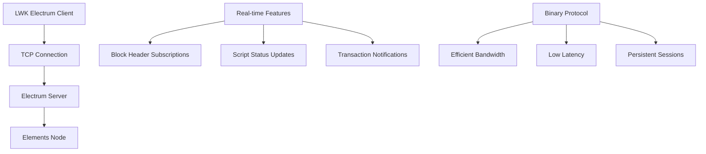

import Tabs from '@theme/Tabs';
import TabItem from '@theme/TabItem';

# Electrum Server Integration

Electrum provides a persistent TCP connection to blockchain data with real-time subscriptions and efficient binary protocol communication. It's ideal for applications requiring live updates and frequent synchronization.

## Protocol Architecture



## Connection Management

### Basic Connection Setup

<Tabs groupId="language">
<TabItem value="rust" label="Rust" default>

```rust
use lwk_wollet::{ElectrumClient, ElectrumUrl, ElectrumOptions};

// Basic connection
let url = ElectrumUrl::new("blockstream.info:465", true, true)?;
let client = ElectrumClient::new(&url)?;

// Connection with custom timeout
let options = ElectrumOptions {
    timeout: Some(30), // 30 seconds
};
let client = ElectrumClient::with_options(&url, options)?;

// Test connectivity
client.ping()?;
println!("Connected to Electrum server");
```

</TabItem>
<TabItem value="python" label="Python">

```python
from lwk import ElectrumClient

# Basic connection
client = ElectrumClient(
    electrum_url="blockstream.info:465",
    tls=True,
    validate_domain=True
)

# Test connectivity
client.ping()
print("Connected to Electrum server")
```

</TabItem>
<TabItem value="kotlin" label="Kotlin">

```kotlin
import com.blockstream.lwk.ElectrumClient

// Basic connection
val client = ElectrumClient(
    electrumUrl = "blockstream.info:465",
    tls = true,
    validateDomain = true
)

// Test connectivity
client.ping()
println("Connected to Electrum server")
```

</TabItem>
<TabItem value="swift" label="Swift">

```swift
import LiquidWalletKit

// Basic connection
let client = try ElectrumClient(
    electrumUrl: "blockstream.info:465",
    tls: true,
    validateDomain: true
)

// Test connectivity
try client.ping()
print("Connected to Electrum server")
```

</TabItem>
</Tabs>

## URL Configuration

<Tabs groupId="language">
<TabItem value="rust" label="Rust" default>

```rust
// TLS connection with domain validation (recommended)
let secure_url = ElectrumUrl::new("blockstream.info:465", true, true)?;

// TLS without domain validation (self-signed certificates)
let tls_url = ElectrumUrl::new("myserver.local:50002", true, false)?;

// Plain TCP (not recommended for production)
let plain_url = ElectrumUrl::new("localhost:50001", false, false)?;

// Parse from string format
let parsed_url: ElectrumUrl = "ssl://blockstream.info:465".parse()?;
```

</TabItem>
<TabItem value="python" label="Python">

```python
# TLS connection with domain validation (recommended)
client = ElectrumClient("blockstream.info:465", True, True)

# TLS without domain validation (self-signed certificates) 
client = ElectrumClient("myserver.local:50002", True, False)

# Plain TCP (not recommended for production)
client = ElectrumClient("localhost:50001", False, False)
```

</TabItem>
<TabItem value="kotlin" label="Kotlin">

```kotlin
// TLS connection with domain validation (recommended)
val client = ElectrumClient("blockstream.info:465", true, true)

// TLS without domain validation (self-signed certificates)
val client = ElectrumClient("myserver.local:50002", true, false)

// Plain TCP (not recommended for production)
val client = ElectrumClient("localhost:50001", false, false)
```

</TabItem>
<TabItem value="swift" label="Swift">

```swift
// TLS connection with domain validation (recommended)
let client = try ElectrumClient(
    electrumUrl: "blockstream.info:465",
    tls: true,
    validateDomain: true
)

// TLS without domain validation (self-signed certificates)
let client = try ElectrumClient(
    electrumUrl: "myserver.local:50002", 
    tls: true,
    validateDomain: false
)

// Plain TCP (not recommended for production)
let client = try ElectrumClient(
    electrumUrl: "localhost:50001",
    tls: false,
    validateDomain: false
)
```

</TabItem>
</Tabs>

## Wallet Synchronization

### Full Wallet Scan

<Tabs groupId="language">
<TabItem value="rust" label="Rust" default>

```rust
// Perform full wallet scan
let update = client.full_scan(&wollet)?;

match update {
    Some(update) => {
        println!("Found {} new transactions", update.new_txs.len());
        
        // Apply the update to the wallet
        wollet.apply_update(update)?;
        
        // Check updated balance
        let balance = wollet.balance()?;
        println!("Current L-BTC balance: {} sats", balance.btc_balance());
    }
    None => {
        println!("Wallet is already up to date");
    }
}
```

</TabItem>
<TabItem value="python" label="Python">

```python
# Perform full wallet scan
update = client.full_scan(wollet)

if update:
    print(f"Found {len(update.new_txs)} new transactions")
    
    # Apply the update to the wallet
    wollet.apply_update(update)
    
    # Check updated balance
    balance = wollet.balance()
    print(f"Current L-BTC balance: {balance.btc_balance()} sats")
else:
    print("Wallet is already up to date")
```

</TabItem>
<TabItem value="kotlin" label="Kotlin">

```kotlin
// Perform full wallet scan
val update = client.fullScan(wollet)

update?.let {
    println("Found ${it.newTxs.size} new transactions")
    
    // Apply the update to the wallet
    wollet.applyUpdate(it)
    
    // Check updated balance
    val balance = wollet.balance()
    println("Current L-BTC balance: ${balance.btcBalance()} sats")
} ?: println("Wallet is already up to date")
```

</TabItem>
<TabItem value="swift" label="Swift">

```swift
// Perform full wallet scan
let update = try client.fullScan(wollet)

if let update = update {
    print("Found \(update.newTxs.count) new transactions")
    
    // Apply the update to the wallet
    try wollet.applyUpdate(update)
    
    // Check updated balance
    let balance = try wollet.balance()
    print("Current L-BTC balance: \(balance.btcBalance()) sats")
} else {
    print("Wallet is already up to date")
}
```

</TabItem>
</Tabs>

## Transaction Broadcasting

<Tabs groupId="language">
<TabItem value="rust" label="Rust" default>

```rust
// Broadcast a signed transaction
let txid = client.broadcast(&signed_transaction)?;
println!("Transaction broadcast successfully: {}", txid);

// Get transaction details
let tx = client.get_tx(&txid)?;
println!("Transaction size: {} bytes", tx.size());
```

</TabItem>
<TabItem value="python" label="Python">

```python
# Broadcast a signed transaction
txid = client.broadcast(signed_transaction)
print(f"Transaction broadcast successfully: {txid}")

# Get transaction details
tx = client.get_tx(txid)
print(f"Transaction size: {tx.size()} bytes")
```

</TabItem>
<TabItem value="kotlin" label="Kotlin">

```kotlin
// Broadcast a signed transaction
val txid = client.broadcast(signedTransaction)
println("Transaction broadcast successfully: $txid")

// Get transaction details
val tx = client.getTx(txid)
println("Transaction size: ${tx.size()} bytes")
```

</TabItem>
<TabItem value="swift" label="Swift">

```swift
// Broadcast a signed transaction
let txid = try client.broadcast(signedTransaction)
print("Transaction broadcast successfully: \(txid)")

// Get transaction details
let tx = try client.getTx(txid)
print("Transaction size: \(tx.size()) bytes")
```

</TabItem>
</Tabs>

## Real-time Updates

<Tabs groupId="language">
<TabItem value="rust" label="Rust" default>

```rust
// Get current tip and monitor for changes
let mut current_tip = client.tip()?;
println!("Current block: {}", current_tip.block_hash());

// In practice, you'd run this in a background thread
loop {
    let new_tip = client.tip()?;
    if new_tip.block_hash() != current_tip.block_hash() {
        println!("New block detected: {}", new_tip.block_hash());
        
        // Sync wallet for new transactions
        let update = client.sync(&wollet, 20)?;
        if let Some(update) = update {
            wollet.apply_update(update)?;
        }
        
        current_tip = new_tip;
    }
    
    std::thread::sleep(std::time::Duration::from_secs(30));
}
```

</TabItem>
<TabItem value="python" label="Python">

```python
import time

# Get current tip and monitor for changes
current_tip = client.tip()
print(f"Current block: {current_tip.block_hash()}")

while True:
    new_tip = client.tip()
    if new_tip.block_hash() != current_tip.block_hash():
        print(f"New block detected: {new_tip.block_hash()}")
        
        # Sync wallet for new transactions
        update = client.sync(wollet, 20)
        if update:
            wollet.apply_update(update)
        
        current_tip = new_tip
    
    time.sleep(30)
```

</TabItem>
<TabItem value="kotlin" label="Kotlin">

```kotlin
import kotlinx.coroutines.delay

// Get current tip and monitor for changes
var currentTip = client.tip()
println("Current block: ${currentTip.blockHash()}")

while (true) {
    val newTip = client.tip()
    if (newTip.blockHash() != currentTip.blockHash()) {
        println("New block detected: ${newTip.blockHash()}")
        
        // Sync wallet for new transactions
        val update = client.sync(wollet, 20)
        update?.let { wollet.applyUpdate(it) }
        
        currentTip = newTip
    }
    
    delay(30000) // 30 seconds
}
```

</TabItem>
<TabItem value="swift" label="Swift">

```swift
import Foundation

// Get current tip and monitor for changes
var currentTip = try client.tip()
print("Current block: \(currentTip.blockHash())")

while true {
    let newTip = try client.tip()
    if newTip.blockHash() != currentTip.blockHash() {
        print("New block detected: \(newTip.blockHash())")
        
        // Sync wallet for new transactions
        let update = try client.sync(wollet, gapLimit: 20)
        if let update = update {
            try wollet.applyUpdate(update)
        }
        
        currentTip = newTip
    }
    
    Thread.sleep(forTimeInterval: 30)
}
```

</TabItem>
</Tabs>

## Key Advantages

**Real-time Subscriptions**: Immediate notifications when blocks are found or relevant transactions appear.

**Persistent Connections**: Maintains connection state, reducing overhead for frequent operations.

**Binary Protocol**: More efficient than JSON, reducing bandwidth usage by 30-50%.

**Batch Operations**: Supports fetching multiple transactions in a single request.

**Wide Compatibility**: Electrum protocol is widely supported across many server implementations.

## External Resources

- **[Electrum Protocol Documentation](https://electrumx.readthedocs.io/en/latest/protocol.html)**: Official Electrum server protocol specification
- **[Blockstream Electrum Servers](https://github.com/Blockstream/electrs)**: Blockstream's Electrum server implementation for Elements
- **[Electrum Network Status](https://1209k.com/bitcoin-eye/ele.php)**: Real-time status of public Electrum servers
- **[ElectrumX Documentation](https://electrumx.readthedocs.io/)**: Complete guide to ElectrumX server implementation
- **[Electrum Client Library](https://github.com/bitcoindevkit/rust-electrum-client)**: Rust Electrum client implementation used by LWK