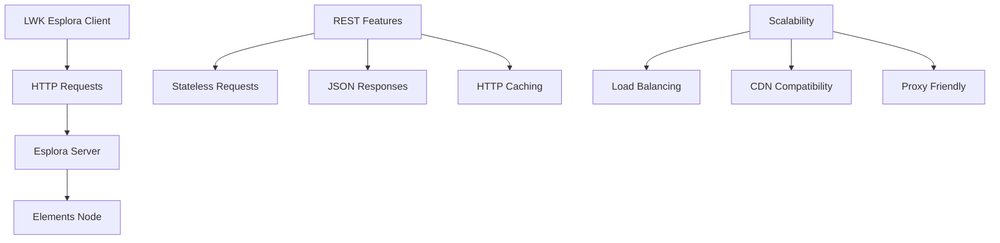

import Tabs from '@theme/Tabs';
import TabItem from '@theme/TabItem';

# Esplora API Integration

Esplora provides a REST API for blockchain data access, offering stateless HTTP requests with JSON responses. It's ideal for web applications, mobile apps, and environments requiring HTTP-based integration.

## API Architecture



## Client Configuration

### Basic Setup

<Tabs groupId="language">
<TabItem value="rust" label="Rust" default>

```rust
use lwk_wollet::blocking::EsploraClient;
use lwk_wollet::ElementsNetwork;

// Basic Esplora client
let client = EsploraClient::new(
    "https://blockstream.info/liquidtestnet/api",
    ElementsNetwork::LiquidTestnet
)?;

println!("Esplora client configured");
```

</TabItem>
<TabItem value="python" label="Python">

```python
from lwk import EsploraClient, Network

# Basic Esplora client
client = EsploraClient(
    url="https://blockstream.info/liquidtestnet/api",
    network=Network.LIQUID_TESTNET
)

print("Esplora client configured")
```

</TabItem>
<TabItem value="kotlin" label="Kotlin">

```kotlin
import com.blockstream.lwk.*

// Basic Esplora client
val client = EsploraClient(
    url = "https://blockstream.info/liquidtestnet/api",
    network = Network.LIQUID_TESTNET
)

println("Esplora client configured")
```

</TabItem>
<TabItem value="swift" label="Swift">

```swift
import LiquidWalletKit

// Basic Esplora client
let client = try EsploraClient(
    url: "https://blockstream.info/liquidtestnet/api",
    network: .liquidTestnet
)

print("Esplora client configured")
```

</TabItem>
</Tabs>

### Network Endpoints

<Tabs groupId="language">
<TabItem value="rust" label="Rust" default>

```rust
// Liquid Mainnet
let mainnet_client = EsploraClient::new(
    "https://blockstream.info/liquid/api",
    ElementsNetwork::Liquid
)?;

// Liquid Testnet  
let testnet_client = EsploraClient::new(
    "https://blockstream.info/liquidtestnet/api",
    ElementsNetwork::LiquidTestnet
)?;

// Local Regtest
let regtest_client = EsploraClient::new(
    "http://localhost:3001/api",
    ElementsNetwork::ElementsRegtest
)?;
```

</TabItem>
<TabItem value="python" label="Python">

```python
# Liquid Mainnet
mainnet_client = EsploraClient(
    "https://blockstream.info/liquid/api",
    Network.LIQUID
)

# Liquid Testnet
testnet_client = EsploraClient(
    "https://blockstream.info/liquidtestnet/api", 
    Network.LIQUID_TESTNET
)

# Local Regtest
regtest_client = EsploraClient(
    "http://localhost:3001/api",
    Network.ELEMENTS_REGTEST
)
```

</TabItem>
<TabItem value="kotlin" label="Kotlin">

```kotlin
// Liquid Mainnet
val mainnetClient = EsploraClient(
    "https://blockstream.info/liquid/api",
    Network.LIQUID
)

// Liquid Testnet
val testnetClient = EsploraClient(
    "https://blockstream.info/liquidtestnet/api",
    Network.LIQUID_TESTNET
)

// Local Regtest
val regtestClient = EsploraClient(
    "http://localhost:3001/api",
    Network.ELEMENTS_REGTEST
)
```

</TabItem>
<TabItem value="swift" label="Swift">

```swift
// Liquid Mainnet
let mainnetClient = try EsploraClient(
    url: "https://blockstream.info/liquid/api",
    network: .liquid
)

// Liquid Testnet
let testnetClient = try EsploraClient(
    url: "https://blockstream.info/liquidtestnet/api",
    network: .liquidTestnet
)

// Local Regtest
let regtestClient = try EsploraClient(
    url: "http://localhost:3001/api",
    network: .elementsRegtest
)
```

</TabItem>
</Tabs>

## Wallet Synchronization

### Full Scan Operation

<Tabs groupId="language">
<TabItem value="rust" label="Rust" default>

```rust
// Perform full wallet scan
let update = client.full_scan(&wollet)?;

match update {
    Some(update) => {
        println!("Scan results:");
        println!("  New transactions: {}", update.new_txs.len());
        println!("  Tip height: {}", update.tip.height);
        
        // Apply the update
        wollet.apply_update(update)?;
        
        // Check updated balance
        let balance = wollet.balance()?;
        println!("L-BTC balance: {} sats", balance.btc_balance());
    }
    None => {
        println!("Wallet is up to date");
    }
}
```

</TabItem>
<TabItem value="python" label="Python">

```python
# Perform full wallet scan
update = client.full_scan(wollet)

if update:
    print("Scan results:")
    print(f"  New transactions: {len(update.new_txs)}")
    print(f"  Tip height: {update.tip.height}")
    
    # Apply the update
    wollet.apply_update(update)
    
    # Check updated balance
    balance = wollet.balance()
    print(f"L-BTC balance: {balance.btc_balance()} sats")
else:
    print("Wallet is up to date")
```

</TabItem>
<TabItem value="kotlin" label="Kotlin">

```kotlin
// Perform full wallet scan
val update = client.fullScan(wollet)

update?.let {
    println("Scan results:")
    println("  New transactions: ${it.newTxs.size}")
    println("  Tip height: ${it.tip.height}")
    
    // Apply the update
    wollet.applyUpdate(it)
    
    // Check updated balance
    val balance = wollet.balance()
    println("L-BTC balance: ${balance.btcBalance()} sats")
} ?: println("Wallet is up to date")
```

</TabItem>
<TabItem value="swift" label="Swift">

```swift
// Perform full wallet scan
let update = try client.fullScan(wollet)

if let update = update {
    print("Scan results:")
    print("  New transactions: \(update.newTxs.count)")
    print("  Tip height: \(update.tip.height)")
    
    // Apply the update
    try wollet.applyUpdate(update)
    
    // Check updated balance  
    let balance = try wollet.balance()
    print("L-BTC balance: \(balance.btcBalance()) sats")
} else {
    print("Wallet is up to date")
}
```

</TabItem>
</Tabs>

### Incremental Sync

<Tabs groupId="language">
<TabItem value="rust" label="Rust" default>

```rust
// Incremental sync - only new data since last sync
let update = client.sync(&wollet, 20)?; // gap limit 20

if let Some(update) = update {
    if !update.new_txs.is_empty() {
        println!("Found {} new transactions", update.new_txs.len());
        wollet.apply_update(update)?;
    } else {
        println!("No new transactions");
    }
} else {
    println!("Wallet already synchronized");
}
```

</TabItem>
<TabItem value="python" label="Python">

```python
# Incremental sync - only new data since last sync
update = client.sync(wollet, 20)  # gap limit 20

if update and update.new_txs:
    print(f"Found {len(update.new_txs)} new transactions")
    wollet.apply_update(update)
else:
    print("No new transactions" if update else "Wallet already synchronized")
```

</TabItem>
<TabItem value="kotlin" label="Kotlin">

```kotlin
// Incremental sync - only new data since last sync
val update = client.sync(wollet, 20)  // gap limit 20

if (update != null && update.newTxs.isNotEmpty()) {
    println("Found ${update.newTxs.size} new transactions")
    wollet.applyUpdate(update)
} else {
    println(if (update != null) "No new transactions" else "Wallet already synchronized")
}
```

</TabItem>
<TabItem value="swift" label="Swift">

```swift
// Incremental sync - only new data since last sync
let update = try client.sync(wollet, gapLimit: 20)

if let update = update, !update.newTxs.isEmpty {
    print("Found \(update.newTxs.count) new transactions")
    try wollet.applyUpdate(update)
} else {
    print(update != nil ? "No new transactions" : "Wallet already synchronized")
}
```

</TabItem>
</Tabs>

## Transaction Broadcasting

<Tabs groupId="language">
<TabItem value="rust" label="Rust" default>

```rust
// Broadcast a signed transaction
let txid = client.broadcast(&signed_transaction)?;
println!("Transaction broadcast successfully: {}", txid);
println!("Explorer: https://blockstream.info/liquidtestnet/tx/{}", txid);

// Verify broadcast
let transactions = client.get_transactions(&[txid])?;
if !transactions.is_empty() {
    println!("Transaction confirmed in mempool");
}
```

</TabItem>
<TabItem value="python" label="Python">

```python
# Broadcast a signed transaction
txid = client.broadcast(signed_transaction)
print(f"Transaction broadcast successfully: {txid}")
print(f"Explorer: https://blockstream.info/liquidtestnet/tx/{txid}")

# Verify broadcast
transactions = client.get_transactions([txid])
if transactions:
    print("Transaction confirmed in mempool")
```

</TabItem>
<TabItem value="kotlin" label="Kotlin">

```kotlin
// Broadcast a signed transaction
val txid = client.broadcast(signedTransaction)
println("Transaction broadcast successfully: $txid")
println("Explorer: https://blockstream.info/liquidtestnet/tx/$txid")

// Verify broadcast
val transactions = client.getTransactions(listOf(txid))
if (transactions.isNotEmpty()) {
    println("Transaction confirmed in mempool")
}
```

</TabItem>
<TabItem value="swift" label="Swift">

```swift
// Broadcast a signed transaction
let txid = try client.broadcast(signedTransaction)
print("Transaction broadcast successfully: \(txid)")
print("Explorer: https://blockstream.info/liquidtestnet/tx/\(txid)")

// Verify broadcast
let transactions = try client.getTransactions([txid])
if !transactions.isEmpty {
    print("Transaction confirmed in mempool")
}
```

</TabItem>
</Tabs>

## Error Handling

<Tabs groupId="language">
<TabItem value="rust" label="Rust" default>

```rust
use std::time::Duration;
use std::thread;

fn sync_with_backoff(client: &EsploraClient, wollet: &Wollet) -> Result<(), Error> {
    let mut retry_delay = 1;
    
    for attempt in 1..=3 {
        match client.sync(wollet, 20) {
            Ok(update) => {
                if let Some(update) = update {
                    wollet.apply_update(update)?;
                }
                return Ok(());
            }
            Err(e) => {
                if attempt == 3 {
                    return Err(e);
                }
                println!("Retry in {} seconds...", retry_delay);
                thread::sleep(Duration::from_secs(retry_delay));
                retry_delay *= 2;
            }
        }
    }
    Ok(())
}
```

</TabItem>
<TabItem value="python" label="Python">

```python
import time

def sync_with_backoff(client, wollet):
    retry_delay = 1
    
    for attempt in range(1, 4):
        try:
            update = client.sync(wollet, 20)
            if update:
                wollet.apply_update(update)
            return
        except Exception as e:
            if attempt == 3:
                raise e
            print(f"Retry in {retry_delay} seconds...")
            time.sleep(retry_delay)
            retry_delay *= 2
```

</TabItem>
<TabItem value="kotlin" label="Kotlin">

```kotlin
import kotlinx.coroutines.delay

suspend fun syncWithBackoff(client: EsploraClient, wollet: Wollet) {
    var retryDelay = 1000L
    
    for (attempt in 1..3) {
        try {
            val update = client.sync(wollet, 20)
            update?.let { wollet.applyUpdate(it) }
            return
        } catch (e: Exception) {
            if (attempt == 3) throw e
            println("Retry in ${retryDelay/1000} seconds...")
            delay(retryDelay)
            retryDelay *= 2
        }
    }
}
```

</TabItem>
<TabItem value="swift" label="Swift">

```swift
func syncWithBackoff(client: EsploraClient, wollet: Wollet) throws {
    var retryDelay: TimeInterval = 1
    
    for attempt in 1...3 {
        do {
            let update = try client.sync(wollet, gapLimit: 20)
            if let update = update {
                try wollet.applyUpdate(update)
            }
            return
        } catch {
            if attempt == 3 { throw error }
            print("Retry in \(retryDelay) seconds...")
            Thread.sleep(forTimeInterval: retryDelay)
            retryDelay *= 2
        }
    }
}
```

</TabItem>
</Tabs>

## Key Advantages

**HTTP Compatibility**: Works through firewalls and proxies without special configuration.

**Stateless Design**: No connection state to manage, ideal for serverless architectures.

**Caching Support**: HTTP responses can be cached for improved performance.

**JSON Format**: Human-readable responses easy to debug and integrate.

**Load Balancing**: Multiple Esplora instances can be load balanced for scalability.

## External Resources

- **[Esplora API Documentation](https://github.com/Blockstream/esplora/blob/master/API.md)**: Complete REST API specification for Esplora
- **[Blockstream Esplora](https://blockstream.info/)**: Public Esplora instances for Bitcoin and Liquid networks
- **[Esplora Source Code](https://github.com/Blockstream/esplora)**: Open source Esplora server implementation
- **[Liquid Network Explorer](https://liquid.network/)**: Alternative public Esplora instance for Liquid
- **[Self-hosted Esplora Guide](https://github.com/Blockstream/esplora#how-to-run-esplora)**: Instructions for running your own Esplora instance