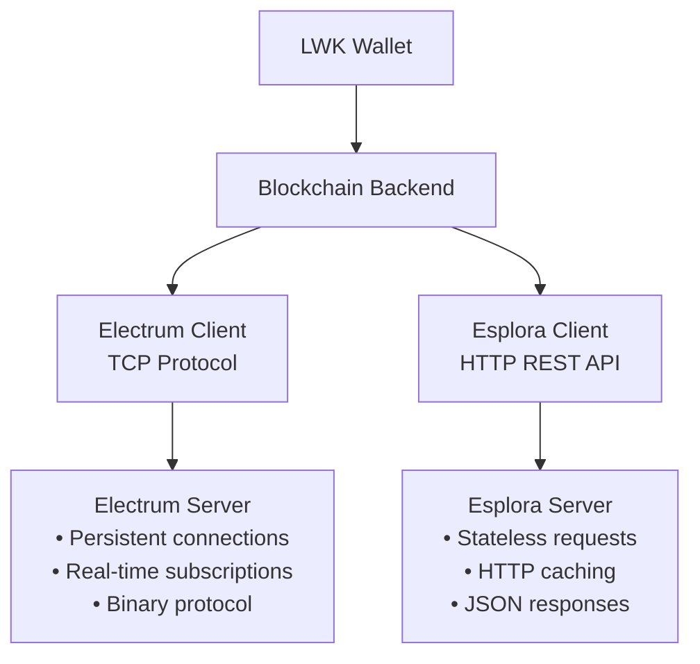

import Tabs from '@theme/Tabs';
import TabItem from '@theme/TabItem';

# Blockchain Backend Architecture

LWK supports multiple blockchain data sources for wallet synchronization and transaction broadcasting. The two primary backends are Electrum (TCP-based protocol) and Esplora (HTTP REST API), each offering different trade-offs for performance, deployment, and integration scenarios.

## Backend Comparison



| Feature | Electrum | Esplora | Best For |
|---------|----------|---------|----------|
| **Protocol** | TCP with binary format | HTTP REST with JSON | Electrum: Real-time apps<br/>Esplora: Web/mobile |
| **Connection** | Persistent with subscriptions | Stateless requests | Electrum: Desktop wallets<br/>Esplora: Web services |
| **Performance** | Lower latency, efficient | Higher latency, cacheable | Electrum: Frequent sync<br/>Esplora: Occasional sync |
| **Deployment** | Requires TCP connectivity | Works behind HTTP proxies | Electrum: Direct networks<br/>Esplora: Enterprise/mobile |

## Quick Start Examples

### Electrum Client

<Tabs groupId="language">
<TabItem value="rust" label="Rust" default>

```rust
use lwk_wollet::{ElectrumClient, ElectrumUrl};

// Connect to Blockstream Electrum server
let url = ElectrumUrl::new("blockstream.info:465", true, true)?;
let mut client = ElectrumClient::new(&url)?;

// Test connection
client.ping()?;

// Sync wallet
let update = client.full_scan(&wollet)?;
if let Some(update) = update {
    wollet.apply_update(update)?;
}

println!("Wallet synced via Electrum");
```

</TabItem>
<TabItem value="python" label="Python">

```python
from lwk import ElectrumClient

# Connect to Blockstream Electrum server
client = ElectrumClient(
    electrum_url="blockstream.info:465",
    tls=True,
    validate_domain=True
)

# Test connection
client.ping()

# Sync wallet
update = client.full_scan(wollet)
if update:
    wollet.apply_update(update)

print("Wallet synced via Electrum")
```

</TabItem>
<TabItem value="kotlin" label="Kotlin">

```kotlin
import com.blockstream.lwk.ElectrumClient

// Connect to Blockstream Electrum server
val client = ElectrumClient(
    electrumUrl = "blockstream.info:465",
    tls = true,
    validateDomain = true
)

// Test connection
client.ping()

// Sync wallet
val update = client.fullScan(wollet)
update?.let { wollet.applyUpdate(it) }

println("Wallet synced via Electrum")
```

</TabItem>
<TabItem value="swift" label="Swift">

```swift
import LiquidWalletKit

// Connect to Blockstream Electrum server
let client = try ElectrumClient(
    electrumUrl: "blockstream.info:465",
    tls: true,
    validateDomain: true
)

// Test connection
try client.ping()

// Sync wallet
let update = try client.fullScan(wollet)
if let update = update {
    try wollet.applyUpdate(update)
}

print("Wallet synced via Electrum")
```

</TabItem>
</Tabs>

### Esplora Client

<Tabs groupId="language">
<TabItem value="rust" label="Rust" default>

```rust
use lwk_wollet::blocking::EsploraClient;

// Connect to Blockstream Esplora API
let client = EsploraClient::new(
    "https://blockstream.info/liquidtestnet/api",
    ElementsNetwork::LiquidTestnet
)?;

// Sync wallet
let update = client.full_scan(&wollet)?;
if let Some(update) = update {
    wollet.apply_update(update)?;
}

println!("Wallet synced via Esplora");
```

</TabItem>
<TabItem value="python" label="Python">

```python
from lwk import EsploraClient, Network

# Connect to Blockstream Esplora API
client = EsploraClient(
    url="https://blockstream.info/liquidtestnet/api",
    network=Network.LIQUID_TESTNET
)

# Sync wallet
update = client.full_scan(wollet)
if update:
    wollet.apply_update(update)

print("Wallet synced via Esplora")
```

</TabItem>
<TabItem value="kotlin" label="Kotlin">

```kotlin
import com.blockstream.lwk.*

// Connect to Blockstream Esplora API
val client = EsploraClient(
    url = "https://blockstream.info/liquidtestnet/api",
    network = Network.LIQUID_TESTNET
)

// Sync wallet
val update = client.fullScan(wollet)
update?.let { wollet.applyUpdate(it) }

println("Wallet synced via Esplora")
```

</TabItem>
<TabItem value="swift" label="Swift">

```swift
import LiquidWalletKit

// Connect to Blockstream Esplora API
let client = try EsploraClient(
    url: "https://blockstream.info/liquidtestnet/api",
    network: .liquidTestnet
)

// Sync wallet
let update = try client.fullScan(wollet)
if let update = update {
    try wollet.applyUpdate(update)
}

print("Wallet synced via Esplora")
```

</TabItem>
</Tabs>

## Network Configuration

### Mainnet (Liquid)

<Tabs groupId="language">
<TabItem value="rust" label="Rust" default>

```rust
// Electrum mainnet
let electrum_url = ElectrumUrl::new("blockstream.info:700", false, true)?;
let electrum_client = ElectrumClient::new(&electrum_url)?;

// Esplora mainnet  
let esplora_client = EsploraClient::new(
    "https://blockstream.info/liquid/api",
    ElementsNetwork::Liquid
)?;
```

</TabItem>
<TabItem value="python" label="Python">

```python
# Electrum mainnet
electrum_client = ElectrumClient("blockstream.info:700", False, True)

# Esplora mainnet
esplora_client = EsploraClient(
    "https://blockstream.info/liquid/api",
    Network.LIQUID
)
```

</TabItem>
<TabItem value="kotlin" label="Kotlin">

```kotlin
// Electrum mainnet
val electrumClient = ElectrumClient("blockstream.info:700", false, true)

// Esplora mainnet
val esploraClient = EsploraClient(
    "https://blockstream.info/liquid/api",
    Network.LIQUID
)
```

</TabItem>
<TabItem value="swift" label="Swift">

```swift
// Electrum mainnet
let electrumClient = try ElectrumClient(
    electrumUrl: "blockstream.info:700",
    tls: false,
    validateDomain: true
)

// Esplora mainnet
let esploraClient = try EsploraClient(
    url: "https://blockstream.info/liquid/api",
    network: .liquid
)
```

</TabItem>
</Tabs>

### Testnet

<Tabs groupId="language">
<TabItem value="rust" label="Rust" default>

```rust
// Electrum testnet
let electrum_url = ElectrumUrl::new("blockstream.info:465", true, true)?;
let electrum_client = ElectrumClient::new(&electrum_url)?;

// Esplora testnet
let esplora_client = EsploraClient::new(
    "https://blockstream.info/liquidtestnet/api",
    ElementsNetwork::LiquidTestnet
)?;
```

</TabItem>
<TabItem value="python" label="Python">

```python
# Electrum testnet
electrum_client = ElectrumClient("blockstream.info:465", True, True)

# Esplora testnet
esplora_client = EsploraClient(
    "https://blockstream.info/liquidtestnet/api",
    Network.LIQUID_TESTNET
)
```

</TabItem>
<TabItem value="kotlin" label="Kotlin">

```kotlin
// Electrum testnet
val electrumClient = ElectrumClient("blockstream.info:465", true, true)

// Esplora testnet
val esploraClient = EsploraClient(
    "https://blockstream.info/liquidtestnet/api",
    Network.LIQUID_TESTNET
)
```

</TabItem>
<TabItem value="swift" label="Swift">

```swift
// Electrum testnet
let electrumClient = try ElectrumClient(
    electrumUrl: "blockstream.info:465",
    tls: true,
    validateDomain: true
)

// Esplora testnet
let esploraClient = try EsploraClient(
    url: "https://blockstream.info/liquidtestnet/api",
    network: .liquidTestnet
)
```

</TabItem>
</Tabs>

### Regtest (Local Development)

<Tabs groupId="language">
<TabItem value="rust" label="Rust" default>

```rust
// Local Electrum server
let electrum_url = ElectrumUrl::new("localhost:60401", false, false)?;
let electrum_client = ElectrumClient::new(&electrum_url)?;

// Local Esplora instance
let esplora_client = EsploraClient::new(
    "http://localhost:3000/api",
    ElementsNetwork::ElementsRegtest
)?;
```

</TabItem>
<TabItem value="python" label="Python">

```python
# Local Electrum server
electrum_client = ElectrumClient("localhost:60401", False, False)

# Local Esplora instance
esplora_client = EsploraClient(
    "http://localhost:3000/api",
    Network.ELEMENTS_REGTEST
)
```

</TabItem>
<TabItem value="kotlin" label="Kotlin">

```kotlin
// Local Electrum server
val electrumClient = ElectrumClient("localhost:60401", false, false)

// Local Esplora instance
val esploraClient = EsploraClient(
    "http://localhost:3000/api",
    Network.ELEMENTS_REGTEST
)
```

</TabItem>
<TabItem value="swift" label="Swift">

```swift
// Local Electrum server
let electrumClient = try ElectrumClient(
    electrumUrl: "localhost:60401",
    tls: false,
    validateDomain: false
)

// Local Esplora instance
let esploraClient = try EsploraClient(
    url: "http://localhost:3000/api",
    network: .elementsRegtest
)
```

</TabItem>
</Tabs>

## Synchronization Strategies

### Full Scan (Initial Sync)

<Tabs groupId="language">
<TabItem value="rust" label="Rust" default>

```rust
// Full scan with gap limit
let update = client.full_scan(&wollet)?;
if let Some(update) = update {
    wollet.apply_update(update)?;
    println!("Discovered {} new transactions", update.new_txs.len());
}

// Check sync status
let balance = wollet.balance()?;
println!("L-BTC balance: {} sats", balance.btc_balance());
```

</TabItem>
<TabItem value="python" label="Python">

```python
# Full scan with gap limit
update = client.full_scan(wollet)
if update:
    wollet.apply_update(update)
    print(f"Discovered {len(update.new_txs)} new transactions")

# Check sync status
balance = wollet.balance()
print(f"L-BTC balance: {balance.btc_balance()} sats")
```

</TabItem>
<TabItem value="kotlin" label="Kotlin">

```kotlin
// Full scan with gap limit
val update = client.fullScan(wollet)
update?.let {
    wollet.applyUpdate(it)
    println("Discovered ${it.newTxs.size} new transactions")
}

// Check sync status
val balance = wollet.balance()
println("L-BTC balance: ${balance.btcBalance()} sats")
```

</TabItem>
<TabItem value="swift" label="Swift">

```swift
// Full scan with gap limit
let update = try client.fullScan(wollet)
if let update = update {
    try wollet.applyUpdate(update)
    print("Discovered \(update.newTxs.count) new transactions")
}

// Check sync status
let balance = try wollet.balance()
print("L-BTC balance: \(balance.btcBalance()) sats")
```

</TabItem>
</Tabs>

### Incremental Sync

<Tabs groupId="language">
<TabItem value="rust" label="Rust" default>

```rust
// Incremental sync (only new transactions since last sync)
let update = client.sync(&wollet, 20)?; // gap limit 20
if let Some(update) = update {
    if !update.new_txs.is_empty() {
        wollet.apply_update(update)?;
        println!("Found new transactions");
    } else {
        println!("Wallet is up to date");
    }
}
```

</TabItem>
<TabItem value="python" label="Python">

```python
# Incremental sync (only new transactions since last sync)
update = client.sync(wollet, 20)  # gap limit 20
if update and update.new_txs:
    wollet.apply_update(update)
    print("Found new transactions")
else:
    print("Wallet is up to date")
```

</TabItem>
<TabItem value="kotlin" label="Kotlin">

```kotlin
// Incremental sync (only new transactions since last sync)
val update = client.sync(wollet, 20)  // gap limit 20
if (update != null && update.newTxs.isNotEmpty()) {
    wollet.applyUpdate(update)
    println("Found new transactions")
} else {
    println("Wallet is up to date")
}
```

</TabItem>
<TabItem value="swift" label="Swift">

```swift
// Incremental sync (only new transactions since last sync)
let update = try client.sync(wollet, gapLimit: 20)
if let update = update, !update.newTxs.isEmpty {
    try wollet.applyUpdate(update)
    print("Found new transactions")
} else {
    print("Wallet is up to date")
}
```

</TabItem>
</Tabs>

## Backend Selection Guidelines

**Choose Electrum when:**
- Building desktop applications with persistent connections
- Need real-time transaction notifications
- Want lower bandwidth usage for frequent syncing
- Can manage TCP connectivity and connection state

**Choose Esplora when:**
- Building web applications or mobile apps
- Working behind corporate firewalls/proxies
- Need simple HTTP-based integration
- Prefer stateless, cacheable requests
- Building microservices or serverless applications

**For development:**
- Use Esplora for quick prototyping and testing
- Use Electrum for production applications requiring real-time updates
- Consider fallback mechanisms using both backends for reliability