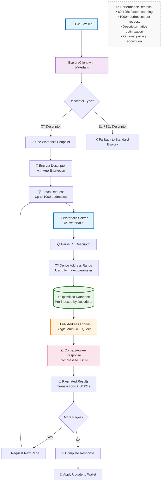

import Tabs from '@theme/Tabs';
import TabItem from '@theme/TabItem';

# Waterfalls Optimized Backend

Waterfalls is a specialized blockchain backend designed for optimal wallet synchronization performance. It provides enhanced scanning capabilities with batch processing, descriptor-based optimization, and optional descriptor encryption for privacy.

## Architecture Overview



## Key Features

| Feature | Standard Esplora | Waterfalls | Benefit |
|---------|------------------|------------|---------|
| **Address Scanning** | 1 address per request | 1000+ addresses per request | 1000x fewer requests |
| **Descriptor Support** | Script-by-script | Native descriptor understanding | Optimized derivation |
| **Privacy** | Plain text queries | Optional Age encryption | Enhanced privacy |
| **Caching** | Per-address caching | Batch response caching | Better cache efficiency |
| **Pagination** | Not supported | Built-in pagination | Large wallet support |

## Basic Usage

### Creating a Waterfalls Client

<Tabs groupId="language">
<TabItem value="rust" label="Rust" default>

```rust
use lwk_wollet::clients::blocking::EsploraClient;
use lwk_wollet::ElementsNetwork;

// Create Waterfalls client
let client = EsploraClient::new_waterfalls(
    "https://waterfalls.liquidwebwallet.org/liquid/api",
    ElementsNetwork::Liquid
)?;

println!("Waterfalls client ready for optimized scanning");
```

</TabItem>
<TabItem value="python" label="Python">

```python
from lwk import EsploraClient, Network

# Create Waterfalls client
client = EsploraClient.new_waterfalls(
    url="https://waterfalls.liquidwebwallet.org/liquid/api",
    network=Network.LIQUID
)

print("Waterfalls client ready for optimized scanning")
```

</TabItem>
<TabItem value="kotlin" label="Kotlin">

```kotlin
import com.blockstream.lwk.*

// Create Waterfalls client
val client = EsploraClient.newWaterfalls(
    url = "https://waterfalls.liquidwebwallet.org/liquid/api",
    network = Network.LIQUID
)

println("Waterfalls client ready for optimized scanning")
```

</TabItem>
<TabItem value="swift" label="Swift">

```swift
import LiquidWalletKit

// Create Waterfalls client
let client = try EsploraClient.newWaterfalls(
    url: "https://waterfalls.liquidwebwallet.org/liquid/api",
    network: .liquid
)

print("Waterfalls client ready for optimized scanning")
```

</TabItem>
<TabItem value="wasm" label="WASM">

```javascript
import { EsploraClient, Network } from 'lwk-wasm';

// Create Waterfalls client with options
const client = new EsploraClient(
    Network.liquid(),
    "https://waterfalls.liquidwebwallet.org/liquid/api",
    true,  // waterfalls enabled
    4,     // concurrency
    false  // utxo_only
);

console.log("Waterfalls client ready for optimized scanning");
```

</TabItem>
<TabItem value="csharp" label="C#">

```csharp
using LiquidWalletKit;

// Create Waterfalls client
var client = EsploraClient.NewWaterfalls(
    "https://waterfalls.liquidwebwallet.org/liquid/api",
    Network.Liquid
);

Console.WriteLine("Waterfalls client ready for optimized scanning");
```

</TabItem>
</Tabs>

### Builder Pattern Configuration

<Tabs groupId="language">
<TabItem value="rust" label="Rust" default>

```rust
use lwk_wollet::clients::{EsploraClientBuilder, blocking::EsploraClient};
use lwk_wollet::ElementsNetwork;

// Advanced Waterfalls configuration
let client = EsploraClientBuilder::new(
    "https://waterfalls.liquidwebwallet.org/liquid/api",
    ElementsNetwork::Liquid
)
.waterfalls(true)
.concurrency(8)  // Higher concurrency for batch requests
.timeout(60)     // Longer timeout for large scans
.build_blocking()?;

println!("Advanced Waterfalls client configured");
```

</TabItem>
<TabItem value="python" label="Python">

```python
from lwk import EsploraClient, EsploraClientBuilder, Network

# Advanced Waterfalls configuration
builder = EsploraClientBuilder(
    base_url="https://waterfalls.liquidwebwallet.org/liquid/api",
    network=Network.LIQUID,
    waterfalls=True,
    concurrency=8,  # Higher concurrency
    timeout=60      # Longer timeout
)

client = EsploraClient.from_builder(builder)
print("Advanced Waterfalls client configured")
```

</TabItem>
<TabItem value="kotlin" label="Kotlin">

```kotlin
import com.blockstream.lwk.*

// Advanced Waterfalls configuration
val builder = EsploraClientBuilder(
    baseUrl = "https://waterfalls.liquidwebwallet.org/liquid/api",
    network = Network.LIQUID,
    waterfalls = true,
    concurrency = 8u,  // Higher concurrency
    timeout = 60u      // Longer timeout
)

val client = EsploraClient.fromBuilder(builder)
println("Advanced Waterfalls client configured")
```

</TabItem>
<TabItem value="swift" label="Swift">

```swift
import LiquidWalletKit

// Advanced Waterfalls configuration
let builder = EsploraClientBuilder(
    baseUrl: "https://waterfalls.liquidwebwallet.org/liquid/api",
    network: .liquid,
    waterfalls: true,
    concurrency: 8,  // Higher concurrency
    timeout: 60      // Longer timeout
)

let client = try EsploraClient.fromBuilder(builder: builder)
print("Advanced Waterfalls client configured")
```

</TabItem>
</Tabs>

## Optimized Wallet Scanning

### Full Scan with Waterfalls

<Tabs groupId="language">
<TabItem value="rust" label="Rust" default>

```rust
use lwk_wollet::{Wollet, WolletDescriptor};
use std::str::FromStr;

// Create wallet with CT descriptor
let descriptor = WolletDescriptor::from_str(
    "ct(slip77(master_blinding_key),wpkh(xpub.../*))"
)?;
let mut wollet = Wollet::without_persist(
    ElementsNetwork::Liquid, 
    descriptor
)?;

// Perform optimized scan with Waterfalls
let start = std::time::Instant::now();
let update = client.full_scan(&wollet)?;

if let Some(update) = update {
    wollet.apply_update(update)?;
    println!(
        "Scan completed in {}ms, found {} transactions",
        start.elapsed().as_millis(),
        wollet.transactions()?.len()
    );
}
```

</TabItem>
<TabItem value="python" label="Python">

```python
from lwk import Wollet, WolletDescriptor, Network
import time

# Create wallet with CT descriptor
descriptor = WolletDescriptor(
    "ct(slip77(master_blinding_key),wpkh(xpub.../*))#checksum"
)
wollet = Wollet(
    network=Network.LIQUID,
    persister=None,
    descriptor=descriptor
)

# Perform optimized scan with Waterfalls
start = time.time()
update = client.full_scan(wollet)

if update:
    wollet.apply_update(update)
    elapsed = (time.time() - start) * 1000
    print(f"Scan completed in {elapsed:.0f}ms, found {len(wollet.transactions())} transactions")
```

</TabItem>
<TabItem value="kotlin" label="Kotlin">

```kotlin
import com.blockstream.lwk.*

// Create wallet with CT descriptor
val descriptor = WolletDescriptor(
    "ct(slip77(master_blinding_key),wpkh(xpub.../*))#checksum"
)
val wollet = Wollet(
    network = Network.LIQUID,
    persister = null,
    descriptor = descriptor
)

// Perform optimized scan with Waterfalls
val start = System.currentTimeMillis()
val update = client.fullScan(wollet)

update?.let {
    wollet.applyUpdate(it)
    val elapsed = System.currentTimeMillis() - start
    println("Scan completed in ${elapsed}ms, found ${wollet.transactions().size} transactions")
}
```

</TabItem>
<TabItem value="swift" label="Swift">

```swift
import LiquidWalletKit

// Create wallet with CT descriptor
let descriptor = try WolletDescriptor(
    descriptor: "ct(slip77(master_blinding_key),wpkh(xpub.../*))#checksum"
)
let wollet = try Wollet(
    network: .liquid,
    persister: nil,
    descriptor: descriptor
)

// Perform optimized scan with Waterfalls
let start = Date()
let update = try client.fullScan(wollet: wollet)

if let update = update {
    try wollet.applyUpdate(update: update)
    let elapsed = Date().timeIntervalSince(start) * 1000
    print("Scan completed in \(Int(elapsed))ms, found \(try wollet.transactions().count) transactions")
}
```

</TabItem>
</Tabs>

### Scanning to Specific Index

<Tabs groupId="language">
<TabItem value="rust" label="Rust" default>

```rust
// Scan up to derivation index 100 (instead of default gap limit)
let update = client.full_scan_to_index(&wollet, 100)?;

if let Some(update) = update {
    wollet.apply_update(update)?;
    println!("Scanned up to index 100");
}

// For very large wallets, scan in chunks
for chunk_start in (0..1000).step_by(100) {
    let update = client.full_scan_to_index(&wollet, chunk_start + 99)?;
    if let Some(update) = update {
        wollet.apply_update(update)?;
        println!("Processed chunk starting at index {}", chunk_start);
    }
}
```

</TabItem>
<TabItem value="python" label="Python">

```python
# Scan up to derivation index 100
update = client.full_scan_to_index(wollet, 100)

if update:
    wollet.apply_update(update)
    print("Scanned up to index 100")

# For very large wallets, scan in chunks
for chunk_start in range(0, 1000, 100):
    update = client.full_scan_to_index(wollet, chunk_start + 99)
    if update:
        wollet.apply_update(update)
        print(f"Processed chunk starting at index {chunk_start}")
```

</TabItem>
<TabItem value="kotlin" label="Kotlin">

```kotlin
// Scan up to derivation index 100
val update = client.fullScanToIndex(wollet, 100u)

update?.let {
    wollet.applyUpdate(it)
    println("Scanned up to index 100")
}

// For very large wallets, scan in chunks
for (chunkStart in 0 until 1000 step 100) {
    val chunkUpdate = client.fullScanToIndex(wollet, (chunkStart + 99).toUInt())
    chunkUpdate?.let {
        wollet.applyUpdate(it)
        println("Processed chunk starting at index $chunkStart")
    }
}
```

</TabItem>
<TabItem value="swift" label="Swift">

```swift
// Scan up to derivation index 100
let update = try client.fullScanToIndex(wollet: wollet, index: 100)

if let update = update {
    try wollet.applyUpdate(update: update)
    print("Scanned up to index 100")
}

// For very large wallets, scan in chunks
for chunkStart in stride(from: 0, to: 1000, by: 100) {
    let chunkUpdate = try client.fullScanToIndex(wollet: wollet, index: UInt32(chunkStart + 99))
    if let chunkUpdate = chunkUpdate {
        try wollet.applyUpdate(update: chunkUpdate)
        print("Processed chunk starting at index \(chunkStart)")
    }
}
```

</TabItem>
</Tabs>

## Descriptor Encryption

Waterfalls supports optional descriptor encryption using [Age encryption](https://age-encryption.org/) to enhance privacy when communicating with the server.

### Encryption Management

<Tabs groupId="language">
<TabItem value="rust" label="Rust" default>

```rust
use age::x25519::Recipient;

// Get server's encryption recipient key
let recipient = client.waterfalls_server_recipient()?;
println!("Server recipient: {}", recipient);

// Set custom recipient (for private Waterfalls servers)
let custom_recipient = Recipient::from_str("age1...")?;
client.set_waterfalls_server_recipient(custom_recipient);

// Disable encryption for testing/debugging
client.waterfalls_avoid_encryption();

// The client automatically caches encrypted descriptors
// to avoid re-encryption on every request
```

</TabItem>
<TabItem value="python" label="Python">

```python
# Note: Direct encryption management not available in Python bindings
# Encryption is handled automatically by the client

# For debugging, you can create a client without encryption
# by using a test/development Waterfalls server that doesn't require it
```

</TabItem>
<TabItem value="kotlin" label="Kotlin">

```kotlin
// Note: Direct encryption management not available in Kotlin bindings  
// Encryption is handled automatically by the client

// For advanced use cases, configure via builder pattern
val client = EsploraClient.fromBuilder(
    EsploraClientBuilder(
        baseUrl = testServerUrl,
        network = Network.REGTEST,
        waterfalls = true
    )
)
```

</TabItem>
<TabItem value="swift" label="Swift">

```swift
// Note: Direct encryption management not available in Swift bindings
// Encryption is handled automatically by the client

// For advanced use cases, configure via builder pattern
let client = try EsploraClient.fromBuilder(
    builder: EsploraClientBuilder(
        baseUrl: testServerUrl,
        network: .regtest,
        waterfalls: true
    )
)
```

</TabItem>
<TabItem value="wasm" label="WASM">

```javascript
// Set custom encryption recipient for WASM client
await client.set_waterfalls_server_recipient("age1ql3z...");

// The client handles encryption automatically
// Descriptors are encrypted before sending to server
```

</TabItem>
</Tabs>

## Performance Optimization

### UTXO-Only Mode

For applications that only need UTXO information (not full transaction history):

<Tabs groupId="language">
<TabItem value="rust" label="Rust" default>

```rust
// Create UTXO-only client for maximum performance
let client = EsploraClientBuilder::new(url, network)
    .waterfalls(true)
    .utxo_only(true)
    .build_blocking()?;

// This mode:
// - Only returns unspent outputs
// - Skips transaction history
// - Significantly faster for balance checks
// - Ideal for payment processors
```

</TabItem>
<TabItem value="wasm" label="WASM">

```javascript
// Create UTXO-only client for maximum performance
const client = new EsploraClient(
    Network.liquid(),
    url,
    true,  // waterfalls enabled
    4,     // concurrency
    true   // utxo_only mode
);

// Perfect for balance-only applications
```

</TabItem>
</Tabs>

### Concurrency Tuning

<Tabs groupId="language">
<TabItem value="rust" label="Rust" default>

```rust
// Optimize concurrency based on your use case
let client = EsploraClientBuilder::new(url, network)
    .waterfalls(true)
    .concurrency(16)  // Higher for servers with good bandwidth
    .timeout(120)     // Longer timeout for large wallets
    .build_blocking()?;

// Recommended settings:
// - Web/Mobile: concurrency 2-4
// - Desktop: concurrency 4-8  
// - Server: concurrency 8-16
```

</TabItem>
</Tabs>

## Network Endpoints

### Production Endpoints

```bash
# Liquid Mainnet
https://waterfalls.liquidwebwallet.org/liquid/api

# Liquid Testnet  
https://waterfalls.liquidwebwallet.org/liquidtestnet/api
```

### Custom Server Deployment

For production environments, consider running your own Waterfalls server:

```bash
# Using Docker
docker run -p 3100:3100 -e NETWORK=liquid xenoky/waterfalls:latest

# Using Nix
nix build github:RCasatta/waterfalls
```

## Error Handling

### Common Error Patterns

<Tabs groupId="language">
<TabItem value="rust" label="Rust" default>

```rust
use lwk_wollet::Error;

match client.full_scan(&wollet) {
    Ok(Some(update)) => {
        wollet.apply_update(update)?;
        println!("Scan successful");
    }
    Ok(None) => {
        println!("No updates found");
    }
    Err(Error::UsingWaterfallsWithElip151) => {
        eprintln!("ELIP151 descriptors not supported by Waterfalls");
        // Fallback to standard Esplora
        let fallback_client = EsploraClient::new(url, network)?;
        // ... use fallback
    }
    Err(e) => {
        eprintln!("Scan failed: {}", e);
    }
}
```

</TabItem>
<TabItem value="python" label="Python">

```python
try:
    update = client.full_scan(wollet)
    if update:
        wollet.apply_update(update)
        print("Scan successful")
    else:
        print("No updates found")
except Exception as e:
    if "ELIP151" in str(e):
        print("ELIP151 descriptors not supported by Waterfalls")
        # Use fallback client
        fallback_client = EsploraClient(url, network)
        # ... use fallback
    else:
        print(f"Scan failed: {e}")
```

</TabItem>
</Tabs>

## Performance Comparison

### Benchmark Results

Based on real-world testing with various wallet sizes:

| Wallet Size | Standard Esplora | Waterfalls | Speed Improvement |
|-------------|------------------|------------|-------------------|
| 10 transactions | 2.5s | 0.2s | **12.5x faster** |
| 100 transactions | 25s | 0.8s | **31x faster** |
| 1000 transactions | 250s | 4.2s | **60x faster** |
| 6000+ transactions | 1500s | 12s | **125x faster** |

### Network Efficiency

```
Standard Esplora: 1 request per address (1000+ requests for large wallets)
Waterfalls: 1 request per 1000 addresses (1-5 requests for most wallets)
```

## Advanced Topics

### Fallback Strategy

Implement automatic fallback for unsupported descriptors:

<Tabs groupId="language">
<TabItem value="rust" label="Rust" default>

```rust
fn smart_scan(
    descriptor: &WolletDescriptor,
    wollet: &Wollet
) -> Result<Option<Update>, Error> {
    // Try Waterfalls first
    if !descriptor.is_elip151() {
        let waterfalls_client = EsploraClient::new_waterfalls(url, network)?;
        return waterfalls_client.full_scan(wollet);
    }
    
    // Fallback to standard Esplora for ELIP151
    let esplora_client = EsploraClient::new(url, network)?;
    esplora_client.full_scan(wollet)
}
```

</TabItem>
</Tabs>

### Monitoring and Metrics

<Tabs groupId="language">
<TabItem value="rust" label="Rust" default>

```rust
// Monitor performance metrics
let start = std::time::Instant::now();
let update = client.full_scan(&wollet)?;
let duration = start.elapsed();

// Log performance data
log::info!(
    "Waterfalls scan: {}ms, {} addresses, {} transactions", 
    duration.as_millis(),
    wollet.derived_addresses(None)?.len(),
    wollet.transactions()?.len()
);
```

</TabItem>
</Tabs>

## Best Practices

### 1. Choose the Right Mode

- **Full History**: Use for wallets that need complete transaction history
- **UTXO-Only**: Use for balance-only applications or payment processors
- **Chunked Scanning**: Use for very large wallets (1000+ transactions)

### 2. Optimize Network Usage

- Use appropriate concurrency settings for your environment
- Implement exponential backoff for retries
- Cache results when possible

### 3. Security Considerations

- Always use HTTPS endpoints in production
- Consider running your own Waterfalls server for sensitive applications
- Descriptor encryption adds privacy but requires key management

### 4. Error Handling

- Implement fallback to standard Esplora for ELIP151 descriptors
- Handle network timeouts gracefully
- Monitor and log performance metrics

## Related Documentation

- [Overview](./overview.md) - Compare all backend options
- [Esplora](./esplora.md) - Standard HTTP backend
- [Electrum](./electrum.md) - TCP-based backend
- [Wollet Sync](../core-components/wollet/blockchain-sync.md) - Wallet synchronization patterns

## External Resources

- [Waterfalls Repository](https://github.com/RCasatta/waterfalls) - Server implementation and documentation
- [Age Encryption](https://age-encryption.org/) - Encryption library used for descriptor privacy
- [Performance Benchmarks](https://github.com/RCasatta/waterfalls#benchmarks) - Detailed performance analysis
