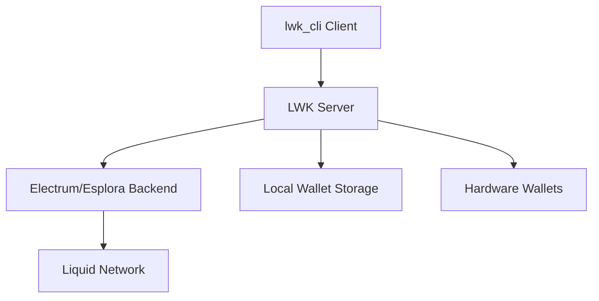

# LWK CLI Overview

The Liquid Wallet Kit command-line interface (`lwk_cli`) provides a comprehensive toolkit for building and managing Liquid wallets through an intuitive command-line interface. It's designed for developers, system administrators, and power users who need programmatic access to Liquid Network functionality.

## Architecture

LWK CLI follows a **client-server architecture** with JSON-RPC communication:



### Core Components

- **Server**: Background daemon handling blockchain communication and wallet state
- **Client**: Command-line interface for user interaction and automation
- **Storage**: Local persistence for wallet descriptors and transaction history
- **Backends**: Electrum or Esplora servers for blockchain data access

## Command Organization

LWK CLI organizes functionality into logical command groups:

### **Server Management**
```bash
lwk_cli server start    # Start the background server
lwk_cli server stop     # Stop the server gracefully
lwk_cli server scan     # Wait for blockchain synchronization
```

### **Signer Operations**
```bash
lwk_cli signer generate      # Create new software signers
lwk_cli signer load-jade     # Connect Jade hardware wallets
lwk_cli signer list          # View loaded signers
lwk_cli signer sign          # Sign PSETs with loaded signers
```

### **Wallet Operations**
```bash
lwk_cli wallet load          # Import wallet descriptors
lwk_cli wallet balance       # Check wallet balances
lwk_cli wallet address       # Generate receive addresses
lwk_cli wallet send          # Create spending transactions
```

### **Asset Management**
```bash
lwk_cli wallet issue         # Issue new Liquid assets
lwk_cli wallet reissue       # Create additional asset units
lwk_cli wallet burn          # Permanently destroy assets
```

## Common Workflows

### **Basic Wallet Setup**
1. Start server: `lwk_cli server start`
2. Generate signer: `lwk_cli signer generate`
3. Load signer: `lwk_cli signer load-software`
4. Create wallet: `lwk_cli wallet multisig-desc`
5. Import wallet: `lwk_cli wallet load`

### **Transaction Flow**
1. Create transaction: `lwk_cli wallet send`
2. Sign PSET: `lwk_cli signer sign`
3. Combine signatures: `lwk_cli wallet combine`
4. Broadcast: `lwk_cli wallet broadcast`

### **Asset Lifecycle**
1. Issue asset: `lwk_cli wallet issue`
2. Distribute: `lwk_cli wallet send`
3. Reissue: `lwk_cli wallet reissue`
4. Burn: `lwk_cli wallet burn`

## Key Features

**🔐 Multi-signature Support**: Create and manage complex multisig policies with hardware and software signers.

**🏭 Asset Management**: Complete lifecycle management for Liquid assets including issuance, reissuance, and burning.

**⚡ Hardware Integration**: Native support for Jade and Ledger hardware wallets with seamless operation.

**🤖 Automation Ready**: JSON output format and scriptable commands for integration with automation systems.

**🔒 Security Focused**: Watch-only wallet architecture with separate signing operations for enhanced security.

## Integration Capabilities

### **Shell Scripting**
```bash
#!/bin/bash
BALANCE=$(lwk_cli wallet balance -w main | jq -r '.balance["144c..."]')
if [ "$BALANCE" -gt 1000000 ]; then
    lwk_cli wallet send -w main --recipient "address:500000:asset"
fi
```

### **System Administration**
- Automated backup procedures
- Monitoring wallet balances
- Batch transaction processing
- Asset management workflows

### **Development Integration**
- CI/CD pipeline integration
- Testing environments
- Wallet provisioning scripts
- Transaction automation

## Getting Started

Ready to dive in? Start with the [Installation Guide](./installation.md) to set up LWK CLI, then explore specific operations:

- [Server Management](./server-management.md) - Starting and configuring the LWK server
- [Signer Operations](./signer-operations.md) - Managing software and hardware signers
- [Wallet Operations](./wallet-operations.md) - Creating and managing wallets
- [Asset Operations](./asset-operations.md) - Complete asset lifecycle management

## Philosophy

LWK CLI is built on the principle that powerful tools should be simple to use. Every command provides clear JSON output, detailed help text, and consistent parameter naming. Whether you're building a simple wallet or managing complex enterprise asset workflows, LWK CLI scales to meet your needs.