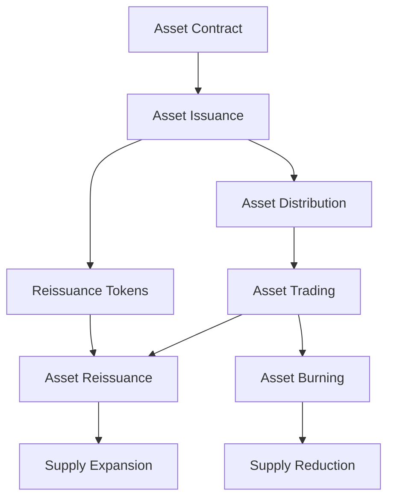

import Tabs from '@theme/Tabs';
import TabItem from '@theme/TabItem';

# Asset Operations

LWK CLI provides comprehensive asset lifecycle management for Liquid Network assets. This guide covers asset issuance, reissuance, burning, and registry management with complete end-to-end workflows.

## Asset Lifecycle Overview



## Asset Contract Creation

### Understanding Asset Contracts

Asset contracts define the metadata and properties of Liquid assets:

```bash
# Create basic asset contract
lwk_cli asset contract \
  --domain "example.com" \
  --issuer-pubkey "020202020202020202020202020202020202020202020202020202020202020202" \
  --name "Example Token" \
  --precision 8 \
  --ticker "EXT"
```

**Example Output**:
```json
{
  "entity": {
    "domain": "example.com"
  },
  "issuer_pubkey": "020202020202020202020202020202020202020202020202020202020202020202",
  "name": "Example Token",
  "precision": 8,
  "ticker": "EXT",
  "version": 0
}
```

### Advanced Contract Features

<Tabs>
<TabItem value="stablecoin" label="Stablecoin Contract" default>

```bash
# Create stablecoin contract
lwk_cli asset contract \
  --domain "stablecorp.com" \
  --issuer-pubkey "03..." \
  --name "Stable Dollar" \
  --ticker "USDS" \
  --precision 2 \
  --category "stablecoin"
```

</TabItem>
<TabItem value="security" label="Security Token">

```bash
# Create security token contract
lwk_cli asset contract \
  --domain "securities.com" \
  --issuer-pubkey "03..." \
  --name "Company Shares" \
  --ticker "COMP" \
  --precision 0 \
  --category "security"
```

</TabItem>
<TabItem value="nft" label="NFT Collection">

```bash
# Create NFT collection contract
lwk_cli asset contract \
  --domain "nftplatform.com" \
  --issuer-pubkey "03..." \
  --name "Digital Art Collection" \
  --ticker "ART" \
  --precision 0 \
  --category "collectible"
```

</TabItem>
</Tabs>

## Asset Issuance

### Basic Asset Issuance

Issue new assets on the Liquid Network:

<Tabs>
<TabItem value="basic" label="Basic Issuance" default>

```bash
# Issue 100 million tokens with 2 reissuance tokens
lwk_cli wallet issue \
  --wallet-name "treasury" \
  --satoshi-asset 10000000000 \
  --satoshi-token 2 \
  --contract '{"entity":{"domain":"example.com"},"issuer_pubkey":"020202...","name":"Example Token","precision":8,"ticker":"EXT","version":0}'
```

**Process Flow**:
1. Creates unsigned PSET for asset issuance
2. Includes asset metadata in transaction
3. Generates reissuance tokens for future supply management
4. Requires multisig signatures before broadcast

</TabItem>
<TabItem value="addresses" label="Custom Addresses">

```bash
# Issue to specific addresses
lwk_cli wallet issue \
  --wallet-name "treasury" \
  --satoshi-asset 10000000000 \
  --address-asset "tlq1qq...asset_receiver" \
  --satoshi-token 1 \
  --address-token "tlq1qq...token_receiver" \
  --contract '{"entity":...}'
```

</TabItem>
<TabItem value="no-reissuance" label="Non-Reissuable">

```bash
# Issue with no reissuance capability
lwk_cli wallet issue \
  --wallet-name "treasury" \
  --satoshi-asset 21000000000000 \
  --satoshi-token 0 \
  --contract '{"name":"Fixed Supply Token","ticker":"FIXED",...}'
```

</TabItem>
</Tabs>

### Complete Issuance Workflow

Step-by-step asset issuance process based on the provided example:

```bash
# Step 1: Start server and set up signers
lwk_cli server start &
lwk_cli signer load-software --signer-name "soft1" --mnemonic "your mnemonic here"
lwk_cli signer load-jade --signer-name "Jade_Orange" --id "your_jade_id"

# Step 2: Create asset contract
lwk_cli asset contract \
  --domain "liquidtestnet.com" \
  --issuer-pubkey "020202020202020202020202020202020202020202020202020202020202020202" \
  --name "StableJuan" \
  --precision 2 \
  --ticker "STJ"

# Step 3: Create unsigned issuance PSET
lwk_cli wallet issue \
  --wallet-name "treasury" \
  --satoshi-asset 100000000 \
  --satoshi-token 2 \
  --contract '{"entity":{"domain":"liquidtestnet.com"},"issuer_pubkey":"020202020202020202020202020202020202020202020202020202020202020202","name":"StableJuan","precision":2,"ticker":"STJ","version":0}'

# Step 4: Inspect the unsigned PSET
lwk_cli wallet pset-details \
  --wallet-name "treasury" \
  --pset "cHNldP8BAgQCAAAAAQQBAQEFAQRPAQQ1h88DV6y9foAA..."

# Step 5: Sign with software signer
lwk_cli signer sign \
  --signer-name "soft1" \
  --pset "cHNldP8BAgQCAAAAAQQBAQEFAQRPAQQ1h88DV6y9foAA..."

# Step 6: Sign with Jade (requires device confirmation)
lwk_cli signer sign \
  --signer-name "Jade_Orange" \
  --pset "cHNldP8BAgQCAAAAAQQBAQEFAQRPAQQ1h88DV6y9f..."

# Step 7: Broadcast the fully signed transaction
lwk_cli wallet broadcast \
  --wallet-name "treasury" \
  --pset "cHNldP8BAgQCAAAAAQQBAQEFAQRPAQQ1h88DV6y9foA..."
```

**Expected Output**:
```json
{
  "txid": "736aa9c7548d243f82716618b367770dbf49051ba1d14cb05c60bace0e7656c0"
}
```

## Asset Reissuance

### Understanding Reissuance

Reissuance allows creating additional units of existing assets using reissuance tokens:

```bash
# Basic reissuance (requires reissuance tokens)
lwk_cli wallet reissue \
  --wallet-name "treasury" \
  --asset "0bb18d8ca2664551993b276d964ac5e50f5f0c7992b0b805b9f655f136fa1172" \
  --satoshi-asset 100000000
```

### Complete Reissuance Workflow

Based on the provided example:

```bash
# Step 1: Check reissuance token balance
lwk_cli wallet balance --wallet-name "treasury"

# Step 2: Create reissuance PSET
lwk_cli wallet reissue \
  --wallet-name "treasury" \
  --asset "0bb18d8ca2664551993b276d964ac5e50f5f0c7992b0b805b9f655f136fa1172" \
  --satoshi-asset 100000000

# Step 3: Inspect reissuance details
lwk_cli wallet pset-details \
  --wallet-name "treasury" \
  --pset "cHNldP8BAgQCAAAAAQQBAgEFAQRPAQQ1h88DV6y9foA..."

# Step 4: Sign with both signers
lwk_cli signer sign \
  --signer-name "soft1" \
  --pset "cHNldP8BAgQCAAAAAQQBAgEFAQR..."

lwk_cli signer sign \
  --signer-name "Jade_Orange" \
  --pset "cHNldP8BAgQCAAAAAQQBAgEFAQR..."

# Step 5: Broadcast reissuance transaction
lwk_cli wallet broadcast \
  --wallet-name "treasury" \
  --pset "cHNldP8BAgQCAAAAAQQBAgEFAQR..."
```

**Expected Output**:
```json
{
  "txid": "029438078c8786af1d62293f09a99380ed3c72f79752856deb15900176c892c3"
}
```

## Asset Burning

### Understanding Asset Burning

Permanently destroy asset units to reduce total supply:

```bash
# Burn 50 million units of an asset
lwk_cli wallet burn \
  --wallet-name "treasury" \
  --asset "0bb18d8ca2664551993b276d964ac5e50f5f0c7992b0b805b9f655f136fa1172" \
  --satoshi-asset 50000000
```

### Complete Burn Workflow

Based on the provided example:

```bash
# Step 1: Check current asset balance
lwk_cli wallet balance --wallet-name "treasury"

# Step 2: Create burn PSET
lwk_cli wallet burn \
  --wallet-name "treasury" \
  --asset "0bb18d8ca2664551993b276d964ac5e50f5f0c7992b0b805b9f655f136fa1172" \
  --satoshi-asset 50000000

# Step 3: Verify burn details
lwk_cli wallet pset-details \
  --wallet-name "treasury" \
  --pset "cHNldP8BAgQCAAAAAQQBAgEFAQRPAQQ1h88DV..."

# Step 4: Sign with required signers
lwk_cli signer sign \
  --signer-name "soft1" \
  --pset "cHNldP8BAgQCAAAAAQQBAgEFAQRPAQQ1h88DV..."

lwk_cli signer sign \
  --signer-name "Jade_Orange" \
  --pset "cHNldP8BAgQCAAAAAQQBAgEFAQRPAQQ1h88DV..."

# Step 5: Broadcast burn transaction
lwk_cli wallet broadcast \
  --wallet-name "treasury" \
  --pset "cHNldP8BAgQCAAAAAQQBAgEFAQRPAQQ1h88DV..."
```

**Expected Output**:
```json
{
  "txid": "59a2b4df9e84a6022c966a08ec4a963600b73498ec976c3cba8f0b3264ceee7a"
}
```

## Asset Registry Management

### Asset Information

Get detailed information about assets:

```bash
# Get asset details
lwk_cli asset details \
  --asset "0bb18d8ca2664551993b276d964ac5e50f5f0c7992b0b805b9f655f136fa1172"

# List all known assets
lwk_cli asset list

# Insert asset metadata manually
lwk_cli asset insert \
  --asset "0bb18d8ca..." \
  --name "Custom Token" \
  --ticker "CUST" \
  --precision 8

# Import from block explorer
lwk_cli asset from-explorer \
  --asset "0bb18d8ca..." \
  --explorer "https://blockstream.info"
```

## Transaction History and Monitoring

### Viewing Transaction Details

Access unblinded transaction URLs:

```bash
# Get wallet transaction history
lwk_cli wallet txs --wallet-name "treasury"

# View specific transaction
lwk_cli wallet tx \
  --wallet-name "treasury" \
  --txid "736aa9c7548d243f82716618b367770dbf49051ba1d14cb05c60bace0e7656c0"
```

**Example unblinded URL output**:
```
"unblinded_url": "https://blockstream.info/liquidtestnet/tx/736aa9c7548d243f82716618b367770dbf49051ba1d14cb05c60bace0e7656c0#blinded=100000,144c654344aa..."
```

## Advanced Operations

### Parallel Signing

Sign PSETs in parallel for efficiency:

```bash
# Create unsigned PSET
UNSIGNED_PSET=$(lwk_cli wallet issue --wallet-name "treasury" --satoshi-asset 100000000 --satoshi-token 2)

# Each signer can sign the original unsigned PSET independently
ALICE_SIGNED=$(lwk_cli signer sign --signer-name "alice" --pset "$UNSIGNED_PSET")
BOB_SIGNED=$(lwk_cli signer sign --signer-name "bob" --pset "$UNSIGNED_PSET")

# Combine signatures
FINAL_PSET=$(lwk_cli wallet combine --wallet-name "treasury" --pset "$ALICE_SIGNED" --pset "$BOB_SIGNED")

# Broadcast combined transaction
lwk_cli wallet broadcast --wallet-name "treasury" --pset "$FINAL_PSET"
```

### Batch Asset Operations

Automate multiple asset operations:

```bash
# Batch issuance script
for token in TOKEN1 TOKEN2 TOKEN3; do
  CONTRACT=$(lwk_cli asset contract --name "$token" --ticker "$token" --precision 8)
  lwk_cli wallet issue --wallet-name "treasury" --satoshi-asset 100000000 --contract "$CONTRACT"
done

# Conditional reissuance based on supply
CURRENT_SUPPLY=$(lwk_cli wallet balance --wallet-name "treasury" | jq -r '.balance["asset_id"]')
if [ "$CURRENT_SUPPLY" -lt 1000000000 ]; then
  lwk_cli wallet reissue --wallet-name "treasury" --asset "asset_id" --satoshi-asset 100000000
fi
```

## Server Management

### Stopping the Server

Always gracefully shutdown when finished:

```bash
# Stop the LWK server
lwk_cli server stop
```

## Troubleshooting

### Common Issues

**Issuance Failures**:
```bash
# Check L-BTC balance for fees
lwk_cli wallet balance --wallet-name "treasury"

# Verify contract format
echo "$CONTRACT" | jq .

# Check server connectivity
lwk_cli server status
```

**Reissuance Problems**:
```bash
# Verify reissuance token ownership
lwk_cli wallet utxos --wallet-name "treasury"

# Check if asset supports reissuance
lwk_cli asset details --asset "asset_id"
```

**Signing Issues**:
```bash
# Check signer availability
lwk_cli signer list

# Verify PSET format
lwk_cli wallet pset-details --wallet-name "treasury" --pset "pset_hex"

# Test hardware wallet connection
lwk_cli signer jade-id  # For Jade
```

## Security Best Practices

### Asset Security

- **Secure Reissuance Tokens**: Store reissuance tokens with the highest security level
- **Multi-signature Requirements**: Use multisig for all asset operations
- **Hardware Wallet Verification**: Always verify transaction details on hardware device screens
- **Contract Verification**: Thoroughly review asset contracts before issuance

### Operational Security

- **Backup Procedures**: Maintain secure backups of wallet descriptors and keys
- **Access Control**: Limit asset operation permissions to authorized personnel
- **Audit Trail**: Keep detailed logs of all asset operations
- **Network Security**: Use secure connections and trusted Electrum/Esplora servers

## Next Steps

With comprehensive asset operations mastered, explore:

1. **[Transaction Operations](./transaction-operations.md)** - Advanced transaction management
2. **[Scripting](./scripting.md)** - Automate asset workflows
3. **Production Deployment** - Scale asset operations for enterprise use

LWK CLI provides enterprise-grade asset management capabilities for the Liquid Network, enabling sophisticated tokenization workflows with security and flexibility.