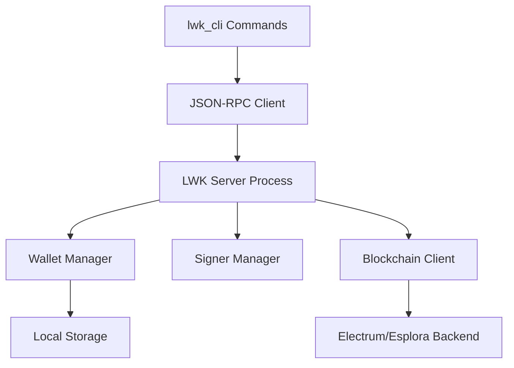

import Tabs from '@theme/Tabs';
import TabItem from '@theme/TabItem';

# LWK Server Management

The LWK CLI operates using a client-server architecture where a background server handles blockchain communication, wallet synchronization, and persistent storage. This guide covers server lifecycle management and configuration.

## Server Architecture



## Basic Server Operations

### Starting the Server

Launch the LWK server daemon:

```bash
# Start server in foreground
lwk_cli server start

# Start server in background
lwk_cli server start &

# Start with custom configuration
lwk_cli server start --electrum-url "ssl://electrum.example.com:50002"
```

**Expected Output**:
```json
{
  "message": "LWK server started successfully",
  "pid": 12345,
  "rpc_port": 3000,
  "electrum_url": "ssl://blockstream.info:995"
}
```

### Server Status and Health

Monitor server status:

```bash
# Check if server is running
lwk_cli server status

# Wait for blockchain synchronization
lwk_cli server scan
```

### Stopping the Server

Gracefully shutdown the server:

```bash
# Stop the server
lwk_cli server stop

# Force stop if unresponsive
killall lwk_app  # Linux/macOS
```

## Configuration Options

### Network Selection

Configure the Liquid network:

<Tabs>
<TabItem value="mainnet" label="Mainnet" default>

```bash
lwk_cli server start --network liquid
```

</TabItem>
<TabItem value="testnet" label="Testnet">

```bash
lwk_cli server start --network liquidtestnet
```

</TabItem>
<TabItem value="regtest" label="Regtest">

```bash
lwk_cli server start --network liquidregtest
```

</TabItem>
</Tabs>

### Blockchain Backend Configuration

Choose your blockchain data source:

<Tabs>
<TabItem value="blockstream" label="Blockstream (Default)" default>

```bash
# Mainnet
lwk_cli server start --electrum-url "ssl://blockstream.info:995"

# Testnet
lwk_cli server start --electrum-url "ssl://blockstream.info:465"
```

</TabItem>
<TabItem value="custom-electrum" label="Custom Electrum">

```bash
# Custom Electrum server
lwk_cli server start --electrum-url "ssl://your-electrum.com:50002"

# Local Electrum server
lwk_cli server start --electrum-url "tcp://localhost:50001"
```

</TabItem>
<TabItem value="esplora" label="Custom Esplora">

```bash
# Custom Esplora instance
lwk_cli server start --esplora-url "https://your-esplora.com/"
```

</TabItem>
</Tabs>

### Data Directory

Specify custom storage location:

```bash
# Custom data directory
lwk_cli server start --datadir "/custom/path/lwk"

# Environment variable
export LWK_DATA_DIR="/custom/path/lwk"
lwk_cli server start
```

### Server Port Configuration

Configure the JSON-RPC server port:

```bash
# Custom port
lwk_cli server start --rpc-port 8080

# Bind to specific interface
lwk_cli server start --rpc-bind "127.0.0.1:3000"
```

## Advanced Configuration

### Production Deployment

For production environments:

```bash
# Production configuration
lwk_cli server start \
  --network liquid \
  --electrum-url "ssl://your-electrum.com:50002" \
  --datadir "/var/lib/lwk" \
  --rpc-bind "127.0.0.1:3000" \
  --log-level info
```

### SSL/TLS Configuration

Configure secure connections:

```bash
# SSL Electrum connection
lwk_cli server start --electrum-url "ssl://electrum.example.com:50002"

# Verify SSL certificates
lwk_cli server start --electrum-url "ssl://electrum.example.com:50002" --validate-ssl
```

### Logging Configuration

Control log output:

```bash
# Set log level
lwk_cli server start --log-level debug

# Log to file
lwk_cli server start --log-file "/var/log/lwk.log"

# JSON structured logging
lwk_cli server start --log-format json
```

## Server Lifecycle Management

### Systemd Service (Linux)

Create a systemd service for automatic startup:

```ini
# /etc/systemd/system/lwk.service
[Unit]
Description=LWK Server
After=network.target

[Service]
Type=simple
User=lwk
WorkingDirectory=/home/lwk
ExecStart=/usr/local/bin/lwk_cli server start --network liquid
Restart=always
RestartSec=5

[Install]
WantedBy=multi-user.target
```

Enable and start the service:

```bash
sudo systemctl enable lwk.service
sudo systemctl start lwk.service
sudo systemctl status lwk.service
```

### Docker Deployment

Run LWK server in Docker:

```dockerfile
FROM rust:1.75 AS builder
RUN cargo install lwk_cli

FROM debian:bookworm-slim
RUN apt-get update && apt-get install -y libudev1 ca-certificates
COPY --from=builder /usr/local/cargo/bin/lwk_cli /usr/local/bin/
EXPOSE 3000
CMD ["lwk_cli", "server", "start", "--rpc-bind", "0.0.0.0:3000"]
```

```bash
# Build and run
docker build -t lwk-server .
docker run -d -p 3000:3000 -v lwk-data:/root/.lwk lwk-server
```

### Process Monitoring

Monitor server health:

```bash
# Check process status
ps aux | grep lwk_app

# Monitor resource usage
top -p $(pgrep lwk_app)

# Check server logs
tail -f ~/.lwk/logs/lwk.log
```

## Synchronization Management

### Initial Sync

Wait for complete blockchain synchronization:

```bash
# Start server and wait for sync
lwk_cli server start &
lwk_cli server scan

# Check sync progress
lwk_cli server status
```

### Periodic Resync

Force wallet resynchronization:

```bash
# Resync all wallets
lwk_cli server scan --force

# Resync specific height range
lwk_cli server scan --from-height 1000000
```

## Troubleshooting

### Common Issues

**Server Won't Start**:
```bash
# Check if port is in use
netstat -tlnp | grep 3000

# Check logs for errors
lwk_cli server start --log-level debug
```

**Connection Issues**:
```bash
# Test Electrum connectivity
telnet blockstream.info 995

# Verify SSL connection
openssl s_client -connect blockstream.info:995
```

**Sync Problems**:
```bash
# Clear cache and resync
rm -rf ~/.lwk/cache
lwk_cli server start
lwk_cli server scan
```

### Performance Tuning

**Memory Optimization**:
```bash
# Limit cache size
lwk_cli server start --cache-size 100MB

# Reduce concurrent connections
lwk_cli server start --max-connections 5
```

**Network Optimization**:
```bash
# Adjust request timeout
lwk_cli server start --timeout 30

# Enable compression
lwk_cli server start --enable-compression
```

## Security Considerations

### Network Security

- Use SSL/TLS connections for Electrum servers
- Bind RPC server to localhost in production
- Consider VPN for remote server access

### Data Security

- Secure the data directory with appropriate permissions
- Regular backups of wallet descriptors
- Monitor access logs for unauthorized activity

### Access Control

```bash
# Restrict file permissions
chmod 700 ~/.lwk
chmod 600 ~/.lwk/wallets/*

# Run as dedicated user
sudo useradd -r -s /bin/false lwk
sudo chown -R lwk:lwk /var/lib/lwk
```

## Next Steps

With the server running, you can proceed to:

1. **[Manage Signers](./signer-operations.md)** - Set up software and hardware signers
2. **[Create Wallets](./wallet-operations.md)** - Import or create wallet descriptors
3. **[Perform Transactions](./transaction-operations.md)** - Send and receive Liquid assets

The LWK server provides the foundation for all wallet operations, ensuring reliable blockchain connectivity and persistent state management.