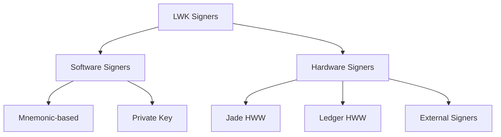

import Tabs from '@theme/Tabs';
import TabItem from '@theme/TabItem';

# Signer Operations

Signers are the cryptographic entities that create digital signatures for transactions. LWK CLI supports both software signers (using mnemonics) and hardware signers (Jade and Ledger devices). This guide covers signer management and usage.

## Signer Types



## Software Signers

### Generating New Signers

Create new software signers with random mnemonics:

```bash
# Generate new mnemonic
lwk_cli signer generate
```

**Example Output**:
```json
{
  "mnemonic": "sheriff pass mechanic old near spring over pioneer rural wealth symptom cook"
}
```

### Loading Software Signers

Import existing mnemonics as named signers:

<Tabs>
<TabItem value="mnemonic" label="From Mnemonic" default>

```bash
# Load signer with name
lwk_cli signer load-software \
  --signer-name "alice" \
  --mnemonic "sheriff pass mechanic old near spring over pioneer rural wealth symptom cook"
```

</TabItem>
<TabItem value="persisted" label="Persisted Signer">

```bash
# Create persisted signer (survives restarts)
lwk_cli signer load-software \
  --signer-name "treasury" \
  --mnemonic "your twelve word mnemonic phrase goes here today example test" \
  --persist
```

</TabItem>
<TabItem value="external" label="External Signer">

```bash
# Load external signer (e.g., from another system)
lwk_cli signer load-external \
  --signer-name "external_alice" \
  --fingerprint "deadbeef"
```

</TabItem>
</Tabs>

### Extracting Public Keys

Get extended public keys (xpubs) for descriptor creation:

```bash
# Get xpub for BIP84 derivation
lwk_cli signer xpub --signer-name "alice" --kind bip84

# Get xpub for BIP87 (multisig)
lwk_cli signer xpub --signer-name "alice" --kind bip87
```

**Example Output**:
```json
{
  "keyorigin_xpub": "[2a0b5159/84h/1h/0h]tpubDDdqx3Ytv8SHAvQYqnh3NgoixyND49wSwcpMiaLMGuGFLC7gUZ4ibabz4R3qtTFYvR3G1n8MxFMtpue1qmKBz4i61J54chUxeTJ9Ma8f16M"
}
```

## Hardware Signers

### Jade Hardware Wallet

Jade is Blockstream's open-source hardware wallet with native Liquid support.

#### Device Discovery

<Tabs>
<TabItem value="usb" label="USB Connection" default>

```bash
# Discover connected Jade devices
lwk_cli signer jade-id

# Unlock and get device ID
lwk_cli signer jade-id --unlock
```

</TabItem>
<TabItem value="serial" label="Serial Connection">

```bash
# Connect via serial port
lwk_cli signer jade-id --serial-port /dev/ttyUSB0

# List available serial ports
ls /dev/ttyUSB* /dev/ttyACM*
```

</TabItem>
<TabItem value="network" label="Network Connection">

```bash
# Connect to networked Jade
lwk_cli signer jade-id --network-address "192.168.1.100:8080"
```

</TabItem>
</Tabs>

#### Loading Jade Signers

```bash
# Load Jade signer
lwk_cli signer load-jade \
  --signer-name "jade_alice" \
  --id "0123456789abcdef" \
  --emulator false
```

#### Jade Multisig Registration

Register multisig policies with Jade for enhanced security:

```bash
# Register 2-of-3 multisig
lwk_cli signer register-multisig \
  --signer-name "jade_alice" \
  --descriptor-name "treasury" \
  --descriptor "ct(slip77(...),elwsh(multi(2,[...]tpub...,[...]tpub...,[...]tpub...)))"
```

### Ledger Hardware Wallet

#### Prerequisites

Ensure Ledger device has:
- Latest firmware installed
- Bitcoin/Elements app installed and open
- Device unlocked and ready

#### Loading Ledger Signers

```bash
# Load Ledger signer
lwk_cli signer load-ledger \
  --signer-name "ledger_bob"

# Load with specific transport
lwk_cli signer load-ledger \
  --signer-name "ledger_bob" \
  --transport tcp://localhost:9999
```

## Signer Management

### Listing Signers

View all loaded signers:

```bash
# List all signers
lwk_cli signer list
```

**Example Output**:
```json
{
  "signers": [
    {
      "fingerprint": "acecd89a",
      "name": "jade_alice",
      "type": "jade"
    },
    {
      "fingerprint": "4fc853a4",
      "name": "software_bob",
      "type": "software"
    }
  ]
}
```

### Signer Details

Get detailed information about a signer:

```bash
# View signer details
lwk_cli signer details --signer-name "alice"
```

**Example Output**:
```json
{
  "name": "alice",
  "fingerprint": "2a0b5159",
  "type": "software",
  "derivation_paths": {
    "bip84": "m/84'/1'/0'",
    "bip87": "m/87'/1'/0'"
  },
  "loaded_at": "2024-01-15T10:30:00Z"
}
```

### Unloading Signers

Remove signers from memory:

```bash
# Unload specific signer
lwk_cli signer unload --signer-name "alice"

# Unload all signers
lwk_cli signer unload --all
```

## Signing Operations

### PSET Signing

Sign Partially Signed Elements Transactions (PSETs):

<Tabs>
<TabItem value="basic" label="Basic Signing" default>

```bash
# Sign PSET with software signer
lwk_cli signer sign \
  --signer-name "alice" \
  --pset "cHNldP8BAgQCAAAAAQQBAQEFAQRPAQQ1h88DV6y9foAA..."
```

</TabItem>
<TabItem value="hardware" label="Hardware Signing">

```bash
# Sign PSET with Jade (requires device confirmation)
lwk_cli signer sign \
  --signer-name "jade_alice" \
  --pset "cHNldP8BAgQCAAAAAQQBAQEFAQRPAQQ1h88DV6y9foAA..."

# Sign with registered multisig policy
lwk_cli signer sign \
  --signer-name "jade_alice" \
  --pset "cHNldP8BAgQCAAAAAQQBAQEFAQRPAQQ1h88DV6y9foAA..." \
  --registered-descriptor "treasury"
```

</TabItem>
<TabItem value="file" label="File-based Signing">

```bash
# Sign PSET from file
lwk_cli signer sign \
  --signer-name "alice" \
  --pset-file "transaction.pset" \
  --output-file "signed_transaction.pset"
```

</TabItem>
</Tabs>

### Batch Signing

Sign multiple PSETs efficiently:

```bash
# Sign multiple PSETs
for pset in *.pset; do
  lwk_cli signer sign \
    --signer-name "alice" \
    --pset-file "$pset" \
    --output-file "signed_$pset"
done
```

## Descriptor Creation

### Single-signature Descriptors

Create descriptors for single-signature wallets:

```bash
# Generate singlesig descriptor
lwk_cli signer singlesig-desc \
  --signer-name "alice" \
  --descriptor-blinding-key slip77 \
  --kind wpkh
```

### Multi-signature Descriptors

Create multisig descriptors from multiple signers:

<Tabs>
<TabItem value="2of2" label="2-of-2 Multisig" default>

```bash
# Create 2-of-2 multisig descriptor
lwk_cli wallet multisig-desc \
  --descriptor-blinding-key slip77 \
  --kind wsh \
  --threshold 2 \
  --keyorigin-xpub "[2a0b5159/84h/1h/0h]tpubDD..." \
  --keyorigin-xpub "[6295429d/84h/1h/0h]tpubDD..."
```

</TabItem>
<TabItem value="2of3" label="2-of-3 Multisig">

```bash
# Create 2-of-3 multisig descriptor
lwk_cli wallet multisig-desc \
  --descriptor-blinding-key slip77 \
  --kind wsh \
  --threshold 2 \
  --keyorigin-xpub "[alice/84h/1h/0h]tpub..." \
  --keyorigin-xpub "[bob/84h/1h/0h]tpub..." \
  --keyorigin-xpub "[charlie/84h/1h/0h]tpub..."
```

</TabItem>
<TabItem value="enterprise" label="Enterprise 3-of-5">

```bash
# Create enterprise 3-of-5 multisig
lwk_cli wallet multisig-desc \
  --descriptor-blinding-key elip151 \
  --kind wsh \
  --threshold 3 \
  --keyorigin-xpub "[ceo/87h/1h/0h]tpub..." \
  --keyorigin-xpub "[cto/87h/1h/0h]tpub..." \
  --keyorigin-xpub "[cfo/87h/1h/0h]tpub..." \
  --keyorigin-xpub "[hsm1/87h/1h/0h]tpub..." \
  --keyorigin-xpub "[hsm2/87h/1h/0h]tpub..."
```

</TabItem>
</Tabs>

## Security Best Practices

### Software Signer Security

**Mnemonic Storage**:
- Store mnemonics securely (encrypted storage, password managers)
- Never transmit mnemonics over insecure channels
- Use strong passphrases for additional protection

**Environment Security**:
```bash
# Use secure memory for sensitive operations
export MLOCK_SECRETS=1
lwk_cli signer generate

# Clear shell history after operations
history -d $(history 1)
```

### Hardware Signer Security

**Device Verification**:
- Always verify transaction details on device screen
- Confirm addresses and amounts before signing
- Use genuine hardware wallets from trusted sources

**Firmware Updates**:
```bash
# Check Jade firmware version
lwk_cli signer details --signer-name "jade_alice"

# Update firmware through Jade companion app
```

### Operational Security

**Key Rotation**:
```bash
# Generate new signers periodically
lwk_cli signer generate
lwk_cli signer load-software --signer-name "alice_v2" --mnemonic "..."

# Migrate to new multisig descriptor
lwk_cli wallet multisig-desc --threshold 2 --keyorigin-xpub "..." --keyorigin-xpub "..."
```

**Access Control**:
- Limit signer access to authorized personnel
- Use hardware signers for high-value operations
- Implement approval workflows for critical transactions

## Troubleshooting

### Hardware Wallet Issues

**Jade Connection Problems**:
```bash
# Check USB permissions
ls -la /dev/ttyUSB* /dev/ttyACM*
sudo usermod -a -G dialout $USER

# Test connection
lwk_cli signer jade-id --debug
```

**Ledger Connection Issues**:
```bash
# Check Ledger app status
lwk_cli signer details --signer-name "ledger_bob"

# Restart Ledger transport
sudo systemctl restart ledger-transport
```

### Software Signer Issues

**Mnemonic Import Errors**:
```bash
# Validate mnemonic format
echo "your mnemonic words here" | wc -w  # Should be 12, 15, 18, 21, or 24

# Test mnemonic validity
lwk_cli signer generate --validate-mnemonic "your mnemonic here"
```

**Permission Errors**:
```bash
# Fix data directory permissions
chmod 700 ~/.lwk
chmod 600 ~/.lwk/signers/*
```

## Next Steps

With signers configured, you can:

1. **[Create Wallets](./wallet-operations.md)** - Use signers to create wallet descriptors
2. **[Perform Transactions](./transaction-operations.md)** - Sign and broadcast transactions
3. **[Manage Assets](./asset-operations.md)** - Issue and manage Liquid assets

Signers form the foundation of wallet security in LWK, providing the cryptographic capabilities needed for secure Liquid Network operations.