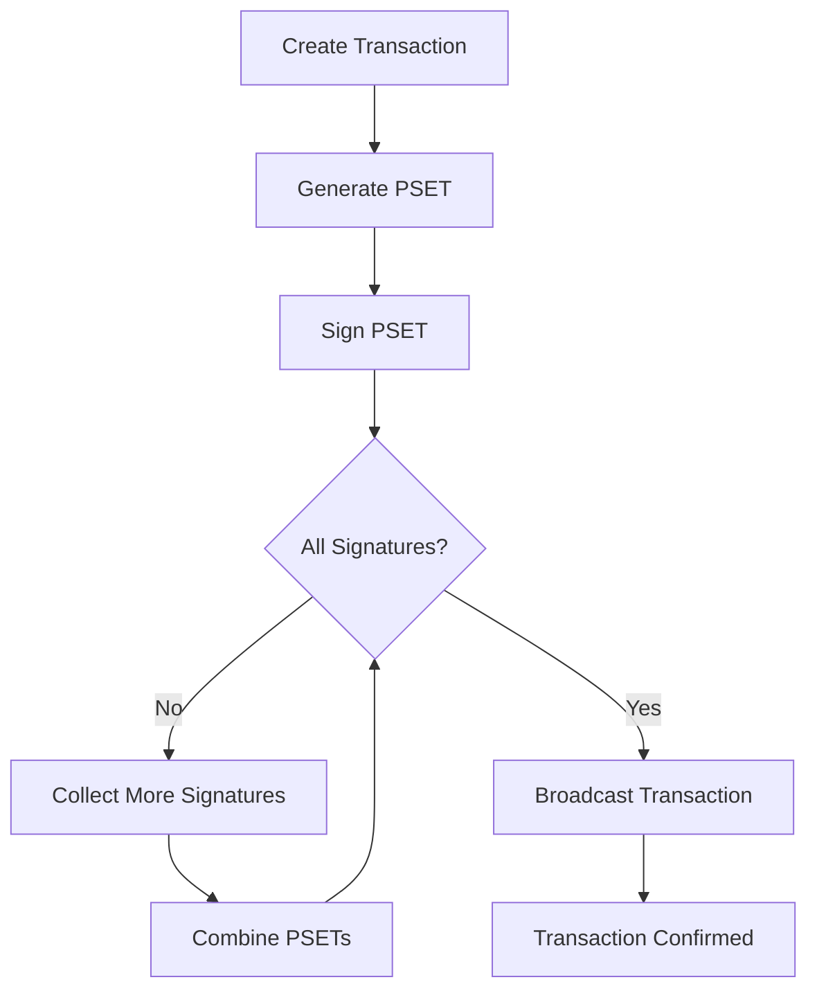

import Tabs from '@theme/Tabs';
import TabItem from '@theme/TabItem';

# Transaction Operations

This guide covers advanced transaction operations in LWK CLI, including sending assets, creating complex transactions, and managing PSETs (Partially Signed Elements Transactions).

## Basic Transaction Flow



## Sending Assets

### Basic Asset Transfers

Send L-BTC and custom assets between addresses:

<Tabs>
<TabItem value="lbtc" label="L-BTC Transfer" default>

```bash
# Send L-BTC to another address
lwk_cli wallet send \
  --wallet-name "treasury" \
  --recipient "tlq1qq...receiver:50000000:144c654344aa716d6f3abcc1ca90e5641e4e2a7f633bc09fe3baf64585819a49"
```

</TabItem>
<TabItem value="custom" label="Custom Asset">

```bash
# Send custom asset
lwk_cli wallet send \
  --wallet-name "treasury" \
  --recipient "tlq1qq...receiver:1000000:0bb18d8ca2664551993b276d964ac5e50f5f0c7992b0b805b9f655f136fa1172"
```

</TabItem>
<TabItem value="multiple" label="Multiple Assets">

```bash
# Send multiple assets in one transaction
lwk_cli wallet send \
  --wallet-name "treasury" \
  --recipient "addr1:50000000:lbtc_asset_id" \
  --recipient "addr2:1000000:custom_asset_id" \
  --recipient "addr3:500:token_asset_id"
```

</TabItem>
</Tabs>

### Complete Transaction Workflow

Step-by-step transaction creation and signing:

```bash
# Step 1: Create unsigned transaction
PSET=$(lwk_cli wallet send \
  --wallet-name "treasury" \
  --recipient "tlq1qqd4er47y4kh4gc2vc6lfh45ead5h89tuxdxglgwdlek5lg8renysvzmvh0zq5gg3l39rvzffqp56lcks5tykkfm4x8p5mwzfh:50000000:144c654344aa716d6f3abcc1ca90e5641e4e2a7f633bc09fe3baf64585819a49")

# Step 2: Inspect transaction details
lwk_cli wallet pset-details \
  --wallet-name "treasury" \
  --pset "$PSET"

# Step 3: Sign with first signer
SIGNED1=$(lwk_cli signer sign \
  --signer-name "alice" \
  --pset "$PSET")

# Step 4: Sign with second signer  
SIGNED2=$(lwk_cli signer sign \
  --signer-name "bob" \
  --pset "$SIGNED1")

# Step 5: Broadcast completed transaction
TXID=$(lwk_cli wallet broadcast \
  --wallet-name "treasury" \
  --pset "$SIGNED2")

echo "Transaction broadcast: $TXID"
```

## PSET Management

### PSET Inspection

Analyze transaction details before signing:

```bash
# Get comprehensive PSET details
lwk_cli wallet pset-details \
  --wallet-name "treasury" \
  --pset "cHNldP8BAgQCAAAAAQQBAQEFAQRPAQQ1h88DV6y9foAA..."
```

**Example Output**:
```json
{
  "balance": {
    "144c654344aa716d6f3abcc1ca90e5641e4e2a7f633bc09fe3baf64585819a49": -50000047
  },
  "fee": 47,
  "has_signatures_from": [],
  "missing_signatures_from": [
    {
      "fingerprint": "4fc853a4",
      "name": "alice"
    },
    {
      "fingerprint": "acecd89a", 
      "name": "bob"
    }
  ],
  "issuances": [],
  "reissuances": [],
  "warnings": ""
}
```

### PSET Combining

Merge multiple signed PSETs:

<Tabs>
<TabItem value="sequential" label="Sequential Signing" default>

```bash
# Sequential signing (signer receives previous signatures)
UNSIGNED=$(lwk_cli wallet send --wallet-name "treasury" --recipient "...")
ALICE_SIGNED=$(lwk_cli signer sign --signer-name "alice" --pset "$UNSIGNED")
FULLY_SIGNED=$(lwk_cli signer sign --signer-name "bob" --pset "$ALICE_SIGNED")
```

</TabItem>
<TabItem value="parallel" label="Parallel Signing">

```bash
# Parallel signing (each signer signs original PSET)
UNSIGNED=$(lwk_cli wallet send --wallet-name "treasury" --recipient "...")
ALICE_SIGNED=$(lwk_cli signer sign --signer-name "alice" --pset "$UNSIGNED")
BOB_SIGNED=$(lwk_cli signer sign --signer-name "bob" --pset "$UNSIGNED")

# Combine independently signed PSETs
COMBINED=$(lwk_cli wallet combine \
  --wallet-name "treasury" \
  --pset "$ALICE_SIGNED" \
  --pset "$BOB_SIGNED")
```

</TabItem>
</Tabs>

## Advanced Transaction Types

### Drain Transactions

Send all available funds to a single address:

```bash
# Drain all L-BTC from wallet
lwk_cli wallet drain \
  --wallet-name "treasury" \
  --address "tlq1qq...destination"

# Drain specific asset
lwk_cli wallet drain \
  --wallet-name "treasury" \
  --address "tlq1qq...destination" \
  --asset "0bb18d8ca..."
```

### Fee Management

Control transaction fees:

<Tabs>
<TabItem value="automatic" label="Automatic Fees" default>

```bash
# Use automatic fee estimation
lwk_cli wallet send \
  --wallet-name "treasury" \
  --recipient "address:amount:asset" \
  --fee-rate auto
```

</TabItem>
<TabItem value="custom" label="Custom Fee Rate">

```bash
# Set specific fee rate (sat/vB)
lwk_cli wallet send \
  --wallet-name "treasury" \
  --recipient "address:amount:asset" \
  --fee-rate 100
```

</TabItem>
<TabItem value="absolute" label="Absolute Fee">

```bash
# Set absolute fee amount
lwk_cli wallet send \
  --wallet-name "treasury" \
  --recipient "address:amount:asset" \
  --absolute-fee 500
```

</TabItem>
</Tabs>

### Coin Selection

Control which UTXOs to spend:

```bash
# Automatic coin selection (default)
lwk_cli wallet send \
  --wallet-name "treasury" \
  --recipient "address:amount:asset"

# Manual UTXO selection
lwk_cli wallet send \
  --wallet-name "treasury" \
  --recipient "address:amount:asset" \
  --utxo "txid:vout" \
  --utxo "txid2:vout2"

# Spend all UTXOs (useful for consolidation)
lwk_cli wallet send \
  --wallet-name "treasury" \
  --recipient "address:amount:asset" \
  --spend-all-utxos
```

## Transaction Monitoring

### Transaction Status

Monitor transaction confirmation:

```bash
# Check transaction status
lwk_cli wallet tx \
  --wallet-name "treasury" \
  --txid "736aa9c7548d243f82716618b367770dbf49051ba1d14cb05c60bace0e7656c0"

# List recent transactions
lwk_cli wallet txs \
  --wallet-name "treasury" \
  --limit 10

# Get unconfirmed transactions
lwk_cli wallet txs \
  --wallet-name "treasury" \
  --unconfirmed-only
```

### Transaction Memos

Add metadata to transactions:

```bash
# Set transaction memo
lwk_cli wallet set-tx-memo \
  --wallet-name "treasury" \
  --txid "736aa9c7..." \
  --memo "Payment to supplier #1001"

# Set address memo for future reference
lwk_cli wallet set-addr-memo \
  --wallet-name "treasury" \
  --address "tlq1qq..." \
  --memo "Customer deposit address - Company ABC"
```

## Batch Operations

### Multiple Recipients

Send to multiple addresses efficiently:

```bash
# Batch payments in single transaction
lwk_cli wallet send \
  --wallet-name "treasury" \
  --recipient "customer1:1000000:asset_id" \
  --recipient "customer2:2000000:asset_id" \
  --recipient "customer3:1500000:asset_id" \
  --recipient "change_addr:remaining:asset_id"
```

### Scripted Transactions

Automate transaction workflows:

```bash
#!/bin/bash
# Batch payment script

WALLET="treasury"
ASSET_ID="0bb18d8ca2664551993b276d964ac5e50f5f0c7992b0b805b9f655f136fa1172"

# Read payment list from file
while IFS=',' read -r address amount memo; do
  echo "Processing payment: $address - $amount - $memo"
  
  # Create transaction
  PSET=$(lwk_cli wallet send \
    --wallet-name "$WALLET" \
    --recipient "$address:$amount:$ASSET_ID")
  
  # Sign transaction (assuming automated signing setup)
  SIGNED=$(lwk_cli signer sign --signer-name "auto_signer" --pset "$PSET")
  
  # Broadcast
  TXID=$(lwk_cli wallet broadcast --wallet-name "$WALLET" --pset "$SIGNED")
  
  # Add memo
  lwk_cli wallet set-tx-memo \
    --wallet-name "$WALLET" \
    --txid "$TXID" \
    --memo "$memo"
    
  echo "Payment completed: $TXID"
  sleep 5  # Rate limiting
done < payments.csv
```

## Error Handling

### Common Transaction Errors

**Insufficient Balance**:
```bash
# Check available balance
lwk_cli wallet balance --wallet-name "treasury"

# Check specific asset balance
lwk_cli wallet balance \
  --wallet-name "treasury" \
  --asset "asset_id"
```

**Invalid Address**:
```bash
# Validate address format
lwk_cli wallet validate-address \
  --address "tlq1qq..."

# Check address network compatibility
lwk_cli wallet address-info \
  --address "tlq1qq..."
```

**UTXO Conflicts**:
```bash
# Check UTXO availability
lwk_cli wallet utxos --wallet-name "treasury"

# Sync wallet to latest state
lwk_cli wallet sync --wallet-name "treasury"
```

### Transaction Recovery

**Failed Broadcasts**:
```bash
# Retry broadcast with different server
lwk_cli wallet broadcast \
  --wallet-name "treasury" \
  --pset "$SIGNED_PSET" \
  --force

# Check mempool status
lwk_cli wallet tx-status \
  --wallet-name "treasury" \
  --txid "$TXID"
```

**Stuck Transactions**:
```bash
# Create replacement transaction with higher fee
lwk_cli wallet send \
  --wallet-name "treasury" \
  --recipient "same_recipient:same_amount:asset" \
  --fee-rate 200 \
  --replace-txid "$STUCK_TXID"
```

## Security Considerations

### Transaction Security

**Amount Verification**:
- Always verify amounts on hardware wallet screens
- Double-check asset IDs before signing
- Confirm recipient addresses independently

**PSET Handling**:
```bash
# Verify PSET integrity before signing
lwk_cli wallet pset-details \
  --wallet-name "treasury" \
  --pset "$PSET" \
  --verify-integrity

# Check for suspicious outputs
lwk_cli wallet pset-details \
  --wallet-name "treasury" \
  --pset "$PSET" \
  --highlight-warnings
```

### Privacy Protection

**Address Management**:
```bash
# Generate fresh addresses for each transaction
lwk_cli wallet address \
  --wallet-name "treasury" \
  --index new

# Avoid address reuse
lwk_cli wallet set-policy \
  --wallet-name "treasury" \
  --prevent-address-reuse
```

**Confidential Transactions**:
- All Liquid transactions are confidential by default
- Amounts and asset types are hidden from public view
- Only wallet owners can see unblinded transaction details

## Performance Optimization

### Batch Processing

```bash
# Process multiple transactions efficiently
for payment in $(cat payment_queue.txt); do
  lwk_cli wallet send \
    --wallet-name "treasury" \
    --recipient "$payment" \
    --async
done

# Wait for all transactions to complete
lwk_cli wallet wait-for-completion --wallet-name "treasury"
```

### Resource Management

```bash
# Limit concurrent operations
lwk_cli wallet set-limits \
  --wallet-name "treasury" \
  --max-concurrent-tx 5 \
  --memory-limit 100MB

# Clean up old PSETs
lwk_cli wallet cleanup \
  --wallet-name "treasury" \
  --remove-old-psets \
  --older-than "7d"
```

## Integration Examples

### API Integration

```bash
# REST API wrapper
curl -X POST http://localhost:3000/wallet/send \
  -H "Content-Type: application/json" \
  -d '{
    "wallet_name": "treasury",
    "recipients": [
      {
        "address": "tlq1qq...",
        "amount": 1000000,
        "asset": "asset_id"
      }
    ]
  }'
```

### Webhook Notifications

```bash
# Set up transaction notifications
lwk_cli wallet set-webhook \
  --wallet-name "treasury" \
  --url "https://api.example.com/webhook" \
  --events "tx_confirmed,tx_failed"
```

## Next Steps

With advanced transaction operations mastered:

1. **[Scripting](./scripting.md)** - Automate complex workflows
2. **[Troubleshooting](./troubleshooting.md)** - Resolve common issues
3. **Production Deployment** - Scale for enterprise use

Transaction operations form the core of Liquid Network interactions, providing secure and efficient value transfer with privacy protection.