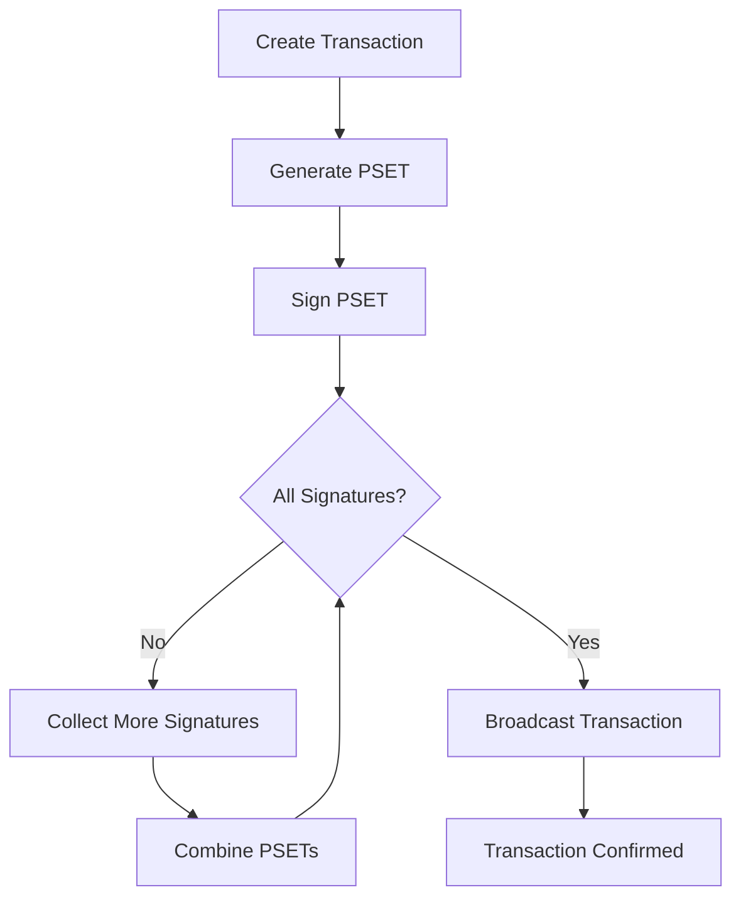

import Tabs from '@theme/Tabs';
import TabItem from '@theme/TabItem';

# Transaction Operations

This guide covers advanced transaction operations in LWK CLI, including sending assets, creating complex transactions, and managing PSETs (Partially Signed Elements Transactions).

## Basic Transaction Flow


```mermaid
graph TB
    A[Create Transaction] --> B[Generate PSET]
    B --> C[Sign PSET]
    C --> D{All Signatures?}
    D -->|No| E[Collect More Signatures]
    E --> F[Combine PSETs]
    F --> D
    D -->|Yes| G[Broadcast Transaction]
    G --> H[Transaction Confirmed]
```

## Sending Assets

### Basic Asset Transfers

Send L-BTC and custom assets between addresses:

<Tabs>
<TabItem value="lbtc" label="L-BTC Transfer" default>

```bash
# Send L-BTC to another address
lwk_cli wallet send \
  --wallet "treasury" \
  --recipient "tlq1qq...receiver:50000000:144c654344aa716d6f3abcc1ca90e5641e4e2a7f633bc09fe3baf64585819a49"
```

</TabItem>
<TabItem value="custom" label="Custom Asset">

```bash
# Send custom asset
lwk_cli wallet send \
  --wallet "treasury" \
  --recipient "tlq1qq...receiver:1000000:0bb18d8ca2664551993b276d964ac5e50f5f0c7992b0b805b9f655f136fa1172"
```

</TabItem>
<TabItem value="multiple" label="Multiple Assets">

```bash
# Send multiple assets in one transaction
lwk_cli wallet send \
  --wallet "treasury" \
  --recipient "addr1:50000000:lbtc_asset_id" \
  --recipient "addr2:1000000:custom_asset_id" \
  --recipient "addr3:500:token_asset_id"
```

</TabItem>
</Tabs>

### Complete Transaction Workflow

Step-by-step transaction creation and signing:

```bash
# Step 1: Create unsigned transaction
PSET=$(lwk_cli wallet send \
  --wallet "treasury" \
  --recipient "tlq1qqd4er47y4kh4gc2vc6lfh45ead5h89tuxdxglgwdlek5lg8renysvzmvh0zq5gg3l39rvzffqp56lcks5tykkfm4x8p5mwzfh:50000000:144c654344aa716d6f3abcc1ca90e5641e4e2a7f633bc09fe3baf64585819a49")

# Step 2: Inspect transaction details
lwk_cli wallet pset-details \
  --wallet "treasury" \
  --pset "$PSET"

# Step 3: Sign with first signer
SIGNED1=$(lwk_cli signer sign \
  --signer "alice" \
  --pset "$PSET")

# Step 4: Sign with second signer  
SIGNED2=$(lwk_cli signer sign \
  --signer "bob" \
  --pset "$SIGNED1")

# Step 5: Broadcast completed transaction
TXID=$(lwk_cli wallet broadcast \
  --wallet "treasury" \
  --pset "$SIGNED2")

echo "Transaction broadcast: $TXID"
```

## PSET Management

### PSET Inspection

Analyze transaction details before signing:

```bash
# Get comprehensive PSET details
lwk_cli wallet pset-details \
  --wallet "treasury" \
  --pset "cHNldP8BAgQCAAAAAQQBAQEFAQRPAQQ1h88DV6y9foAA..."

# Get PSET details with asset tickers for readability
lwk_cli wallet pset-details \
  --wallet "treasury" \
  --pset "cHNldP8BAgQCAAAAAQQBAQEFAQRPAQQ1h88DV6y9foAA..." \
  --with-tickers
```

**Example Output**:
```json
{
  "balance": {
    "144c654344aa716d6f3abcc1ca90e5641e4e2a7f633bc09fe3baf64585819a49": -50000047
  },
  "fee": 47,
  "has_signatures_from": [],
  "missing_signatures_from": [
    {
      "fingerprint": "4fc853a4",
      "name": "alice"
    },
    {
      "fingerprint": "acecd89a", 
      "name": "bob"
    }
  ],
  "issuances": [],
  "reissuances": [],
  "warnings": ""
}
```

### PSET Combining

Merge multiple signed PSETs:

<Tabs>
<TabItem value="sequential" label="Sequential Signing" default>

```bash
# Sequential signing (signer receives previous signatures)
UNSIGNED=$(lwk_cli wallet send --wallet "treasury" --recipient "...")
ALICE_SIGNED=$(lwk_cli signer sign --signer "alice" --pset "$UNSIGNED")
FULLY_SIGNED=$(lwk_cli signer sign --signer "bob" --pset "$ALICE_SIGNED")
```

</TabItem>
<TabItem value="parallel" label="Parallel Signing">

```bash
# Parallel signing (each signer signs original PSET)
UNSIGNED=$(lwk_cli wallet send --wallet "treasury" --recipient "...")
ALICE_SIGNED=$(lwk_cli signer sign --signer "alice" --pset "$UNSIGNED")
BOB_SIGNED=$(lwk_cli signer sign --signer "bob" --pset "$UNSIGNED")

# Combine independently signed PSETs
COMBINED=$(lwk_cli wallet combine \
  --wallet "treasury" \
  --pset "$ALICE_SIGNED" \
  --pset "$BOB_SIGNED")
```

</TabItem>
</Tabs>

## Advanced Transaction Types

### Drain Transactions

Send all available funds to a single address:

```bash
# Drain all L-BTC from wallet
lwk_cli wallet drain \
  --wallet "treasury" \
  --address "tlq1qq...destination"
```

### Fee Management

Control transaction fees:

<Tabs>
<TabItem value="automatic" label="Automatic Fees" default>

```bash
# Use automatic fee estimation
lwk_cli wallet send \
  --wallet-name "treasury" \
  --recipient "address:amount:asset" \
  --fee-rate auto
```

</TabItem>
<TabItem value="custom" label="Custom Fee Rate">

```bash
# Set specific fee rate (sat/vB)
lwk_cli wallet send \
  --wallet-name "treasury" \
  --recipient "address:amount:asset" \
  --fee-rate 100
```

</TabItem>
<TabItem value="absolute" label="Absolute Fee">

```bash
# Set absolute fee amount
lwk_cli wallet send \
  --wallet-name "treasury" \
  --recipient "address:amount:asset" \
  --absolute-fee 500
```

</TabItem>
</Tabs>

### Coin Selection

Control which UTXOs to spend:

```bash
# Automatic coin selection (default)
lwk_cli wallet send \
  --wallet-name "treasury" \
  --recipient "address:amount:asset"

# Manual UTXO selection
lwk_cli wallet send \
  --wallet-name "treasury" \
  --recipient "address:amount:asset" \
  --utxo "txid:vout" \
  --utxo "txid2:vout2"

# Spend all UTXOs (useful for consolidation)
lwk_cli wallet send \
  --wallet-name "treasury" \
  --recipient "address:amount:asset" \
  --spend-all-utxos
```

## Transaction Monitoring

### Transaction Status

Monitor transaction confirmation:

```bash
# Check transaction status
lwk_cli wallet tx \
  --wallet-name "treasury" \
  --txid "736aa9c7548d243f82716618b367770dbf49051ba1d14cb05c60bace0e7656c0"

# List recent transactions
lwk_cli wallet txs \
  --wallet-name "treasury" \
  --limit 10

# Get unconfirmed transactions
lwk_cli wallet txs \
  --wallet-name "treasury" \
  --unconfirmed-only
```

## Liquidex Operations

LWK CLI supports Liquidex, a protocol for peer-to-peer atomic swaps on the Liquid Network.

### Making Liquidex Proposals

Create proposals to trade specific UTXOs for other assets:

```bash
# Make a Liquidex proposal to trade UTXO for another asset
lwk_cli liquidex make \
  --wallet "treasury" \
  --txid "736aa9c7548d243f82716618b367770dbf49051ba1d14cb05c60bace0e7656c0" \
  --vout 0 \
  --asset "144c654344aa716d6f3abcc1ca90e5641e4e2a7f633bc09fe3baf64585819a49" \
  --satoshi 50000000
```

**Example Output**:
```json
{
  "proposal": "liquidex_proposal_data_here...",
  "expiry": "2024-01-15T12:00:00Z"
}
```

### Taking Liquidex Proposals

Accept and complete Liquidex proposals:

```bash
# Take a Liquidex proposal
lwk_cli liquidex take \
  --wallet "treasury" \
  --proposal "liquidex_proposal_data_here..."
```

### Converting PSETs to Proposals

Convert existing PSETs to Liquidex proposals:

```bash
# Convert PSET to Liquidex proposal
lwk_cli liquidex to-proposal \
  --pset "cHNldP8BAgQCAAAAAQQBAQEFAQRPAQQ1h88DV6y9foAA..."
```

## AMP2 Operations

AMP2 (Asset Management Platform 2) provides enhanced custody and compliance features.

### Creating AMP2 Descriptors

Generate wallet descriptors compatible with AMP2:

```bash
# Create AMP2 wallet descriptor
lwk_cli amp2 descriptor \
  --signer "alice"
```

### Registering with AMP2 Server

Register wallets with AMP2 for cosigning services:

```bash
# Register wallet with AMP2 server
lwk_cli amp2 register \
  --signer "alice"
```

### AMP2 Cosigning

Request AMP2 server to cosign transactions:

```bash
# Request AMP2 cosigning
lwk_cli amp2 cosign \
  --pset "cHNldP8BAgQCAAAAAQQBAQEFAQRPAQQ1h88DV6y9foAA..."
```

**Example Output**:
```json
{
  "cosigned_pset": "cHNldP8BAgQCAAAAAQQBAQEFAQRPAQQ1h88DV6y9foAA...",
  "status": "approved",
  "compliance_checks": "passed"
}
```

## Next Steps

With advanced transaction operations mastered:

1. **[Scripting](./scripting.md)** - Automate complex workflows
2. **[Troubleshooting](./troubleshooting.md)** - Resolve common issues
3. **Production Deployment** - Scale for enterprise use

Transaction operations form the core of Liquid Network interactions, providing secure and efficient value transfer with privacy protection.