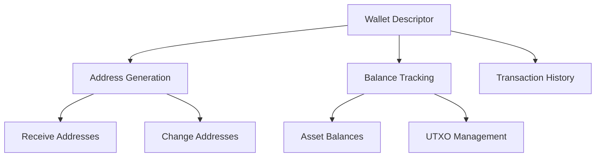

import Tabs from '@theme/Tabs';
import TabItem from '@theme/TabItem';

# Wallet Operations

LWK CLI provides comprehensive wallet management capabilities for Liquid Network wallets. This guide covers wallet creation, management, and basic operations including receiving funds and checking balances.

## Wallet Concepts


```mermaid
graph TB
    A[Wallet Descriptor] --> B[Address Generation]
    A --> C[Balance Tracking]
    A --> D[Transaction History]
    B --> E[Receive Addresses]
    B --> F[Change Addresses]
    C --> G[Asset Balances]
    C --> H[UTXO Management]
```

### Descriptor-Based Wallets

LWK uses descriptors to define wallet policies:

- **Single-signature**: `ct(slip77(...),wpkh(xpub...))`
- **Multi-signature**: `ct(slip77(...),wsh(multi(2,xpub1,xpub2)))`
- **Complex scripts**: Custom spending conditions and covenants

## Wallet Creation

### Creating Multisig Descriptors

Generate multisig wallet descriptors from signer xpubs:

<Tabs>
<TabItem value="2of2" label="2-of-2 Setup" default>

```bash
# Step 1: Get xpubs from both signers
lwk_cli signer xpub --signer-name "alice" --kind bip84
lwk_cli signer xpub --signer-name "bob" --kind bip84

# Step 2: Create 2-of-2 descriptor
lwk_cli wallet multisig-desc \
  --descriptor-blinding-key slip77 \
  --kind wsh \
  --threshold 2 \
  --keyorigin-xpub "[2a0b5159/84h/1h/0h]tpubDDdqx3Ytv8SHAvQYqnh3NgoixyND49wSwcpMiaLMGuGFLC7gUZ4ibabz4R3qtTFYvR3G1n8MxFMtpue1qmKBz4i61J54chUxeTJ9Ma8f16M" \
  --keyorigin-xpub "[6295429d/84h/1h/0h]tpubDDm7RGVu5vLmSfT5tq7gJx6KsYk9Veg6Ytvj3MNL1jTpPFjvM6j185YjXRvgET6owS6PSSkmStHb5bTjCwBMtTH2zp6WrGyN2S3rjbSzuYn"
```

**Example Output**:
```json
{
  "descriptor": "ct(slip77(9c8e4f05c7711a9c7cae0e6a6cc4f72e75e2def2cecc7c8e6e6ba5c34e8c4e0f),elwsh(multi(2,[2a0b5159/84h/1h/0h]tpubDDdqx3Ytv8SHAvQYqnh3NgoixyND49wSwcpMiaLMGuGFLC7gUZ4ibabz4R3qtTFYvR3G1n8MxFMtpue1qmKBz4i61J54chUxeTJ9Ma8f16M/<0;1>/*,[6295429d/84h/1h/0h]tpubDDm7RGVu5vLmSfT5tq7gJx6KsYk9Veg6Ytvj3MNL1jTpPFjvM6j185YjXRvgET6owS6PSSkmStHb5bTjCwBMtTH2zp6WrGyN2S3rjbSzuYn/<0;1>/*)))"
}
```

</TabItem>
<TabItem value="2of3" label="2-of-3 Setup">

```bash
# Create 2-of-3 multisig descriptor
lwk_cli wallet multisig-desc \
  --descriptor-blinding-key slip77 \
  --kind wsh \
  --threshold 2 \
  --keyorigin-xpub "[alice/84h/1h/0h]tpub..." \
  --keyorigin-xpub "[bob/84h/1h/0h]tpub..." \
  --keyorigin-xpub "[charlie/84h/1h/0h]tpub..."
```

</TabItem>
<TabItem value="enterprise" label="Enterprise 3-of-5">

```bash
# Create enterprise-grade 3-of-5 multisig
lwk_cli wallet multisig-desc \
  --descriptor-blinding-key elip151 \
  --kind wsh \
  --threshold 3 \
  --keyorigin-xpub "[ceo/87h/1h/0h]tpub..." \
  --keyorigin-xpub "[cto/87h/1h/0h]tpub..." \
  --keyorigin-xpub "[cfo/87h/1h/0h]tpub..." \
  --keyorigin-xpub "[hsm1/87h/1h/0h]tpub..." \
  --keyorigin-xpub "[hsm2/87h/1h/0h]tpub..."
```

</TabItem>
</Tabs>

### Loading Wallets

Import wallet descriptors into LWK:

<Tabs>
<TabItem value="basic" label="Basic Loading" default>

```bash
# Load wallet with descriptor
lwk_cli wallet load \
  --wallet "treasury" \
  --descriptor "ct(slip77(...),elwsh(multi(2,[...]tpub.../<0;1>/*,[...]tpub.../<0;1>/*)))"
```

</TabItem>
<TabItem value="file" label="From File">

```bash
# Load descriptor from file
echo "ct(slip77(...),elwsh(multi(2,...)))" > treasury.desc
lwk_cli wallet load \
  --wallet "treasury" \
  --descriptor "$(cat treasury.desc)"
```

</TabItem>
<TabItem value="persistent" label="Persistent Loading">

```bash
# Load wallet (wallets are automatically persisted)
lwk_cli wallet load \
  --wallet "treasury" \
  --descriptor "ct(...)"
```

</TabItem>
</Tabs>

## Wallet Management

### Listing Wallets

View all loaded wallets:

```bash
# List all wallets
lwk_cli wallet list
```

**Example Output**:
```json
{
  "wallets": [
    {
      "name": "treasury",
      "descriptor": "ct(slip77(...),elwsh(multi(2,...)))",
      "network": "liquidtestnet",
      "loaded_at": "2024-01-15T10:30:00Z"
    },
    {
      "name": "personal",
      "descriptor": "ct(slip77(...),wpkh(...))",
      "network": "liquidtestnet",
      "loaded_at": "2024-01-15T11:00:00Z"
    }
  ]
}
```

### Wallet Details

Get comprehensive wallet information:

```bash
# Get wallet details
lwk_cli wallet details --wallet "treasury"
```

**Example Output**:
```json
{
  "name": "treasury",
  "descriptor": "ct(slip77(...),elwsh(multi(2,...)))",
  "network": "liquidtestnet",
  "policy": {
    "type": "multisig",
    "threshold": 2,
    "participants": 2
  },
  "derivation": {
    "external": "m/0/*",
    "internal": "m/1/*"
  },
  "sync_height": 1814044,
  "last_sync": "2024-01-15T15:30:00Z"
}
```

### Unloading Wallets

Remove wallets from memory:

```bash
# Unload specific wallet
lwk_cli wallet unload --wallet "treasury"
```

## Address Management

### Generating Receive Addresses

Create addresses for receiving funds:

<Tabs>
<TabItem value="basic" label="Next Address" default>

```bash
# Get next receive address
lwk_cli wallet address --wallet "treasury"
```

**Example Output**:
```json
{
  "address": "tlq1qqvexwnnwkessvc5xukhytv7we5p0td4fsyx7e2lpfm7s7evrmcwcxwawvmrkjpc38uqa650ds5vxkmgu7gq93lnv5dcyx895pwxwg0andrnpr40e42mt",
  "index": 0,
  "derivation_path": "m/0/0"
}
```

</TabItem>
<TabItem value="specific" label="Specific Index">

```bash
# Get address at specific index
lwk_cli wallet address \
  --wallet "treasury" \
  --index 5
```

</TabItem>
<TabItem value="batch" label="Batch Generation">

```bash
# Generate multiple addresses
for i in {0..9}; do
  lwk_cli wallet address \
    --wallet "treasury" \
    --index $i
done
```

</TabItem>
</Tabs>

### Address Validation

Verify address ownership and properties:

```bash
# Validate address belongs to wallet
lwk_cli wallet validate-address \
  --wallet-name "treasury" \
  --address "tlq1qq..."

# Get address information
lwk_cli wallet address-info \
  --address "tlq1qq..."
```

## Balance Management

### Checking Balances

View wallet asset balances:

<Tabs>
<TabItem value="all" label="All Assets" default>

```bash
# Get complete balance information (raw asset IDs)
lwk_cli wallet balance --wallet "treasury"

# Get balance with asset tickers for readability
lwk_cli wallet balance --wallet "treasury" --with-tickers
```

**Example Output (without tickers)**:
```json
{
  "balance": {
    "144c654344aa716d6f3abcc1ca90e5641e4e2a7f633bc09fe3baf64585819a49": 1000000,
    "0bb18d8ca2664551993b276d964ac5e50f5f0c7992b0b805b9f655f136fa1172": 200000000
  }
}
```

**Example Output (with tickers)**:
```json
{
  "balance": {
    "L-BTC": 1000000,
    "STJ": 200000000
  }
}
```

</TabItem>
<TabItem value="specific" label="Specific Asset">

```bash
# Get balance with tickers (asset names)
lwk_cli wallet balance \
  --wallet "treasury" \
  --with-tickers
```

</TabItem>
<TabItem value="formatted" label="Human Readable">

```bash
# Get balance with tickers for readable output
lwk_cli wallet balance \
  --wallet "treasury" \
  --with-tickers
```

**Example Output**:
```
L-BTC: 0.01000000 (1,000,000 sats)
STJ: 2,000,000.00 (200,000,000 units)
```

</TabItem>
</Tabs>

### UTXO Management

View and manage unspent transaction outputs:

```bash
# List all UTXOs
lwk_cli wallet utxos --wallet "treasury"
```

**Example UTXO Output**:
```json
{
  "utxos": [
    {
      "txid": "736aa9c7548d243f82716618b367770dbf49051ba1d14cb05c60bace0e7656c0",
      "vout": 0,
      "asset": "144c654344aa716d6f3abcc1ca90e5641e4e2a7f633bc09fe3baf64585819a49",
      "value": 1000000,
      "address": "tlq1qqvexwnnwkessvc5xukhytv7we5p0td4f...",
      "derivation_path": "m/0/0",
      "confirmations": 6
    }
  ]
}
```

## Transaction History

### Viewing Transactions

Access wallet transaction history:

<Tabs>
<TabItem value="all" label="All Transactions" default>

```bash
# Get complete transaction history
lwk_cli wallet txs --wallet "treasury"
```

</TabItem>
<TabItem value="recent" label="Recent Transactions">

```bash
# Get transactions with tickers for readability
lwk_cli wallet txs \
  --wallet "treasury" \
  --with-tickers
```

</TabItem>
<TabItem value="detailed" label="Detailed View">

```bash
# Get specific transaction details
lwk_cli wallet tx \
  --wallet "treasury" \
  --txid "736aa9c7548d243f82716618b367770dbf49051ba1d14cb05c60bace0e7656c0"

# Get transaction from explorer if not in wallet
lwk_cli wallet tx \
  --wallet "treasury" \
  --txid "736aa9c7548d243f82716618b367770dbf49051ba1d14cb05c60bace0e7656c0" \
  --from-explorer
```

</TabItem>
</Tabs>

### Transaction Memos

Add and manage transaction annotations:

```bash
# Set transaction memo
lwk_cli wallet set-tx-memo \
  --wallet "treasury" \
  --txid "736aa9c7..." \
  --memo "Asset issuance for Q1 2024"

# Set address memo
lwk_cli wallet set-addr-memo \
  --wallet "treasury" \
  --address "tlq1qq..." \
  --memo "Customer deposit address #1001"
```

## Synchronization

### Manual Sync

Force wallet synchronization with blockchain:

```bash
# Sync specific wallet
lwk_cli wallet sync --wallet-name "treasury"

# Sync all wallets
lwk_cli wallet sync --all

# Sync from specific height
lwk_cli wallet sync \
  --wallet-name "treasury" \
  --from-height 1814000
```

### Automatic Sync

Configure automatic synchronization:

```bash
# Enable auto-sync (background)
lwk_cli wallet sync \
  --wallet-name "treasury" \
  --auto \
  --interval 60  # Every 60 seconds
```

## Next Steps

With wallets configured and funded, you can proceed to:

1. **[Transaction Operations](./transaction-operations.md)** - Send and receive payments
2. **[Asset Operations](./asset-operations.md)** - Manage Liquid asset lifecycle
3. **[Scripting](./scripting.md)** - Automate wallet operations

Wallet operations form the foundation of all Liquid Network activities, providing secure storage and management for your digital assets.