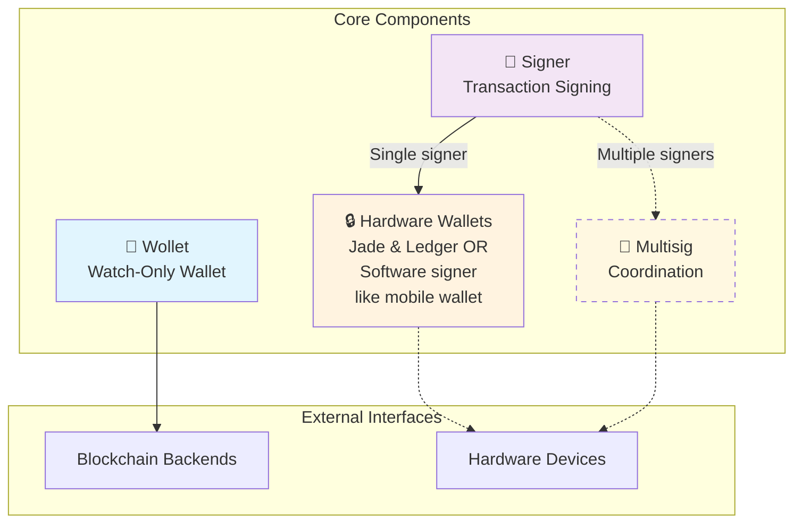
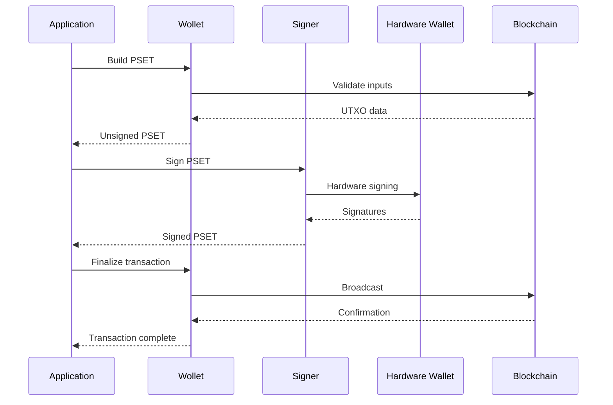

import Tabs from '@theme/Tabs';
import TabItem from '@theme/TabItem';

# Core Components Overview

LWK's modular architecture is built around three essential core components that work together to provide comprehensive Liquid wallet functionality. Each component serves a specific purpose while maintaining clear interfaces for seamless integration.

## Component Architecture

```mermaid
graph TB
    subgraph "Core Components"
        WOLLET[📱 Wollet<br/>Watch-Only Wallet]
        SIGNER[🔐 Signer<br/>Transaction Signing]
        HW[🔒 Hardware Wallets<br/>Jade & Ledger OR<br/>Software signer<br/>like mobile wallet]
        MULTISIG[👥 Multisig<br/>Coordination]
    end
    
    subgraph "External Interfaces"
        BLOCKCHAIN[Blockchain Backends]
        DEVICES[Hardware Devices]
    end
    
    SIGNER -->|Single signer| HW
    SIGNER -.->|Multiple signers| MULTISIG
    HW -.-> DEVICES
    MULTISIG -.-> DEVICES
    WOLLET --> BLOCKCHAIN
    
    style WOLLET fill:#e1f5fe
    style SIGNER fill:#f3e5f5
    style HW fill:#fff3e0
    style MULTISIG stroke-dasharray: 5 5,fill:#fff8e1
```

## Component Responsibilities

### [Wollet - Watch-Only Wallet](./wollet/README.md)

The foundational component for wallet operations, handling everything except private keys.

**Primary Use Cases:**
- Descriptor-based wallet creation and management
- Address generation and derivation
- Balance tracking across all assets
- Transaction building and PSET creation
- Blockchain synchronization via Electrum/Esplora

### [Signer - Transaction Signing](./signer/README.md)

Unified abstraction layer for all signing operations, supporting both software and hardware signers.

**Primary Use Cases:**
- Software signer with BIP39 mnemonic support
- Hardware wallet integration (Jade, Ledger)
- PSET-based transaction signing
- Multi-signature coordination
- Key derivation and management

### [Hardware Wallets - Secure Signing](./hardware-wallets/README.md)

Enterprise-grade security through dedicated hardware devices with comprehensive Liquid support.

**Primary Use Cases:**
- Jade and Ledger device integration
- Secure transaction signing with user confirmation
- Multisig wallet registration
- Address verification on device
- Asset operation support

## Integration Patterns

### Complete Wallet Workflow

Here's how the components work together in a typical wallet operation:

```mermaid
sequenceDiagram
    participant App as Application
    participant Wollet
    participant Signer
    participant HW as Hardware Wallet
    participant Blockchain

    App->>Wollet: Build PSET
    Wollet->>Blockchain: Validate inputs
    Blockchain-->>Wollet: UTXO data
    Wollet-->>App: Unsigned PSET
    App->>Signer: Sign PSET
    Signer->>HW: Hardware signing
    HW-->>Signer: Signatures
    Signer-->>App: Signed PSET
    App->>Wollet: Finalize transaction
    Wollet->>Blockchain: Broadcast
    Blockchain-->>Wollet: Confirmation
    Wollet-->>App: Transaction complete
```

## Next Steps

Now let's dive into the details of each component:

- **[Wollet Basics](./wollet/README.md)** - Learn watch-only wallet fundamentals
- **[Signer Setup](./signer/README.md)** - Understand signing architecture  
- **[Hardware Integration](./hardware-wallets/README.md)** - Add secure hardware wallet support