import Tabs from '@theme/Tabs';
import TabItem from '@theme/TabItem';

# Core Components Overview

LWK's modular architecture is built around three essential core components that work together to provide comprehensive Liquid wallet functionality. Each component serves a specific purpose while maintaining clear interfaces for seamless integration.

## Component Architecture

```mermaid
graph TB
    subgraph "Core Components"
        WOLLET[📱 Wollet<br/>Watch-Only Wallet]
        SIGNER[🔐 Signer<br/>Transaction Signing]
        HW[🔒 Hardware Wallets<br/>Jade & Ledger]
    end
    
    subgraph "External Interfaces"
        BLOCKCHAIN[Blockchain Backends]
        DEVICES[Hardware Devices]
    end
    
    SIGNER --> HW
    HW --> DEVICES
    WOLLET --> BLOCKCHAIN
    
    style WOLLET fill:#e1f5fe
    style SIGNER fill:#f3e5f5
    style HW fill:#fff3e0
```



## Component Responsibilities

### [📱 Wollet - Watch-Only Wallet](./wollet/README.md)

The foundational component for wallet operations, handling everything except private keys.

**Key Responsibilities:**
- Descriptor-based wallet creation and management
- Address generation and derivation
- Balance tracking across all assets
- Transaction building and PSET creation
- Blockchain synchronization via Electrum/Esplora

**Primary Use Cases:**
- Creating wallets from CT descriptors
- Generating addresses for receiving funds
- Monitoring wallet balances and transaction history
- Building transactions for various operations

### [🔐 Signer - Transaction Signing](./signer/README.md)

Unified abstraction layer for all signing operations, supporting both software and hardware signers.

**Key Responsibilities:**
- Software signer with BIP39 mnemonic support
- Hardware wallet integration (Jade, Ledger)
- PSET-based transaction signing
- Multi-signature coordination
- Key derivation and management

**Primary Use Cases:**
- Signing transactions with software keys
- Coordinating hardware wallet signing
- Managing multisig signing workflows
- Deriving extended public keys

### [🔒 Hardware Wallets - Secure Signing](./hardware-wallets/README.md)

Enterprise-grade security through dedicated hardware devices with comprehensive Liquid support.

**Key Responsibilities:**
- Jade and Ledger device integration
- Secure transaction signing with user confirmation
- Multisig wallet registration
- Address verification on device
- Asset operation support

**Primary Use Cases:**
- Production-grade transaction signing
- Multisig wallet setup and coordination
- Address verification for enhanced security
- Asset issuance and management operations

## Integration Patterns

### Complete Wallet Workflow

Here's how the components work together in a typical wallet operation:


### Development Workflow

**1. Start with Wollet**

<Tabs groupId="language">
<TabItem value="rust" label="Rust" default>

```rust
// Create and sync a watch-only wallet
let wollet = Wollet::new(network, persister, descriptor)?;
let update = electrum_client.full_scan(&wollet, 20, 20)?;
wollet.apply_update(update)?;
```

</TabItem>
<TabItem value="python" label="Python">

```python
# Create and sync a watch-only wallet
wollet = Wollet(network, persister, descriptor)
update = electrum_client.full_scan(wollet, 20, 20)
wollet.apply_update(update)
```

</TabItem>
<TabItem value="kotlin" label="Kotlin">

```kotlin
// Create and sync a watch-only wallet
val wollet = Wollet(network, persister, descriptor)
val update = electrumClient.fullScan(wollet, 20, 20)
wollet.applyUpdate(update)
```

</TabItem>
<TabItem value="swift" label="Swift">

```swift
// Create and sync a watch-only wallet
let wollet = try Wollet(network: network, persister: persister, descriptor: descriptor)
let update = try electrumClient.fullScan(wollet: wollet, stopGap: 20, batchSize: 20)
try wollet.applyUpdate(update: update)
```

</TabItem>
</Tabs>

**2. Add Signing Capability**

<Tabs groupId="language">
<TabItem value="rust" label="Rust" default>

```rust
// Create signer for transaction signing
let signer = SwSigner::generate(is_mainnet, 0)?;
let any_signer = AnySigner::Software(signer);
```

</TabItem>
<TabItem value="python" label="Python">

```python
# Create signer for transaction signing
signer = SwSigner.generate(is_mainnet, 0)
any_signer = AnySigner.software(signer)
```

</TabItem>
<TabItem value="kotlin" label="Kotlin">

```kotlin
// Create signer for transaction signing
val signer = SwSigner.generate(isMainnet, 0)
val anySigner = AnySigner.Software(signer)
```

</TabItem>
<TabItem value="swift" label="Swift">

```swift
// Create signer for transaction signing
let signer = try SwSigner.generate(isMainnet: isMainnet, wordCount: 0)
let anySigner = AnySigner.software(signer)
```

</TabItem>
</Tabs>

**3. Build and Sign Transactions**

<Tabs groupId="language">
<TabItem value="rust" label="Rust" default>

```rust
// Build transaction with wollet, sign with signer
let mut pset = TxBuilder::new().finish(&wollet)?;
let signed_inputs = any_signer.sign(&mut pset)?;
```

</TabItem>
<TabItem value="python" label="Python">

```python
# Build transaction with wollet, sign with signer
pset = TxBuilder().finish(wollet)
signed_inputs = any_signer.sign(pset)
```

</TabItem>
<TabItem value="kotlin" label="Kotlin">

```kotlin
// Build transaction with wollet, sign with signer
val pset = TxBuilder().finish(wollet)
val signedInputs = anySigner.sign(pset)
```

</TabItem>
<TabItem value="swift" label="Swift">

```swift
// Build transaction with wollet, sign with signer
let pset = try TxBuilder().finish(wollet: wollet)
let signedInputs = try anySigner.sign(pset: pset)
```

</TabItem>
</Tabs>

## Language Binding Support

All core components are available through LWK's multi-language bindings:

| Component | Rust | Python | Kotlin | Swift | C# | WebAssembly |
|-----------|------|--------|--------|-------|----|----|
| **Wollet** | ✅ | ✅ | ✅ | ✅ | ✅ | ✅ |
| **Signer** | ✅ | ✅ | ✅ | ✅ | ✅ | ✅ |
| **Hardware Wallets** | ✅ | ✅ | ✅ | ✅ | ⚠️ | ❌ |
**Legend**: ✅ Full Support, ⚠️ Limited Support, ❌ Not Available

## Deployment Scenarios

### Mobile Applications

**Recommended Components**: Wollet + Signer + Hardware Wallets
- Use bindings for native mobile development
- Hardware wallet support for enhanced security
- Direct blockchain communication via Electrum

### Web Applications

**Recommended Components**: WebAssembly Wollet + Signer
- WebAssembly bindings for client-side functionality
- Hardware wallet support via WebHID/WebUSB
- Direct blockchain communication

### Desktop Applications

**Recommended Components**: All Components
- Full feature set including hardware wallet support
- Direct access to all LWK functionality
- Comprehensive hardware wallet integration

### Server/Exchange Integration

**Recommended Components**: Wollet + Signer + Hardware Wallets
- Server-side wallet management
- Automated transaction processing
- Hardware wallet support for critical operations

## Security Considerations

### Component Isolation

Each component maintains security boundaries:

- **Wollet**: Watch-only, no private key exposure
- **Signer**: Isolated key management with secure interfaces
- **Hardware Wallets**: Air-gapped private key storage

### Best Practices

1. **Development**: Use software signers for testing
2. **Production**: Deploy hardware wallets for signing
3. **Multi-sig**: Combine multiple signer types
4. **Validation**: Always validate transactions before signing

## Error Handling

Each component provides comprehensive error handling:

- **Wollet**: Descriptor parsing, network, and synchronization errors
- **Signer**: Key derivation, signing, and hardware communication errors
- **Hardware Wallets**: Device connection, authentication, and operation errors

## Performance Characteristics

| Component | Initialization | Operation Speed | Memory Usage | Network Usage |
|-----------|---------------|-----------------|--------------|---------------|
| **Wollet** | Fast | Very Fast | Low | Moderate |
| **Signer** | Fast | Fast | Low | None |
| **Hardware Wallets** | Slow | Slow | Low | None |

## Next Steps

### Getting Started
1. **[Wollet Basics](./wollet/README.md)** - Learn wallet fundamentals
2. **[Signer Setup](./signer/README.md)** - Understand signing architecture
3. **[Hardware Integration](./hardware-wallets/README.md)** - Add hardware wallet support

### Advanced Topics
- **[Multisig Workflows](../multisig/README.md)** - Complex signing scenarios
- **[Asset Operations](../assets/README.md)** - Liquid asset management
- **[Custom Integrations](../tutorials/README.md)** - Build custom applications

### Integration Examples
- **[Exchange Integration](../tutorials/exchange-integration.md)** - Server-side integration
- **[Mobile Wallet](../tutorials/mobile-wallet.md)** - Client-side application
- **[Hardware Workflow](../tutorials/hardware-integration.md)** - Secure signing setup