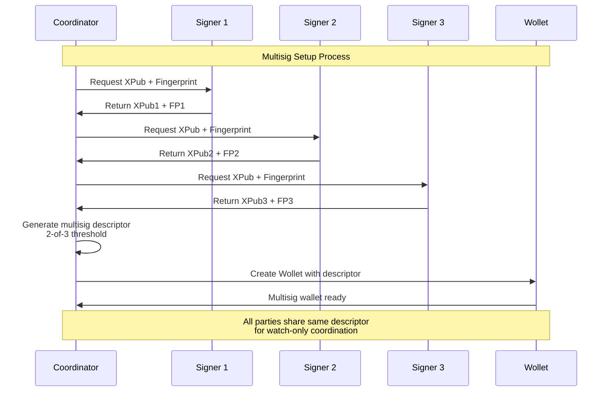
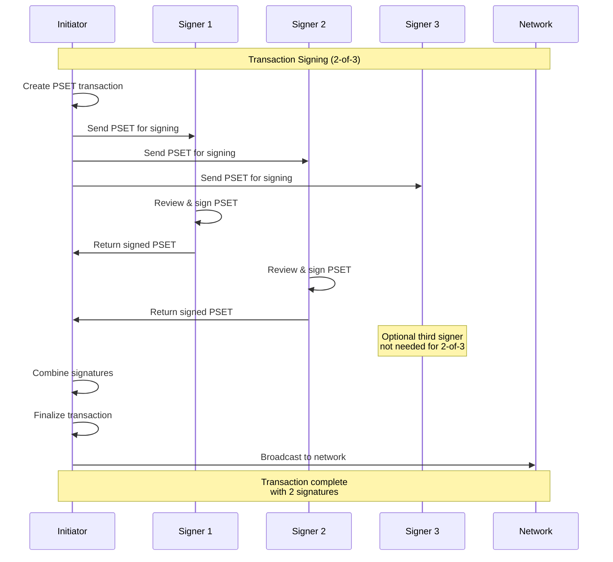

import Tabs from '@theme/Tabs';
import TabItem from '@theme/TabItem';

# Multisig Wallets in LWK

Multisig (M-of-N) wallets require multiple signatures to authorize transactions, providing enhanced security and distributed control. LWK supports multisig wallets with software and hardware signers, maintaining Liquid's confidential transaction privacy.

## Multisig Setup Flow

The multisig setup process involves three main phases:

1. **XPub Collection**: Each participant generates and shares their extended public key
2. **Descriptor Creation**: Combine XPubs into a standardized multisig descriptor  
3. **Wallet Initialization**: Create watch-only wallets using the shared descriptor

## Multisig Transaction Signing

Once the multisig wallet is set up, the signing process follows a coordinated workflow:

## Key Considerations

- **Security Model**: Each signer independently validates transactions before signing. No single party can authorize transactions alone when threshold > 1.

- **Coordination**: PSETs serve as the communication medium between signers. They can be transmitted via any secure channel (encrypted messaging, secure storage, etc.).

- **Hardware Integration**: Hardware wallets must register multisig policies before they can sign transactions. This is a one-time setup per wallet.

- **Confidential Transactions**: All multisig transactions maintain Liquid's privacy features - amounts and asset types remain confidential to outside observers.