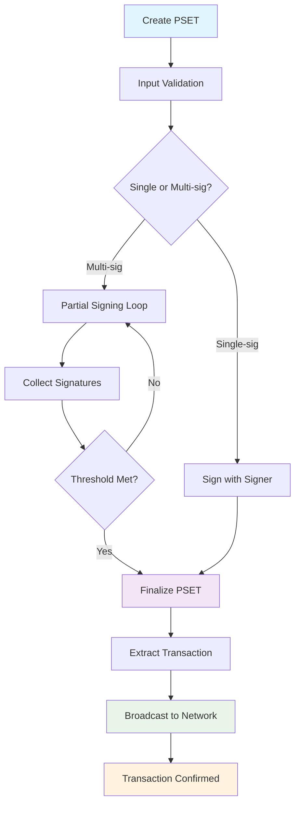

import Tabs from '@theme/Tabs';
import TabItem from '@theme/TabItem';

# Step-by-Step Signing Process

The complete PSET signing workflow involves validation, signature generation, finalization, and broadcasting. This process supports both single-signature and multi-signature scenarios.

## Signing Process Overview



## PSET Creation to Finalization

### 1. PSET Creation

<Tabs groupId="language">
<TabItem value="rust" label="Rust" default>

```rust
// Build PSET with TxBuilder
let mut pset = TxBuilder::new()
    .add_recipient(&address, amount)?
    .finish(&wollet)?;
```

</TabItem>
<TabItem value="python" label="Python">

```python
# Build PSET with TxBuilder
builder = TxBuilder()
builder.add_lbtc_recipient(address, amount)
pset = builder.finish(wollet)
```

</TabItem>
<TabItem value="kotlin" label="Kotlin">

```kotlin
// Build PSET with TxBuilder
val builder = TxBuilder()
builder.addLbtcRecipient(address, amount)
val pset = builder.finish(wollet)
```

</TabItem>
<TabItem value="swift" label="Swift">

```swift
// Build PSET with TxBuilder
let builder = TxBuilder()
try builder.addLbtcRecipient(address: address, satoshi: amount)
let pset = try builder.finish(wollet: wollet)
```

</TabItem>
<TabItem value="js" label="JS">

```javascript
// Build PSET with TxBuilder
const builder = new TxBuilder();
builder.addLbtcRecipient(address, amount);
const pset = builder.finish(wollet);
```

</TabItem>
<TabItem value="csharp" label="C#">

```csharp
// Build PSET with TxBuilder
TxBuilder builder = new TxBuilder();
builder.AddLbtcRecipient(address, amount);
Pset pset = builder.Finish(wollet);
```

</TabItem>
</Tabs>

### 2. Input Validation

<Tabs groupId="language">
<TabItem value="rust" label="Rust" default>

```rust
// Validate PSET inputs
for (index, input) in pset.inputs().iter().enumerate() {
    // Check UTXO exists
    if input.witness_utxo.is_none() {
        return Err("Missing witness UTXO".into());
    }
    
    // Verify amounts
    let utxo = input.witness_utxo.as_ref().unwrap();
    if utxo.value.is_explicit() {
        println!("Input {}: {} sats", index, utxo.value.explicit());
    }
}
```

</TabItem>
<TabItem value="python" label="Python">

```python
# Validate PSET inputs
for index, input_data in enumerate(pset.inputs()):
    # Check UTXO exists
    if not input_data.witness_utxo():
        raise ValueError(f"Missing witness UTXO for input {index}")
    
    # Verify amounts
    utxo = input_data.witness_utxo()
    if utxo.is_explicit():
        print(f"Input {index}: {utxo.explicit()} sats")
```

</TabItem>
<TabItem value="kotlin" label="Kotlin">

```kotlin
// Validate PSET inputs
pset.inputs().forEachIndexed { index, input ->
    // Check UTXO exists
    if (input.witnessUtxo() == null) {
        throw IllegalStateException("Missing witness UTXO for input $index")
    }
    
    // Verify amounts
    val utxo = input.witnessUtxo()!!
    if (utxo.isExplicit()) {
        println("Input $index: ${utxo.explicit()} sats")
    }
}
```

</TabItem>
<TabItem value="swift" label="Swift">

```swift
// Validate PSET inputs
for (index, input) in pset.inputs().enumerated() {
    // Check UTXO exists
    guard let witnessUtxo = input.witnessUtxo() else {
        throw ValidationError.missingWitnessUtxo(index)
    }
    
    // Verify amounts
    if witnessUtxo.isExplicit() {
        print("Input \(index): \(witnessUtxo.explicit()) sats")
    }
}
```

</TabItem>
<TabItem value="js" label="JS">

```javascript
// Validate PSET inputs
pset.inputs().forEach((input, index) => {
    // Check UTXO exists
    if (!input.witnessUtxo()) {
        throw new Error(`Missing witness UTXO for input ${index}`);
    }
    
    // Verify amounts
    const utxo = input.witnessUtxo();
    if (utxo.isExplicit()) {
        console.log(`Input ${index}: ${utxo.explicit()} sats`);
    }
});
```

</TabItem>
<TabItem value="csharp" label="C#">

```csharp
// Validate PSET inputs
for (int index = 0; index < pset.Inputs().Count; index++) {
    var input = pset.Inputs()[index];
    
    // Check UTXO exists
    if (input.WitnessUtxo() == null) {
        throw new InvalidOperationException($"Missing witness UTXO for input {index}");
    }
    
    // Verify amounts
    var utxo = input.WitnessUtxo();
    if (utxo.IsExplicit()) {
        Console.WriteLine($"Input {index}: {utxo.Explicit()} sats");
    }
}
```

</TabItem>
</Tabs>

### 3. Signature Generation

<Tabs groupId="language">
<TabItem value="rust" label="Rust" default>

```rust
// Sign with any signer type
let signed_inputs = signer.sign(&mut pset)?;
println!("Signed {} inputs", signed_inputs);
```

</TabItem>
<TabItem value="python" label="Python">

```python
# Sign PSET and return new signed PSET
signed_pset = signer.sign(pset)
print("Successfully signed transaction")
```

</TabItem>
<TabItem value="kotlin" label="Kotlin">

```kotlin
// Sign PSET and return new signed PSET
val signedPset = signer.sign(pset)
println("Successfully signed transaction")
```

</TabItem>
<TabItem value="swift" label="Swift">

```swift
// Sign PSET and return new signed PSET
let signedPset = try signer.sign(pset: pset)
print("Successfully signed transaction")
```

</TabItem>
<TabItem value="js" label="JS">

```javascript
// Sign PSET and return new signed PSET
const signedPset = signer.sign(pset);
console.log("Successfully signed transaction");
```

</TabItem>
<TabItem value="csharp" label="C#">

```csharp
// Sign PSET and return new signed PSET
Pset signedPset = signer.Sign(pset);
Console.WriteLine("Successfully signed transaction");
```

</TabItem>
</Tabs>

### 4. Finalization

<Tabs groupId="language">
<TabItem value="rust" label="Rust" default>

```rust
// Finalize PSET to extract transaction
let final_tx = wollet.finalize(&mut pset)?;
println!("Transaction ready for broadcast: {}", final_tx.txid());
```

</TabItem>
<TabItem value="python" label="Python">

```python
# Finalize PSET to extract transaction
final_tx = wollet.finalize(signed_pset)
print(f"Transaction ready for broadcast: {final_tx.txid()}")
```

</TabItem>
<TabItem value="kotlin" label="Kotlin">

```kotlin
// Finalize PSET to extract transaction
val finalTx = wollet.finalize(signedPset)
println("Transaction ready for broadcast: ${finalTx.txid()}")
```

</TabItem>
<TabItem value="swift" label="Swift">

```swift
// Finalize PSET to extract transaction
let finalTx = try wollet.finalize(pset: signedPset)
print("Transaction ready for broadcast: \(finalTx.txid())")
```

</TabItem>
<TabItem value="js" label="JS">

```javascript
// Finalize PSET to extract transaction
const finalTx = wollet.finalize(signedPset);
console.log(`Transaction ready for broadcast: ${finalTx.txid()}`);
```

</TabItem>
<TabItem value="csharp" label="C#">

```csharp
// Finalize PSET to extract transaction
Transaction finalTx = wollet.Finalize(signedPset);
Console.WriteLine($"Transaction ready for broadcast: {finalTx.Txid()}");
```

</TabItem>
</Tabs>

### 5. Broadcasting

<Tabs groupId="language">
<TabItem value="rust" label="Rust" default>

```rust
// Broadcast transaction to network
let txid = client.broadcast(&final_tx)?;
println!("Transaction broadcast with ID: {}", txid);

// Wait for confirmation
loop {
    let update = client.full_scan(&wollet).await?;
    if let Some(update) = update {
        wollet.apply_update(&update)?;
        let tx = wollet.get_transaction(&txid);
        if tx.is_some() {
            println!("Transaction confirmed!");
            break;
        }
    }
    tokio::time::sleep(Duration::from_secs(10)).await;
}
```

</TabItem>
<TabItem value="python" label="Python">

```python
# Broadcast transaction to network
txid = client.broadcast(final_tx)
print(f"Transaction broadcast with ID: {txid}")

# Wait for confirmation
import time
while True:
    update = client.full_scan(wollet)
    if update:
        wollet.apply_update(update)
        tx = wollet.get_transaction(txid)
        if tx:
            print("Transaction confirmed!")
            break
    time.sleep(10)
```

</TabItem>
<TabItem value="kotlin" label="Kotlin">

```kotlin
// Broadcast transaction to network
val txid = client.broadcast(finalTx)
println("Transaction broadcast with ID: $txid")

// Wait for confirmation
while (true) {
    val update = client.fullScan(wollet)
    if (update != null) {
        wollet.applyUpdate(update)
        val tx = wollet.getTransaction(txid)
        if (tx != null) {
            println("Transaction confirmed!")
            break
        }
    }
    Thread.sleep(10000)
}
```

</TabItem>
<TabItem value="swift" label="Swift">

```swift
// Broadcast transaction to network
let txid = try client.broadcast(tx: finalTx)
print("Transaction broadcast with ID: \(txid)")

// Wait for confirmation
while true {
    if let update = try client.fullScan(wollet: wollet) {
        try wollet.applyUpdate(update: update)
        if let tx = wollet.getTransaction(txid: txid) {
            print("Transaction confirmed!")
            break
        }
    }
    try await Task.sleep(nanoseconds: 10_000_000_000)
}
```

</TabItem>
<TabItem value="js" label="JS">

```javascript
// Broadcast transaction to network
const txid = await client.broadcast(finalTx);
console.log(`Transaction broadcast with ID: ${txid}`);

// Wait for confirmation
while (true) {
    const update = await client.fullScan(wollet);
    if (update) {
        wollet.applyUpdate(update);
        const tx = wollet.getTransaction(txid);
        if (tx) {
            console.log("Transaction confirmed!");
            break;
        }
    }
    await new Promise(resolve => setTimeout(resolve, 10000));
}
```

</TabItem>
<TabItem value="csharp" label="C#">

```csharp
// Broadcast transaction to network
Txid txid = client.Broadcast(finalTx);
Console.WriteLine($"Transaction broadcast with ID: {txid}");

// Wait for confirmation
while (true) {
    var update = client.FullScan(wollet);
    if (update != null) {
        wollet.ApplyUpdate(update);
        var tx = wollet.GetTransaction(txid);
        if (tx != null) {
            Console.WriteLine("Transaction confirmed!");
            break;
        }
    }
    await Task.Delay(10000);
}
```

</TabItem>
</Tabs>

## Multi-signature Coordination

### Partial Signing Workflow

<Tabs groupId="language">
<TabItem value="rust" label="Rust" default>

```rust
// 2-of-3 multisig example
let signers = vec![signer1, signer2, signer3];
let mut signatures_collected = 0;

for signer in &signers {
    if let Ok(count) = signer.sign(&mut pset) {
        signatures_collected += count;
        println!("Signer contributed {} signatures", count);
        
        // Check if we have enough signatures
        if signatures_collected >= 2 {
            println!("Threshold reached!");
            break;
        }
    }
}
```

</TabItem>
<TabItem value="python" label="Python">

```python
# 2-of-3 multisig example
signers = [signer1, signer2, signer3]
signatures_collected = 0

for signer in signers:
    try:
        signed_pset = signer.sign(pset)
        signatures_collected += 1  # Each signer contributes
        print(f"Signer contributed signature")
        
        # Check if we have enough signatures
        if signatures_collected >= 2:
            print("Threshold reached!")
            break
            
        pset = signed_pset  # Use signed PSET for next signer
    except Exception as e:
        print(f"Signer failed: {e}")
```

</TabItem>
<TabItem value="kotlin" label="Kotlin">

```kotlin
// 2-of-3 multisig example
val signers = listOf(signer1, signer2, signer3)
var signaturesCollected = 0
var currentPset = pset

for (signer in signers) {
    try {
        currentPset = signer.sign(currentPset)
        signaturesCollected++
        println("Signer contributed signature")
        
        // Check if we have enough signatures
        if (signaturesCollected >= 2) {
            println("Threshold reached!")
            break
        }
    } catch (e: Exception) {
        println("Signer failed: ${e.message}")
    }
}
```

</TabItem>
<TabItem value="swift" label="Swift">

```swift
// 2-of-3 multisig example
let signers = [signer1, signer2, signer3]
var signaturesCollected = 0
var currentPset = pset

for signer in signers {
    do {
        currentPset = try signer.sign(pset: currentPset)
        signaturesCollected += 1
        print("Signer contributed signature")
        
        // Check if we have enough signatures
        if signaturesCollected >= 2 {
            print("Threshold reached!")
            break
        }
    } catch {
        print("Signer failed: \(error)")
    }
}
```

</TabItem>
<TabItem value="js" label="JS">

```javascript
// 2-of-3 multisig example
const signers = [signer1, signer2, signer3];
let signaturesCollected = 0;
let currentPset = pset;

for (const signer of signers) {
    try {
        currentPset = signer.sign(currentPset);
        signaturesCollected++;
        console.log("Signer contributed signature");
        
        // Check if we have enough signatures
        if (signaturesCollected >= 2) {
            console.log("Threshold reached!");
            break;
        }
    } catch (error) {
        console.log(`Signer failed: ${error}`);
    }
}
```

</TabItem>
<TabItem value="csharp" label="C#">

```csharp
// 2-of-3 multisig example
Signer[] signers = { signer1, signer2, signer3 };
int signaturesCollected = 0;
Pset currentPset = pset;

foreach (var signer in signers) {
    try {
        currentPset = signer.Sign(currentPset);
        signaturesCollected++;
        Console.WriteLine("Signer contributed signature");
        
        // Check if we have enough signatures
        if (signaturesCollected >= 2) {
            Console.WriteLine("Threshold reached!");
            break;
        }
    } catch (Exception e) {
        Console.WriteLine($"Signer failed: {e.Message}");
    }
}
```

</TabItem>
</Tabs>

### Signature Collection

<Tabs groupId="language">
<TabItem value="rust" label="Rust" default>

```rust
// Track signature progress
fn check_multisig_progress(pset: &PartiallySignedTransaction, threshold: usize) -> bool {
    pset.inputs().iter().all(|input| {
        input.partial_sigs.len() >= threshold
    })
}

let is_ready = check_multisig_progress(&pset, 2);
```

</TabItem>
<TabItem value="python" label="Python">

```python
# Track signature progress
def check_multisig_progress(pset, threshold):
    """Check if all inputs have enough signatures"""
    details = wollet.pset_details(pset)
    return len(details.missing_signatures_from()) == 0

is_ready = check_multisig_progress(pset, 2)
```

</TabItem>
<TabItem value="kotlin" label="Kotlin">

```kotlin
// Track signature progress
fun checkMultisigProgress(pset: Pset, threshold: Int): Boolean {
    val details = wollet.psetDetails(pset)
    return details.missingSignaturesFrom().isEmpty()
}

val isReady = checkMultisigProgress(pset, 2)
```

</TabItem>
<TabItem value="swift" label="Swift">

```swift
// Track signature progress
func checkMultisigProgress(pset: Pset, threshold: Int) -> Bool {
    let details = try wollet.psetDetails(pset: pset)
    return details.missingSignaturesFrom().isEmpty
}

let isReady = checkMultisigProgress(pset: pset, threshold: 2)
```

</TabItem>
<TabItem value="js" label="JS">

```javascript
// Track signature progress
function checkMultisigProgress(pset, threshold) {
    const details = wollet.psetDetails(pset);
    return details.missingSignaturesFrom().length === 0;
}

const isReady = checkMultisigProgress(pset, 2);
```

</TabItem>
<TabItem value="csharp" label="C#">

```csharp
// Track signature progress
bool CheckMultisigProgress(Pset pset, int threshold) {
    var details = wollet.PsetDetails(pset);
    return details.MissingSignaturesFrom().Count == 0;
}

bool isReady = CheckMultisigProgress(pset, 2);
```

</TabItem>
</Tabs>

## Best Practices

1. **Validate Early**: Check PSET structure before signing
2. **Progress Tracking**: Monitor signature collection in multisig
3. **Error Recovery**: Implement retry mechanisms for transient failures
4. **Security Checks**: Verify amounts and recipients before signing
5. **State Management**: Track signing progress across sessions 