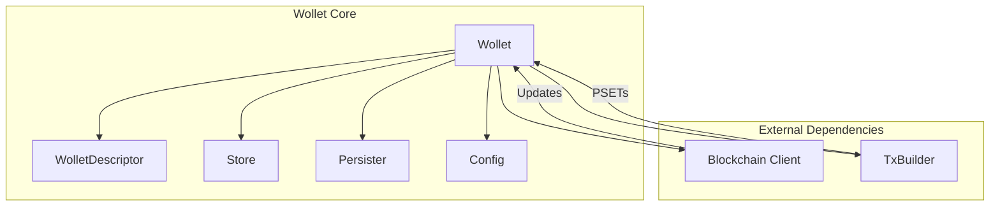

import Tabs from '@theme/Tabs';
import TabItem from '@theme/TabItem';

# Watch-Only Wallet (Wollet)

The `lwk_wollet` crate is the core component of LWK, providing comprehensive watch-only wallet functionality for Liquid Bitcoin. The name "wollet" emphasizes its watch-only nature while offering all essential wallet operations except private key management.

## Overview

A Wollet is defined by a [CT descriptor](https://github.com/ElementsProject/ELIPs/blob/main/elip-0150.mediawiki) (Confidential Transaction descriptor), which combines a Bitcoin descriptor with blinding key information. This enables the wallet to generate addresses, track balances, and build transactions while remaining watch-only.

### Key Capabilities

- **Descriptor-Based Wallets**: Create wallets from CT descriptors with built-in blinding support
- **Address Generation**: Derive receiving and change addresses from descriptors
- **Balance Tracking**: Monitor L-BTC and asset balances across all wallet addresses
- **Transaction Building**: Create PSETs for various operations including issuance, reissuance, and burns
- **Blockchain Synchronization**: Update wallet state from Electrum or Esplora backends
- **Asset Management**: Handle Liquid asset operations and registry integration

## Quick Start

<Tabs groupId="language">
<TabItem value="rust" label="Rust" default>

```rust
use lwk_wollet::{ElementsNetwork, NoPersist, Wollet, WolletDescriptor};

// Create wallet from CT descriptor
let descriptor_str = "ct(slip77(master_blinding_key),wpkh(xpub/0/*))";
let descriptor: WolletDescriptor = descriptor_str.parse()?;
let wollet = Wollet::new(ElementsNetwork::LiquidTestnet, NoPersist::new(), descriptor)?;

// Generate address and sync
let address = wollet.address(None)?;
let update = electrum_client.full_scan(&wollet, 20, 20)?;
wollet.apply_update(update)?;
```

</TabItem>
<TabItem value="python" label="Python">

```python
from lwk import Wollet, WolletDescriptor, ElementsNetwork

# Create wallet from CT descriptor
descriptor = WolletDescriptor("ct(slip77(master_blinding_key),wpkh(xpub/0/*))")
wollet = Wollet(ElementsNetwork.LIQUID_TESTNET, None, descriptor)

# Generate address and sync
address = wollet.address()
update = electrum_client.full_scan(wollet, stop_gap=20)
wollet.apply_update(update)
```

</TabItem>
<TabItem value="kotlin" label="Kotlin">

```kotlin
import com.blockstream.lwk.*

// Create wallet from CT descriptor
val descriptor = WolletDescriptor("ct(slip77(master_blinding_key),wpkh(xpub/0/*))")
val wollet = Wollet(ElementsNetwork.LIQUID_TESTNET, null, descriptor)

// Generate address and sync
val address = wollet.address()
val update = electrumClient.fullScan(wollet, stopGap = 20u)
wollet.applyUpdate(update)
```

</TabItem>
<TabItem value="swift" label="Swift">

```swift
import LiquidWalletKit

// Create wallet from CT descriptor
let descriptor = try WolletDescriptor(descriptor: "ct(slip77(master_blinding_key),wpkh(xpub/0/*))")
let wollet = try Wollet(network: .liquidTestnet, persister: nil, descriptor: descriptor)

// Generate address and sync
let address = try wollet.address()
let update = try electrumClient.fullScan(wollet: wollet, stopGap: 20)
try wollet.applyUpdate(update: update)
```

</TabItem>
</Tabs>

## Core Architecture

### Wallet Structure



The Wollet consists of:

- **WolletDescriptor**: Defines the wallet's address derivation and blinding key
- **Store**: In-memory state containing transactions, UTXOs, and balances
- **Persister**: Interface for saving/loading wallet state (optional)
- **Config**: Network configuration and validation settings

### Data Flow

1. **Initialization**: Parse descriptor and create wallet instance
2. **Synchronization**: Fetch blockchain data and apply updates
3. **Address Generation**: Derive addresses from descriptor
4. **Transaction Building**: Create PSETs for various operations
5. **State Management**: Persist wallet state for future sessions

## Integration Patterns

### Backend Integration

Wollet supports multiple blockchain backends:

- **Electrum**: Efficient, lightweight backend for most applications
- **Esplora**: REST API backend for web integrations

### Transaction Building

Use the `TxBuilder` for creating various transaction types:

- **Simple Transfers**: L-BTC and asset transfers
- **Asset Operations**: Issuance, reissuance, and burn transactions
- **Multi-Output**: Complex transactions with multiple recipients

## Next Steps

- [Address Generation](./address-generation.md) - Learn about address derivation
- [Balance Tracking](./balance-tracking.md) - Understand balance management
- [Blockchain Sync](./blockchain-sync.md) - Deep dive into synchronization
- [Descriptors](./descriptors.md) - Master CT descriptor creation 