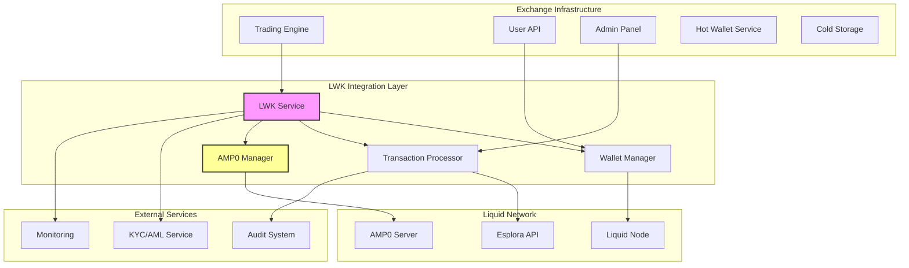
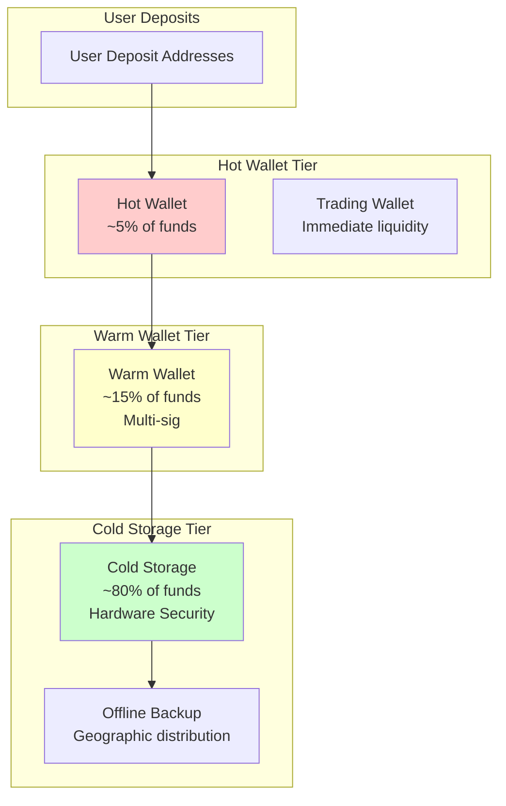

# Crypto Exchange Guide: Liquid and AMP0 Asset Integration

## Introduction

This guide provides crypto exchanges with comprehensive information for integrating Liquid Network assets and AMP0 (Asset Management Platform) support using LWK 0.11.0. Whether you're looking to list L-BTC, regulated securities tokens, or other Liquid assets, this guide covers the technical implementation, compliance considerations, and operational procedures required for a production exchange.

## Executive Summary

### Liquid Network Benefits for Exchanges

- **Faster Settlement**: 1-minute block times vs 10 minutes for Bitcoin
- **Lower Fees**: Significantly reduced transaction costs
- **Confidential Transactions**: Enhanced privacy for users while maintaining auditability
- **Multi-Asset Support**: Native support for thousands of different assets
- **Regulated Assets**: AMP0 enables compliant digital securities
- **Bitcoin Security**: Inherits Bitcoin's security model via federation

### What LWK 0.11.0 Enables

✅ **L-BTC Trading**: Full support for Liquid Bitcoin  
✅ **Asset Management**: Handle any Liquid-issued asset  
✅ **AMP0 Assets**: Support for regulated securities tokens  
✅ **Confidential Transactions**: Privacy-preserving transfers  
✅ **Hardware Security**: Integration with HSMs and hardware wallets  
✅ **High Performance**: Optimized for exchange-scale operations  

## Architecture Overview



## Asset Types and Handling

### 1. L-BTC (Liquid Bitcoin)

**Properties:**
- 1:1 pegged to Bitcoin
- Policy Asset ID: `6f0279e9ed041c3d710a9f57d0c02928416460c4b722ae3457a11eec381c526d`
- Used for transaction fees
- Standard confidential transactions

**Integration:**
```rust
use lwk_wollet::ElementsNetwork;

// L-BTC is the policy asset
let lbtc_asset_id = ElementsNetwork::Liquid.policy_asset();
println!("L-BTC Asset ID: {}", lbtc_asset_id);

// Check if an asset is L-BTC
fn is_lbtc(asset_id: &AssetId, network: ElementsNetwork) -> bool {
    *asset_id == network.policy_asset()
}
```

### 2. Issued Assets (Standard Liquid Assets)

**Properties:**
- Custom tokens on Liquid
- Can be blinded or unblinded
- Reissuable or fixed supply
- Custom metadata via asset registry

**Listing Process:**
```python
from lwk import AssetId, AssetRegistry

class AssetManager:
    def __init__(self):
        self.registry = AssetRegistry()
        self.supported_assets = {}
    
    def add_supported_asset(self, asset_id: str, metadata: dict):
        """Add a new asset to exchange trading"""
        asset = AssetId(asset_id)
        
        # Validate asset exists on network
        if self.validate_asset(asset):
            self.supported_assets[asset_id] = {
                'name': metadata['name'],
                'ticker': metadata['ticker'],
                'precision': metadata.get('precision', 8),
                'issuer': metadata.get('issuer'),
                'contract_hash': metadata.get('contract_hash'),
                'is_amp0': metadata.get('is_amp0', False)
            }
            return True
        return False
    
    def validate_asset(self, asset_id: AssetId) -> bool:
        """Verify asset exists and get metadata"""
        try:
            # Check asset registry
            metadata = self.registry.get_asset(asset_id)
            return metadata is not None
        except Exception:
            return False
```

### 3. AMP0 Assets (Regulated Securities)

**Properties:**
- 2-of-2 multisig requirement
- Server-side transaction approval
- Compliance-ready audit trail
- KYC/AML integration points

**Special Handling:**
```rust
use lwk_wollet::amp0::blocking::Amp0;

struct AMP0AssetHandler {
    amp0_contexts: HashMap<String, Amp0>, // asset_id -> AMP0 context
}

impl AMP0AssetHandler {
    fn is_amp0_asset(&self, descriptor: &WolletDescriptor) -> bool {
        descriptor.is_amp0()
    }
    
    fn handle_amp0_transaction(&self, asset_id: &str, tx_request: TransactionRequest) -> Result<String, Error> {
        let amp0 = self.amp0_contexts.get(asset_id)
            .ok_or("AMP0 context not found")?;
        
        // Build AMP0 transaction
        let amp0pset = self.build_amp0_transaction(amp0, tx_request)?;
        
        // Request compliance approval
        self.request_compliance_approval(&amp0pset)?;
        
        // Execute with cosigning
        let tx = amp0.sign(&amp0pset)?;
        
        Ok(tx.txid().to_string())
    }
}
```

## Exchange Wallet Architecture

### 1. Multi-Tier Wallet Structure



### 2. Implementation Example

```rust
use lwk_wollet::{Wollet, WolletDescriptor};
use lwk_signer::SwSigner;
use lwk_jade::Jade;

pub struct ExchangeWalletManager {
    hot_wallets: HashMap<AssetId, Wollet>,
    warm_wallets: HashMap<AssetId, Wollet>,
    cold_wallets: HashMap<AssetId, Wollet>,
    hot_signers: HashMap<AssetId, SwSigner>,
    warm_signers: HashMap<AssetId, Vec<SwSigner>>, // Multi-sig
    cold_signers: HashMap<AssetId, Jade>, // Hardware
}

impl ExchangeWalletManager {
    pub fn new() -> Self {
        Self {
            hot_wallets: HashMap::new(),
            warm_wallets: HashMap::new(),
            cold_wallets: HashMap::new(),
            hot_signers: HashMap::new(),
            warm_signers: HashMap::new(),
            cold_signers: HashMap::new(),
        }
    }
    
    pub fn create_asset_wallets(&mut self, asset_id: AssetId) -> Result<(), Error> {
        let network = ElementsNetwork::Liquid;
        
        // Hot wallet (single-sig for speed)
        let hot_desc = self.generate_hot_wallet_descriptor()?;
        let hot_wallet = Wollet::without_persist(network, hot_desc)?;
        self.hot_wallets.insert(asset_id, hot_wallet);
        
        // Warm wallet (2-of-3 multi-sig)
        let warm_desc = self.generate_warm_wallet_descriptor()?;
        let warm_wallet = Wollet::without_persist(network, warm_desc)?;
        self.warm_wallets.insert(asset_id, warm_wallet);
        
        // Cold wallet (3-of-5 multi-sig with hardware)
        let cold_desc = self.generate_cold_wallet_descriptor()?;
        let cold_wallet = Wollet::without_persist(network, cold_desc)?;
        self.cold_wallets.insert(asset_id, cold_wallet);
        
        Ok(())
    }
    
    pub fn get_deposit_address(&self, asset_id: AssetId, user_id: u64) -> Result<String, Error> {
        let wallet = self.hot_wallets.get(&asset_id)
            .ok_or("Asset not supported")?;
        
        // Generate unique address for user
        let address_index = self.derive_user_address_index(user_id);
        let address = wallet.address(Some(address_index))?;
        
        Ok(address.address().to_string())
    }
    
    pub fn process_withdrawal(&self, request: WithdrawalRequest) -> Result<String, Error> {
        let wallet_tier = self.determine_wallet_tier(&request)?;
        
        match wallet_tier {
            WalletTier::Hot => self.process_hot_withdrawal(request),
            WalletTier::Warm => self.process_warm_withdrawal(request),
            WalletTier::Cold => self.process_cold_withdrawal(request),
        }
    }
    
    fn rebalance_wallets(&mut self) -> Result<(), Error> {
        // Automated rebalancing logic
        for (asset_id, hot_wallet) in &self.hot_wallets {
            let balance = hot_wallet.balance()?;
            let asset_balance = balance.get(asset_id).unwrap_or(&0);
            
            // If hot wallet exceeds threshold, move to warm
            if *asset_balance > self.hot_wallet_threshold(*asset_id) {
                self.transfer_to_warm(*asset_id, *asset_balance / 2)?;
            }
            
            // If hot wallet too low, transfer from warm
            if *asset_balance < self.hot_wallet_minimum(*asset_id) {
                self.transfer_from_warm(*asset_id)?;
            }
        }
        
        Ok(())
    }
}
```

## Transaction Processing

### 1. Deposit Processing

```python
import asyncio
from typing import Dict, List
from lwk import Wollet, EsploraClient, Transaction

class DepositProcessor:
    def __init__(self, wallets: Dict[str, Wollet], network):
        self.wallets = wallets
        self.network = network
        self.client = EsploraClient.new("https://blockstream.info/liquid/api", network)
        self.processed_txids = set()
        
    async def monitor_deposits(self):
        """Continuous monitoring of incoming deposits"""
        while True:
            try:
                await self.scan_for_deposits()
                await asyncio.sleep(10)  # Check every 10 seconds
            except Exception as e:
                print(f"Deposit monitoring error: {e}")
                await asyncio.sleep(30)  # Back off on error
    
    async def scan_for_deposits(self):
        """Scan all wallets for new deposits"""
        for asset_id, wallet in self.wallets.items():
            try:
                # Update wallet
                update = await self.client.full_scan(wallet)
                if update:
                    wallet.apply_update(update)
                
                # Check for new transactions
                transactions = wallet.transactions()
                for tx in transactions:
                    if tx.txid not in self.processed_txids:
                        await self.process_deposit(asset_id, tx)
                        self.processed_txids.add(tx.txid)
                        
            except Exception as e:
                print(f"Error scanning wallet for {asset_id}: {e}")
    
    async def process_deposit(self, asset_id: str, transaction):
        """Process a single deposit transaction"""
        try:
            # Extract deposit information
            deposit_info = self.extract_deposit_info(transaction, asset_id)
            
            if deposit_info:
                # Verify minimum confirmations
                if deposit_info['confirmations'] >= self.get_min_confirmations(asset_id):
                    # Credit user account
                    await self.credit_user_account(deposit_info)
                    
                    # Send notification
                    await self.notify_deposit_confirmed(deposit_info)
                    
                    print(f"Processed deposit: {deposit_info}")
                else:
                    print(f"Deposit pending confirmations: {deposit_info}")
                    
        except Exception as e:
            print(f"Error processing deposit: {e}")
    
    def extract_deposit_info(self, transaction, asset_id: str) -> dict:
        """Extract relevant deposit information from transaction"""
        for balance_change in transaction.balances:
            if balance_change['asset_id'] == asset_id and balance_change['value'] > 0:
                # Find corresponding address
                user_id = self.get_user_id_from_address(balance_change['script_pubkey'])
                
                if user_id:
                    return {
                        'txid': transaction.txid,
                        'user_id': user_id,
                        'asset_id': asset_id,
                        'amount': balance_change['value'],
                        'confirmations': transaction.height,
                        'timestamp': transaction.timestamp
                    }
        
        return None
    
    def get_min_confirmations(self, asset_id: str) -> int:
        """Get minimum confirmations required for asset"""
        if asset_id == self.network.policy_asset():  # L-BTC
            return 3
        else:
            return 1  # Faster for other assets
```

### 2. Withdrawal Processing

```rust
use lwk_wollet::{TxBuilder, Recipient};
use lwk_signer::AnySigner;

pub struct WithdrawalProcessor {
    signers: HashMap<AssetId, AnySigner>,
    approval_service: ApprovalService,
    audit_logger: AuditLogger,
}

impl WithdrawalProcessor {
    pub async fn process_withdrawal(&self, request: WithdrawalRequest) -> Result<String, Error> {
        // 1. Validate withdrawal request
        self.validate_withdrawal(&request).await?;
        
        // 2. Check user balance and limits
        self.check_balance_and_limits(&request).await?;
        
        // 3. Get approval if required
        if self.requires_manual_approval(&request) {
            self.request_manual_approval(&request).await?;
        }
        
        // 4. Build transaction
        let (pset, is_amp0) = self.build_withdrawal_transaction(&request).await?;
        
        // 5. Sign transaction
        let signed_tx = if is_amp0 {
            self.sign_amp0_transaction(pset, &request).await?
        } else {
            self.sign_standard_transaction(pset, &request).await?
        };
        
        // 6. Broadcast transaction
        let txid = self.broadcast_transaction(&signed_tx).await?;
        
        // 7. Update user balance
        self.debit_user_account(&request, &txid).await?;
        
        // 8. Audit logging
        self.audit_logger.log_withdrawal(&request, &txid).await?;
        
        Ok(txid)
    }
    
    async fn build_withdrawal_transaction(&self, request: &WithdrawalRequest) -> Result<(PartiallySignedTransaction, bool), Error> {
        let wallet = self.get_appropriate_wallet(&request.asset_id, request.amount)?;
        
        let mut builder = wallet.tx_builder();
        
        // Add recipient
        let recipient = Recipient {
            address: request.destination_address.parse()?,
            satoshi: request.amount,
            asset_id: request.asset_id,
        };
        builder = builder.add_validated_recipient(recipient);
        
        // Add fee
        builder = builder.fee_rate(request.fee_rate.unwrap_or(1000))?; // 1 sat/vbyte default
        
        // Check if this is an AMP0 asset
        let descriptor = wallet.descriptor();
        let is_amp0 = descriptor.is_amp0();
        
        let pset = if is_amp0 {
            builder.finish_for_amp0(wallet)?.pset().clone()
        } else {
            builder.finish(wallet)?
        };
        
        Ok((pset, is_amp0))
    }
    
    async fn sign_amp0_transaction(&self, pset: PartiallySignedTransaction, request: &WithdrawalRequest) -> Result<Transaction, Error> {
        // Get AMP0 context for this asset
        let amp0 = self.get_amp0_context(&request.asset_id)?;
        
        // Sign with exchange key
        let mut signed_pset = pset;
        let signer = self.signers.get(&request.asset_id)
            .ok_or("Signer not found for asset")?;
        signer.sign(&mut signed_pset)?;
        
        // Create AMP0 PSET with blinding nonces
        let blinding_nonces = self.get_blinding_nonces(&signed_pset)?;
        let amp0pset = Amp0Pset::new(signed_pset, blinding_nonces)?;
        
        // Request AMP0 server cosignature
        let final_tx = amp0.sign(&amp0pset).await?;
        
        Ok(final_tx)
    }
    
    fn requires_manual_approval(&self, request: &WithdrawalRequest) -> bool {
        // Large amounts
        if request.amount > self.get_auto_approval_limit(&request.asset_id) {
            return true;
        }
        
        // Suspicious patterns
        if self.detect_suspicious_pattern(&request.user_id) {
            return true;
        }
        
        // AMP0 assets (regulated)
        if self.is_amp0_asset(&request.asset_id) {
            return self.requires_compliance_approval(&request);
        }
        
        false
    }
    
    async fn validate_withdrawal(&self, request: &WithdrawalRequest) -> Result<(), Error> {
        // Validate address format
        let _address: elements::Address = request.destination_address.parse()
            .map_err(|_| Error::InvalidAddress)?;
        
        // Check minimum withdrawal amount
        if request.amount < self.get_minimum_withdrawal(&request.asset_id) {
            return Err(Error::AmountTooSmall);
        }
        
        // Check maximum withdrawal amount
        if request.amount > self.get_maximum_withdrawal(&request.asset_id) {
            return Err(Error::AmountTooLarge);
        }
        
        // Verify asset is supported
        if !self.is_asset_supported(&request.asset_id) {
            return Err(Error::AssetNotSupported);
        }
        
        Ok(())
    }
}
```

### 3. AMP0 Compliance Integration

```python
from typing import Optional
import requests

class AMP0ComplianceManager:
    def __init__(self, kyc_provider_url: str, api_key: str):
        self.kyc_provider = kyc_provider_url
        self.api_key = api_key
        self.compliance_rules = {}
    
    async def check_transaction_compliance(self, request: dict) -> dict:
        """Check if AMP0 transaction meets compliance requirements"""
        
        # 1. KYC/AML verification
        kyc_status = await self.verify_kyc_status(request['user_id'])
        if not kyc_status['verified']:
            return {
                'approved': False,
                'reason': 'KYC verification required',
                'action_required': 'complete_kyc'
            }
        
        # 2. Asset-specific compliance rules
        asset_rules = self.get_asset_compliance_rules(request['asset_id'])
        compliance_check = self.check_asset_rules(request, asset_rules)
        
        if not compliance_check['compliant']:
            return {
                'approved': False,
                'reason': compliance_check['reason'],
                'action_required': 'contact_compliance'
            }
        
        # 3. Transaction limits
        limit_check = await self.check_transaction_limits(request)
        if not limit_check['within_limits']:
            return {
                'approved': False,
                'reason': 'Transaction exceeds limits',
                'action_required': 'reduce_amount'
            }
        
        # 4. Geographic restrictions
        geo_check = await self.check_geographic_restrictions(request)
        if not geo_check['allowed']:
            return {
                'approved': False,
                'reason': 'Geographic restriction',
                'action_required': 'contact_support'
            }
        
        # All checks passed
        return {
            'approved': True,
            'compliance_id': self.generate_compliance_id(),
            'expires_at': self.get_approval_expiry()
        }
    
    def get_asset_compliance_rules(self, asset_id: str) -> dict:
        """Get compliance rules for specific asset"""
        return self.compliance_rules.get(asset_id, {
            'requires_accredited_investor': False,
            'min_holding_period': 0,
            'max_daily_volume': None,
            'restricted_countries': [],
            'business_hours_only': False
        })
    
    async def verify_kyc_status(self, user_id: int) -> dict:
        """Verify user's KYC status with external provider"""
        try:
            response = requests.get(
                f"{self.kyc_provider}/users/{user_id}/kyc-status",
                headers={'Authorization': f'Bearer {self.api_key}'},
                timeout=10
            )
            
            if response.status_code == 200:
                data = response.json()
                return {
                    'verified': data.get('kyc_verified', False),
                    'aml_score': data.get('aml_score', 0),
                    'risk_level': data.get('risk_level', 'unknown'),
                    'last_updated': data.get('last_updated')
                }
            else:
                return {'verified': False, 'error': 'KYC service unavailable'}
                
        except Exception as e:
            print(f"KYC verification error: {e}")
            return {'verified': False, 'error': str(e)}
    
    def setup_asset_compliance_rules(self, asset_id: str, rules: dict):
        """Configure compliance rules for an asset"""
        self.compliance_rules[asset_id] = rules
        
        # Example for a regulated security token:
        # rules = {
        #     'requires_accredited_investor': True,
        #     'min_holding_period': 365,  # days
        #     'max_daily_volume': 1000000,  # sats
        #     'restricted_countries': ['US', 'CN'],
        #     'business_hours_only': True,
        #     'lock_up_period': 90  # days
        # }
```

## Risk Management

### 1. Position Limits and Controls

```rust
pub struct RiskManager {
    position_limits: HashMap<AssetId, PositionLimit>,
    user_limits: HashMap<u64, UserLimit>,
    global_limits: GlobalLimit,
}

#[derive(Debug)]
pub struct PositionLimit {
    max_hot_wallet_balance: u64,
    max_single_transaction: u64,
    max_daily_volume: u64,
    requires_manual_approval_above: u64,
}

impl RiskManager {
    pub fn check_transaction_risk(&self, request: &TransactionRequest) -> RiskAssessment {
        let mut assessment = RiskAssessment::new();
        
        // Check position limits
        if let Some(limit) = self.position_limits.get(&request.asset_id) {
            if request.amount > limit.max_single_transaction {
                assessment.add_flag(RiskFlag::ExceedsTransactionLimit);
            }
            
            let daily_volume = self.get_daily_volume(&request.asset_id);
            if daily_volume + request.amount > limit.max_daily_volume {
                assessment.add_flag(RiskFlag::ExceedsDailyVolume);
            }
        }
        
        // Check user limits
        if let Some(user_limit) = self.user_limits.get(&request.user_id) {
            let user_daily_volume = self.get_user_daily_volume(request.user_id);
            if user_daily_volume + request.amount > user_limit.max_daily_withdrawal {
                assessment.add_flag(RiskFlag::ExceedsUserDailyLimit);
            }
        }
        
        // Check global limits
        let total_outflow = self.get_total_daily_outflow();
        if total_outflow + request.amount > self.global_limits.max_daily_outflow {
            assessment.add_flag(RiskFlag::ExceedsGlobalLimit);
        }
        
        // Check for suspicious patterns
        if self.detect_suspicious_activity(&request.user_id) {
            assessment.add_flag(RiskFlag::SuspiciousActivity);
        }
        
        assessment
    }
    
    pub fn detect_suspicious_activity(&self, user_id: &u64) -> bool {
        // Check for rapid successive transactions
        let recent_txs = self.get_user_transactions_last_hour(*user_id);
        if recent_txs.len() > 10 {
            return true;
        }
        
        // Check for round-number patterns
        if self.has_round_number_pattern(*user_id) {
            return true;
        }
        
        // Check for unusual asset combinations
        if self.has_unusual_asset_pattern(*user_id) {
            return true;
        }
        
        false
    }
    
    pub fn adjust_limits_dynamically(&mut self) {
        // Adjust limits based on market conditions
        let market_volatility = self.calculate_market_volatility();
        
        for (asset_id, limit) in &mut self.position_limits {
            // Reduce limits during high volatility
            if market_volatility > 0.1 {
                limit.max_single_transaction *= 0.8;
                limit.max_daily_volume *= 0.9;
            }
            
            // Increase limits during stable periods
            if market_volatility < 0.02 {
                limit.max_single_transaction *= 1.1;
                limit.max_daily_volume *= 1.05;
            }
        }
    }
}
```

### 2. Liquidity Management

```python
class LiquidityManager:
    def __init__(self, target_ratios: dict):
        self.target_ratios = target_ratios  # asset_id -> target % in hot wallet
        self.rebalance_thresholds = {}
        self.liquidity_providers = {}
    
    def check_liquidity_needs(self) -> dict:
        """Assess current liquidity position"""
        needs = {}
        
        for asset_id, target_ratio in self.target_ratios.items():
            current_ratio = self.get_current_hot_wallet_ratio(asset_id)
            
            if current_ratio < target_ratio * 0.8:  # 20% below target
                needs[asset_id] = {
                    'action': 'increase_liquidity',
                    'current_ratio': current_ratio,
                    'target_ratio': target_ratio,
                    'amount_needed': self.calculate_amount_needed(asset_id, target_ratio)
                }
            elif current_ratio > target_ratio * 1.2:  # 20% above target
                needs[asset_id] = {
                    'action': 'reduce_liquidity',
                    'current_ratio': current_ratio,
                    'target_ratio': target_ratio,
                    'amount_excess': self.calculate_amount_excess(asset_id, target_ratio)
                }
        
        return needs
    
    async def auto_rebalance(self):
        """Automatically rebalance wallets"""
        needs = self.check_liquidity_needs()
        
        for asset_id, need in needs.items():
            try:
                if need['action'] == 'increase_liquidity':
                    await self.increase_hot_wallet_liquidity(asset_id, need['amount_needed'])
                elif need['action'] == 'reduce_liquidity':
                    await self.move_to_cold_storage(asset_id, need['amount_excess'])
                    
                print(f"Rebalanced {asset_id}: {need['action']}")
                
            except Exception as e:
                print(f"Rebalancing failed for {asset_id}: {e}")
    
    def predict_liquidity_needs(self, time_horizon_hours: int) -> dict:
        """Predict future liquidity needs based on historical patterns"""
        predictions = {}
        
        for asset_id in self.target_ratios.keys():
            # Analyze historical withdrawal patterns
            historical_data = self.get_historical_withdrawals(asset_id, time_horizon_hours)
            
            # Calculate average withdrawal rate
            avg_hourly_withdrawals = sum(historical_data) / len(historical_data)
            
            # Predict needs for next period
            predicted_withdrawals = avg_hourly_withdrawals * time_horizon_hours
            current_hot_balance = self.get_hot_wallet_balance(asset_id)
            
            predictions[asset_id] = {
                'predicted_withdrawals': predicted_withdrawals,
                'current_balance': current_hot_balance,
                'buffer_needed': predicted_withdrawals * 1.5,  # 50% buffer
                'rebalance_recommended': predicted_withdrawals > current_hot_balance * 0.8
            }
        
        return predictions
```

## Monitoring and Alerting

### 1. Real-time Monitoring

```rust
use tokio::time::{interval, Duration};
use serde_json::json;

pub struct ExchangeMonitor {
    wallets: HashMap<AssetId, Wollet>,
    alert_thresholds: AlertThresholds,
    notification_service: NotificationService,
}

impl ExchangeMonitor {
    pub async fn start_monitoring(&self) {
        let mut interval = interval(Duration::from_secs(30)); // Check every 30 seconds
        
        loop {
            interval.tick().await;
            
            // Monitor wallet balances
            self.monitor_wallet_balances().await;
            
            // Monitor transaction confirmations
            self.monitor_pending_transactions().await;
            
            // Monitor network health
            self.monitor_network_health().await;
            
            // Monitor AMP0 server connectivity
            self.monitor_amp0_connectivity().await;
            
            // Monitor system performance
            self.monitor_system_performance().await;
        }
    }
    
    async fn monitor_wallet_balances(&self) {
        for (asset_id, wallet) in &self.wallets {
            match wallet.balance() {
                Ok(balance) => {
                    let asset_balance = balance.get(asset_id).unwrap_or(&0);
                    
                    // Check for low balance alert
                    if *asset_balance < self.alert_thresholds.low_balance_threshold(*asset_id) {
                        self.send_alert(Alert::LowBalance {
                            asset_id: *asset_id,
                            current_balance: *asset_balance,
                            threshold: self.alert_thresholds.low_balance_threshold(*asset_id),
                        }).await;
                    }
                    
                    // Check for suspicious balance changes
                    let previous_balance = self.get_previous_balance(*asset_id);
                    let balance_change = (*asset_balance as i64) - (previous_balance as i64);
                    
                    if balance_change.abs() > self.alert_thresholds.large_balance_change(*asset_id) as i64 {
                        self.send_alert(Alert::LargeBalanceChange {
                            asset_id: *asset_id,
                            change: balance_change,
                            previous: previous_balance,
                            current: *asset_balance,
                        }).await;
                    }
                }
                Err(e) => {
                    self.send_alert(Alert::WalletError {
                        asset_id: *asset_id,
                        error: e.to_string(),
                    }).await;
                }
            }
        }
    }
    
    async fn monitor_network_health(&self) {
        // Check Liquid network status
        match self.check_liquid_network_status().await {
            Ok(status) => {
                if !status.is_healthy {
                    self.send_alert(Alert::NetworkUnhealthy {
                        details: status.details,
                    }).await;
                }
            }
            Err(e) => {
                self.send_alert(Alert::NetworkCheckFailed {
                    error: e.to_string(),
                }).await;
            }
        }
    }
    
    async fn send_alert(&self, alert: Alert) {
        let alert_data = json!({
            "timestamp": chrono::Utc::now(),
            "severity": alert.severity(),
            "type": alert.alert_type(),
            "details": alert.details(),
        });
        
        // Send to multiple channels
        let _ = self.notification_service.send_slack(alert_data.clone()).await;
        let _ = self.notification_service.send_email(alert_data.clone()).await;
        let _ = self.notification_service.send_pagerduty(alert_data).await;
        
        // Log alert
        log::warn!("ALERT: {:?}", alert);
    }
}

#[derive(Debug)]
pub enum Alert {
    LowBalance { asset_id: AssetId, current_balance: u64, threshold: u64 },
    LargeBalanceChange { asset_id: AssetId, change: i64, previous: u64, current: u64 },
    WalletError { asset_id: AssetId, error: String },
    NetworkUnhealthy { details: String },
    NetworkCheckFailed { error: String },
    AMP0ServerDown,
    TransactionStuck { txid: String, hours_pending: u64 },
    UnusualWithdrawalPattern { user_id: u64, details: String },
}

impl Alert {
    fn severity(&self) -> &'static str {
        match self {
            Alert::LowBalance { .. } => "warning",
            Alert::LargeBalanceChange { .. } => "warning",
            Alert::WalletError { .. } => "error",
            Alert::NetworkUnhealthy { .. } => "critical",
            Alert::NetworkCheckFailed { .. } => "error",
            Alert::AMP0ServerDown => "critical",
            Alert::TransactionStuck { .. } => "warning",
            Alert::UnusualWithdrawalPattern { .. } => "warning",
        }
    }
}
```

### 2. Metrics and Analytics

```python
import time
from prometheus_client import Counter, Histogram, Gauge, start_http_server

class ExchangeMetrics:
    def __init__(self):
        # Transaction metrics
        self.transactions_total = Counter('lwk_transactions_total', 'Total transactions processed', ['asset', 'type'])
        self.transaction_amount = Histogram('lwk_transaction_amount_sats', 'Transaction amounts in satoshis', ['asset'])
        self.transaction_duration = Histogram('lwk_transaction_duration_seconds', 'Transaction processing time')
        
        # Wallet metrics
        self.wallet_balance = Gauge('lwk_wallet_balance_sats', 'Current wallet balance', ['asset', 'tier'])
        self.address_generation_time = Histogram('lwk_address_generation_seconds', 'Address generation time')
        
        # AMP0 metrics
        self.amp0_cosigning_time = Histogram('lwk_amp0_cosigning_seconds', 'AMP0 cosigning duration')
        self.amp0_failures = Counter('lwk_amp0_failures_total', 'AMP0 operation failures', ['operation'])
        
        # System metrics
        self.active_connections = Gauge('lwk_active_connections', 'Active connections to Liquid network')
        self.pending_transactions = Gauge('lwk_pending_transactions', 'Number of pending transactions')
        
        # Start metrics server
        start_http_server(8000)
    
    def record_transaction(self, asset_id: str, tx_type: str, amount: int, duration: float):
        """Record transaction metrics"""
        self.transactions_total.labels(asset=asset_id, type=tx_type).inc()
        self.transaction_amount.labels(asset=asset_id).observe(amount)
        self.transaction_duration.observe(duration)
    
    def update_wallet_balance(self, asset_id: str, tier: str, balance: int):
        """Update wallet balance metric"""
        self.wallet_balance.labels(asset=asset_id, tier=tier).set(balance)
    
    def record_amp0_operation(self, operation: str, duration: float, success: bool):
        """Record AMP0 operation metrics"""
        if operation == 'cosigning':
            self.amp0_cosigning_time.observe(duration)
        
        if not success:
            self.amp0_failures.labels(operation=operation).inc()
    
    def generate_daily_report(self) -> dict:
        """Generate daily operational report"""
        return {
            'total_transactions': self._get_daily_transactions(),
            'total_volume': self._get_daily_volume(),
            'average_transaction_size': self._get_average_transaction_size(),
            'wallet_balances': self._get_current_balances(),
            'amp0_success_rate': self._get_amp0_success_rate(),
            'system_uptime': self._get_system_uptime(),
            'pending_transactions': self.pending_transactions._value.get(),
        }
```

## Operational Procedures

### 1. Daily Operations Checklist

```python
class DailyOperations:
    def __init__(self, exchange_manager):
        self.exchange = exchange_manager
        self.checklist_items = []
    
    async def run_daily_checklist(self):
        """Execute daily operational checklist"""
        checklist = [
            self.verify_wallet_balances,
            self.check_pending_transactions,
            self.verify_amp0_connectivity,
            self.review_overnight_alerts,
            self.validate_cold_storage_balances,
            self.check_regulatory_compliance,
            self.verify_backup_systems,
            self.review_risk_limits,
            self.update_exchange_rates,
            self.generate_daily_report
        ]
        
        results = {}
        for task in checklist:
            try:
                result = await task()
                results[task.__name__] = {'status': 'success', 'result': result}
                print(f"✅ {task.__name__} completed")
            except Exception as e:
                results[task.__name__] = {'status': 'failed', 'error': str(e)}
                print(f"❌ {task.__name__} failed: {e}")
        
        # Generate summary report
        await self.send_daily_report(results)
        return results
    
    async def verify_wallet_balances(self):
        """Verify all wallet balances match expected values"""
        discrepancies = []
        
        for asset_id, expected_balance in self.exchange.expected_balances.items():
            actual_balance = await self.exchange.get_total_balance(asset_id)
            
            # Allow for small rounding differences
            if abs(actual_balance - expected_balance) > 100:  # 100 sats tolerance
                discrepancies.append({
                    'asset_id': asset_id,
                    'expected': expected_balance,
                    'actual': actual_balance,
                    'difference': actual_balance - expected_balance
                })
        
        if discrepancies:
            raise Exception(f"Balance discrepancies found: {discrepancies}")
        
        return "All balances verified"
    
    async def check_pending_transactions(self):
        """Check for stuck or delayed transactions"""
        stuck_transactions = []
        
        pending_txs = await self.exchange.get_pending_transactions()
        for tx in pending_txs:
            # Check if transaction is older than expected confirmation time
            age_hours = (time.time() - tx['created_at']) / 3600
            expected_confirmation_time = self.get_expected_confirmation_time(tx['asset_id'])
            
            if age_hours > expected_confirmation_time:
                stuck_transactions.append({
                    'txid': tx['txid'],
                    'age_hours': age_hours,
                    'asset_id': tx['asset_id'],
                    'amount': tx['amount']
                })
        
        if stuck_transactions:
            # Alert operations team
            await self.alert_stuck_transactions(stuck_transactions)
        
        return f"Checked {len(pending_txs)} pending transactions, {len(stuck_transactions)} stuck"
```

### 2. Incident Response Procedures

```python
class IncidentResponse:
    def __init__(self):
        self.severity_levels = {
            'low': {'response_time': 4, 'escalation_time': 24},      # hours
            'medium': {'response_time': 1, 'escalation_time': 4},    # hours  
            'high': {'response_time': 0.25, 'escalation_time': 1},  # hours
            'critical': {'response_time': 0.05, 'escalation_time': 0.5} # hours
        }
    
    async def handle_incident(self, incident_type: str, details: dict):
        """Main incident response handler"""
        severity = self.determine_severity(incident_type, details)
        
        # Immediate response actions
        response_plan = self.get_response_plan(incident_type, severity)
        
        # Execute response plan
        for action in response_plan['immediate_actions']:
            await self.execute_action(action, details)
        
        # Notify stakeholders
        await self.notify_incident(incident_type, severity, details)
        
        # Start monitoring resolution
        await self.monitor_incident_resolution(incident_type, details)
    
    def get_response_plan(self, incident_type: str, severity: str) -> dict:
        """Get predefined response plan for incident type"""
        plans = {
            'wallet_compromise': {
                'immediate_actions': [
                    'freeze_affected_wallets',
                    'disable_withdrawals',
                    'isolate_compromised_systems',
                    'preserve_evidence'
                ],
                'investigation_steps': [
                    'analyze_transaction_history',
                    'review_access_logs',
                    'check_for_unauthorized_access'
                ]
            },
            'amp0_server_down': {
                'immediate_actions': [
                    'pause_amp0_transactions',
                    'notify_amp0_provider',
                    'activate_manual_approval_process'
                ],
                'fallback_procedures': [
                    'switch_to_manual_compliance_checks',
                    'implement_temporary_transaction_limits'
                ]
            },
            'large_balance_discrepancy': {
                'immediate_actions': [
                    'freeze_all_transactions',
                    'initiate_full_balance_audit',
                    'preserve_system_state'
                ],
                'investigation_steps': [
                    'reconcile_all_transactions',
                    'verify_blockchain_state',
                    'check_for_double_spending'
                ]
            }
        }
        
        return plans.get(incident_type, {'immediate_actions': ['escalate_to_engineering']})
    
    async def execute_action(self, action: str, context: dict):
        """Execute specific incident response action"""
        action_handlers = {
            'freeze_affected_wallets': self.freeze_wallets,
            'disable_withdrawals': self.disable_withdrawals,
            'pause_amp0_transactions': self.pause_amp0_transactions,
            'notify_amp0_provider': self.notify_external_provider,
            'initiate_full_balance_audit': self.start_balance_audit
        }
        
        handler = action_handlers.get(action)
        if handler:
            await handler(context)
        else:
            print(f"Unknown action: {action}")
```

## Compliance and Reporting

### 1. Regulatory Reporting

```rust
use serde::{Serialize, Deserialize};
use chrono::{DateTime, Utc};

#[derive(Serialize, Deserialize)]
pub struct RegulatoryReport {
    pub report_type: ReportType,
    pub reporting_period: ReportingPeriod,
    pub jurisdiction: String,
    pub generated_at: DateTime<Utc>,
    pub data: ReportData,
}

#[derive(Serialize, Deserialize)]
pub enum ReportType {
    DailyTransactionReport,
    SuspiciousActivityReport,
    AssetHoldingsReport,
    AMP0ComplianceReport,
    LargeCashTransactionReport,
}

pub struct ComplianceReporter {
    jurisdictions: Vec<Jurisdiction>,
    reporting_templates: HashMap<ReportType, ReportTemplate>,
}

impl ComplianceReporter {
    pub async fn generate_daily_reports(&self) -> Result<Vec<RegulatoryReport>, Error> {
        let mut reports = Vec::new();
        
        for jurisdiction in &self.jurisdictions {
            // Generate required reports for each jurisdiction
            for report_type in &jurisdiction.required_reports {
                let report = self.generate_report(*report_type, jurisdiction).await?;
                reports.push(report);
            }
        }
        
        // Submit reports to regulatory authorities
        for report in &reports {
            self.submit_report(report).await?;
        }
        
        Ok(reports)
    }
    
    async fn generate_amp0_compliance_report(&self, period: &ReportingPeriod) -> Result<ReportData, Error> {
        let amp0_transactions = self.get_amp0_transactions(period).await?;
        
        let mut compliance_data = AMP0ComplianceData::new();
        
        for tx in amp0_transactions {
            // Verify each transaction had proper approvals
            let approval_record = self.get_approval_record(&tx.txid).await?;
            
            compliance_data.add_transaction(AMP0TransactionRecord {
                txid: tx.txid,
                asset_id: tx.asset_id,
                amount: tx.amount,
                timestamp: tx.timestamp,
                user_id: tx.user_id,
                kyc_verified: approval_record.kyc_verified,
                compliance_approval_id: approval_record.compliance_id,
                approver: approval_record.approver,
                approval_timestamp: approval_record.timestamp,
            });
        }
        
        Ok(ReportData::AMP0Compliance(compliance_data))
    }
    
    pub async fn check_suspicious_activity(&self, user_id: u64) -> Option<SuspiciousActivityReport> {
        let user_transactions = self.get_user_transactions_last_30_days(user_id).await;
        
        // Pattern detection algorithms
        if self.detect_structuring_pattern(&user_transactions) {
            return Some(self.create_sar("Potential structuring", user_id, &user_transactions));
        }
        
        if self.detect_rapid_movement_pattern(&user_transactions) {
            return Some(self.create_sar("Rapid fund movement", user_id, &user_transactions));
        }
        
        if self.detect_unusual_asset_pattern(&user_transactions) {
            return Some(self.create_sar("Unusual asset trading pattern", user_id, &user_transactions));
        }
        
        None
    }
}
```

### 2. Audit Trail Management

```python
import hashlib
import json
from datetime import datetime
from typing import Dict, Any

class AuditTrailManager:
    def __init__(self, blockchain_logger=None):
        self.blockchain_logger = blockchain_logger
        self.audit_db = {}  # In production, use proper database
        
    def log_transaction(self, transaction_data: Dict[str, Any]) -> str:
        """Log transaction with immutable audit trail"""
        
        # Create audit record
        audit_record = {
            'timestamp': datetime.utcnow().isoformat(),
            'transaction_id': transaction_data['txid'],
            'user_id': transaction_data['user_id'],
            'asset_id': transaction_data['asset_id'],
            'amount': transaction_data['amount'],
            'transaction_type': transaction_data['type'],  # deposit/withdrawal
            'status': transaction_data['status'],
            'approval_chain': transaction_data.get('approvals', []),
            'compliance_checks': transaction_data.get('compliance_checks', {}),
            'risk_assessment': transaction_data.get('risk_assessment', {}),
        }
        
        # Add AMP0-specific data if applicable
        if transaction_data.get('is_amp0'):
            audit_record['amp0_data'] = {
                'amp_id': transaction_data.get('amp_id'),
                'compliance_approval_id': transaction_data.get('compliance_approval_id'),
                'cosigning_server': transaction_data.get('cosigning_server'),
                'blinding_nonces': transaction_data.get('blinding_nonces', [])
            }
        
        # Create hash chain for integrity
        previous_hash = self.get_last_audit_hash()
        record_json = json.dumps(audit_record, sort_keys=True)
        current_hash = hashlib.sha256(f"{previous_hash}{record_json}".encode()).hexdigest()
        
        audit_record['audit_hash'] = current_hash
        audit_record['previous_hash'] = previous_hash
        
        # Store audit record
        audit_id = f"audit_{current_hash[:16]}"
        self.audit_db[audit_id] = audit_record
        
        # Optional: Log to blockchain for immutability
        if self.blockchain_logger:
            self.blockchain_logger.log_to_blockchain(audit_id, current_hash)
        
        return audit_id
    
    def verify_audit_chain(self) -> bool:
        """Verify integrity of audit chain"""
        records = sorted(self.audit_db.values(), key=lambda x: x['timestamp'])
        
        for i, record in enumerate(records):
            if i == 0:
                continue  # Skip first record
            
            previous_record = records[i-1]
            expected_previous_hash = previous_record['audit_hash']
            
            if record['previous_hash'] != expected_previous_hash:
                print(f"Audit chain integrity violation at record {record['audit_hash']}")
                return False
        
        return True
    
    def generate_compliance_report(self, start_date: str, end_date: str, jurisdiction: str) -> Dict:
        """Generate compliance report for specific jurisdiction"""
        
        # Filter records by date range
        relevant_records = [
            record for record in self.audit_db.values()
            if start_date <= record['timestamp'] <= end_date
        ]
        
        # Generate jurisdiction-specific report
        if jurisdiction == 'US':
            return self.generate_us_compliance_report(relevant_records)
        elif jurisdiction == 'EU':
            return self.generate_eu_compliance_report(relevant_records)
        else:
            return self.generate_generic_compliance_report(relevant_records)
    
    def generate_us_compliance_report(self, records: list) -> Dict:
        """Generate US-specific compliance report (FinCEN, etc.)"""
        
        # Aggregate data for US reporting requirements
        large_transactions = [r for r in records if r['amount'] > 10000_00000000]  # > $10k equivalent
        suspicious_patterns = self.analyze_suspicious_patterns(records)
        
        return {
            'report_type': 'US_FINCEN_CTR',
            'reporting_period': {'start': records[0]['timestamp'], 'end': records[-1]['timestamp']},
            'total_transactions': len(records),
            'total_volume': sum(r['amount'] for r in records),
            'large_transactions': len(large_transactions),
            'suspicious_activity_reports': len(suspicious_patterns),
            'currency_breakdown': self.breakdown_by_asset(records),
            'detailed_records': large_transactions,  # Include detailed records for large transactions
        }
```

## Testing and Quality Assurance

### 1. Integration Testing

```rust
#[cfg(test)]
mod integration_tests {
    use super::*;
    use lwk_test_util::*;
    
    #[tokio::test]
    async fn test_complete_exchange_flow() {
        // Setup test environment
        let mut exchange = ExchangeManager::new_test_instance().await;
        
        // Test asset onboarding
        let test_asset_id = AssetId::from_str("test_asset_123").unwrap();
        exchange.add_supported_asset(test_asset_id, AssetMetadata {
            name: "Test Asset".to_string(),
            ticker: "TEST".to_string(),
            precision: 8,
            is_amp0: false,
        }).await.unwrap();
        
        // Test user deposit
        let user_id = 12345;
        let deposit_address = exchange.get_deposit_address(test_asset_id, user_id).await.unwrap();
        
        // Simulate deposit transaction
        let deposit_tx = create_test_deposit_transaction(deposit_address, 1000000); // 0.01 TEST
        exchange.process_deposit(deposit_tx).await.unwrap();
        
        // Verify user balance
        let balance = exchange.get_user_balance(user_id, test_asset_id).await.unwrap();
        assert_eq!(balance, 1000000);
        
        // Test withdrawal
        let withdrawal_request = WithdrawalRequest {
            user_id,
            asset_id: test_asset_id,
            amount: 500000, // 0.005 TEST
            destination_address: "test_address_456".to_string(),
            fee_rate: Some(1000),
        };
        
        let txid = exchange.process_withdrawal(withdrawal_request).await.unwrap();
        assert!(!txid.is_empty());
        
        // Verify final balance
        let final_balance = exchange.get_user_balance(user_id, test_asset_id).await.unwrap();
        assert!(final_balance < 1000000); // Should be less due to withdrawal + fees
    }
    
    #[tokio::test]
    async fn test_amp0_transaction_flow() {
        let mut exchange = ExchangeManager::new_test_instance().await;
        
        // Setup AMP0 asset
        let amp0_asset_id = AssetId::from_str("amp0_test_asset").unwrap();
        exchange.add_amp0_asset(amp0_asset_id, AMP0Credentials {
            username: "test_user".to_string(),
            password: "test_pass".to_string(),
            amp_id: "test_amp_id".to_string(),
        }).await.unwrap();
        
        // Test AMP0 deposit
        let user_id = 67890;
        let amp0_address = exchange.get_amp0_deposit_address(amp0_asset_id, user_id).await.unwrap();
        
        // Test AMP0 withdrawal with compliance checks
        let withdrawal_request = WithdrawalRequest {
            user_id,
            asset_id: amp0_asset_id,
            amount: 100000,
            destination_address: "amp0_test_address".to_string(),
            fee_rate: Some(1000),
        };
        
        // Should require compliance approval
        let result = exchange.process_withdrawal(withdrawal_request).await;
        match result {
            Ok(_) => panic!("AMP0 withdrawal should require compliance approval"),
            Err(Error::ComplianceApprovalRequired) => {}, // Expected
            Err(e) => panic!("Unexpected error: {:?}", e),
        }
    }
    
    #[tokio::test]
    async fn test_risk_management() {
        let mut exchange = ExchangeManager::new_test_instance().await;
        let risk_manager = &exchange.risk_manager;
        
        // Test position limits
        let large_withdrawal = WithdrawalRequest {
            user_id: 99999,
            asset_id: ElementsNetwork::LiquidTestnet.policy_asset(),
            amount: 1000000000000, // Very large amount
            destination_address: "test_address".to_string(),
            fee_rate: Some(1000),
        };
        
        let risk_assessment = risk_manager.check_transaction_risk(&large_withdrawal);
        assert!(risk_assessment.has_flag(RiskFlag::ExceedsTransactionLimit));
        
        // Test suspicious activity detection
        let rapid_transactions = create_rapid_transaction_pattern(12345);
        for tx in rapid_transactions {
            exchange.record_user_transaction(tx).await;
        }
        
        assert!(risk_manager.detect_suspicious_activity(&12345));
    }
}
```

### 2. Load Testing

```python
import asyncio
import time
from concurrent.futures import ThreadPoolExecutor

class LoadTester:
    def __init__(self, exchange_endpoint: str):
        self.endpoint = exchange_endpoint
        self.results = []
    
    async def run_load_test(self, concurrent_users: int, duration_seconds: int):
        """Run load test with specified parameters"""
        
        print(f"Starting load test: {concurrent_users} concurrent users for {duration_seconds}s")
        
        # Create test scenarios
        scenarios = [
            self.deposit_scenario,
            self.withdrawal_scenario,
            self.balance_check_scenario,
            self.address_generation_scenario
        ]
        
        # Run concurrent users
        tasks = []
        for user_id in range(concurrent_users):
            task = asyncio.create_task(
                self.user_simulation(user_id, scenarios, duration_seconds)
            )
            tasks.append(task)
        
        # Wait for all users to complete
        results = await asyncio.gather(*tasks, return_exceptions=True)
        
        # Analyze results
        self.analyze_results(results)
        
        return self.generate_load_test_report()
    
    async def user_simulation(self, user_id: int, scenarios: list, duration: int):
        """Simulate a single user's activity"""
        start_time = time.time()
        operations = 0
        errors = 0
        
        while time.time() - start_time < duration:
            try:
                # Randomly select scenario
                scenario = random.choice(scenarios)
                start_op_time = time.time()
                
                await scenario(user_id)
                
                operation_duration = time.time() - start_op_time
                operations += 1
                
                # Record operation metrics
                self.results.append({
                    'user_id': user_id,
                    'operation': scenario.__name__,
                    'duration': operation_duration,
                    'timestamp': time.time(),
                    'success': True
                })
                
                # Brief pause between operations
                await asyncio.sleep(random.uniform(0.1, 1.0))
                
            except Exception as e:
                errors += 1
                self.results.append({
                    'user_id': user_id,
                    'operation': scenario.__name__,
                    'error': str(e),
                    'timestamp': time.time(),
                    'success': False
                })
        
        return {'user_id': user_id, 'operations': operations, 'errors': errors}
    
    async def deposit_scenario(self, user_id: int):
        """Simulate deposit operation"""
        # Generate deposit address
        response = await self.api_call('POST', '/api/deposit-address', {
            'user_id': user_id,
            'asset_id': 'lbtc'
        })
        
        # Simulate waiting for deposit confirmation
        await asyncio.sleep(0.1)
        
        return response
    
    async def withdrawal_scenario(self, user_id: int):
        """Simulate withdrawal operation"""
        response = await self.api_call('POST', '/api/withdraw', {
            'user_id': user_id,
            'asset_id': 'lbtc',
            'amount': 100000,  # 0.001 L-BTC
            'address': 'test_address_123'
        })
        
        return response
    
    def generate_load_test_report(self) -> dict:
        """Generate comprehensive load test report"""
        successful_ops = [r for r in self.results if r['success']]
        failed_ops = [r for r in self.results if not r['success']]
        
        if successful_ops:
            avg_response_time = sum(op['duration'] for op in successful_ops) / len(successful_ops)
            p95_response_time = sorted([op['duration'] for op in successful_ops])[int(len(successful_ops) * 0.95)]
        else:
            avg_response_time = 0
            p95_response_time = 0
        
        return {
            'total_operations': len(self.results),
            'successful_operations': len(successful_ops),
            'failed_operations': len(failed_ops),
            'success_rate': len(successful_ops) / len(self.results) if self.results else 0,
            'average_response_time': avg_response_time,
            'p95_response_time': p95_response_time,
            'operations_per_second': len(successful_ops) / max(1, max(op['timestamp'] for op in self.results) - min(op['timestamp'] for op in self.results)),
            'error_breakdown': self.analyze_errors(failed_ops)
        }
```

## Deployment and Production

### 1. Production Deployment Checklist

```yaml
# deployment-checklist.yml
production_checklist:
  infrastructure:
    - name: "Server hardening completed"
      verified: false
    - name: "Firewall rules configured"
      verified: false
    - name: "SSL certificates installed"
      verified: false
    - name: "Database security configured"
      verified: false
    - name: "Backup systems tested"
      verified: false
  
  security:
    - name: "HSM integration tested"
      verified: false
    - name: "Multi-signature wallets configured"
      verified: false
    - name: "Access controls implemented"
      verified: false
    - name: "Audit logging enabled"
      verified: false
    - name: "Penetration testing completed"
      verified: false
  
  compliance:
    - name: "KYC/AML integration tested"
      verified: false
    - name: "Regulatory reporting configured"
      verified: false
    - name: "Transaction monitoring active"
      verified: false
    - name: "Compliance policies documented"
      verified: false
  
  monitoring:
    - name: "Health checks configured"
      verified: false
    - name: "Alerting system tested"
      verified: false
    - name: "Metrics collection active"
      verified: false
    - name: "Log aggregation configured"
      verified: false
  
  testing:
    - name: "Load testing completed"
      verified: false
    - name: "Integration tests passing"
      verified: false
    - name: "Security tests completed"
      verified: false
    - name: "Disaster recovery tested"
      verified: false
```

### 2. Configuration Management

```rust
use serde::{Deserialize, Serialize};
use std::collections::HashMap;

#[derive(Debug, Deserialize, Serialize)]
pub struct ExchangeConfig {
    pub network: NetworkConfig,
    pub wallets: WalletConfig,
    pub security: SecurityConfig,
    pub compliance: ComplianceConfig,
    pub monitoring: MonitoringConfig,
    pub assets: HashMap<String, AssetConfig>,
}

#[derive(Debug, Deserialize, Serialize)]
pub struct NetworkConfig {
    pub liquid_network: String, // "mainnet" | "testnet"
    pub esplora_url: String,
    pub elements_rpc_url: Option<String>,
    pub connection_timeout_seconds: u64,
    pub retry_attempts: u32,
}

#[derive(Debug, Deserialize, Serialize)]
pub struct WalletConfig {
    pub hot_wallet_threshold_sats: u64,
    pub cold_storage_threshold_sats: u64,
    pub rebalance_interval_hours: u64,
    pub address_gap_limit: u32,
    pub fee_rate_sats_per_vbyte: u64,
}

#[derive(Debug, Deserialize, Serialize)]
pub struct SecurityConfig {
    pub hsm_enabled: bool,
    pub multisig_threshold: u32,
    pub multisig_total_keys: u32,
    pub session_timeout_minutes: u32,
    pub max_failed_login_attempts: u32,
    pub ip_whitelist: Vec<String>,
}

#[derive(Debug, Deserialize, Serialize)]
pub struct ComplianceConfig {
    pub kyc_required: bool,
    pub aml_screening_enabled: bool,
    pub suspicious_activity_threshold_sats: u64,
    pub large_transaction_threshold_sats: u64,
    pub reporting_jurisdictions: Vec<String>,
    pub audit_retention_days: u32,
}

#[derive(Debug, Deserialize, Serialize)]
pub struct AssetConfig {
    pub name: String,
    pub ticker: String,
    pub precision: u8,
    pub is_amp0: bool,
    pub min_deposit_sats: u64,
    pub min_withdrawal_sats: u64,
    pub max_withdrawal_sats: u64,
    pub withdrawal_fee_sats: u64,
    pub confirmation_blocks: u32,
    pub amp0_credentials: Option<AMP0Config>,
}

#[derive(Debug, Deserialize, Serialize)]
pub struct AMP0Config {
    pub username: String,
    pub password_env_var: String, // Environment variable name for password
    pub amp_id: String,
    pub compliance_endpoint: String,
    pub requires_manual_approval: bool,
}

impl ExchangeConfig {
    pub fn load_from_file(path: &str) -> Result<Self, Box<dyn std::error::Error>> {
        let config_content = std::fs::read_to_string(path)?;
        let config: ExchangeConfig = toml::from_str(&config_content)?;
        
        // Validate configuration
        config.validate()?;
        
        Ok(config)
    }
    
    fn validate(&self) -> Result<(), Box<dyn std::error::Error>> {
        // Validate network configuration
        if self.network.esplora_url.is_empty() {
            return Err("Esplora URL cannot be empty".into());
        }
        
        // Validate security configuration
        if self.security.multisig_threshold > self.security.multisig_total_keys {
            return Err("Multisig threshold cannot exceed total keys".into());
        }
        
        // Validate asset configurations
        for (asset_id, asset_config) in &self.assets {
            if asset_config.min_withdrawal_sats > asset_config.max_withdrawal_sats {
                return Err(format!("Invalid withdrawal limits for asset {}", asset_id).into());
            }
            
            if asset_config.is_amp0 && asset_config.amp0_credentials.is_none() {
                return Err(format!("AMP0 credentials required for asset {}", asset_id).into());
            }
        }
        
        Ok(())
    }
}
```

## Conclusion

This comprehensive guide provides crypto exchanges with the technical foundation needed to integrate Liquid Network assets and AMP0 support using LWK 0.11.0. The implementation covers:

### Key Benefits Achieved
- **Enhanced Asset Support**: Trade L-BTC and any Liquid-issued asset
- **Regulatory Compliance**: Built-in AMP0 support for regulated securities
- **Improved Security**: Hardware wallet integration and multi-tier architecture
- **Operational Efficiency**: Automated monitoring, risk management, and reporting
- **Scalability**: High-performance architecture for exchange-scale operations

### Critical Implementation Points
1. **Security First**: Multi-tier wallet architecture with hardware security modules
2. **Compliance Ready**: Built-in KYC/AML integration and regulatory reporting
3. **Risk Management**: Comprehensive position limits and suspicious activity detection
4. **Operational Excellence**: Automated monitoring, alerting, and incident response
5. **Testing Rigor**: Comprehensive integration and load testing procedures

### Next Steps
1. **Pilot Implementation**: Start with testnet deployment
2. **Security Audit**: Conduct thorough security review
3. **Regulatory Review**: Ensure compliance with local regulations
4. **Staff Training**: Train operations team on new procedures
5. **Gradual Rollout**: Phase production deployment with close monitoring

LWK 0.11.0's AMP0 integration positions exchanges to participate in the growing regulated digital asset ecosystem while maintaining the security and operational standards required for production cryptocurrency exchange operations.

For additional support and resources:
- [LWK Documentation](https://docs.rs/lwk_wollet)
- [Liquid Network Resources](https://docs.liquid.net)
- [Blockstream Exchange Solutions](https://blockstream.com/solutions/)
- [Technical Support](https://github.com/Blockstream/lwk/issues)
