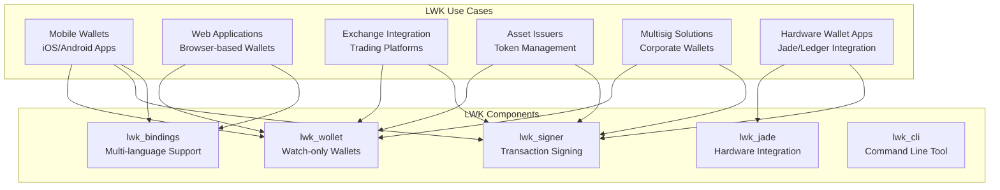
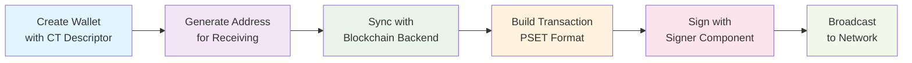

import Tabs from '@theme/Tabs';
import TabItem from '@theme/TabItem';

# Getting Started with LWK

Welcome to **Liquid Wallet Kit (LWK)** - the comprehensive toolkit for building Liquid Bitcoin wallets. LWK provides everything you need to create robust, secure, and feature-rich Liquid applications.

## What is LWK?

LWK is a modular collection of Rust crates designed for Liquid Bitcoin wallet development. Unlike monolithic solutions, LWK's modular architecture lets you pick exactly the components you need for your specific use case.

## Core Use Cases



## Key Features

- **Watch-Only Wallets**: Create wallets using [CT descriptors](https://github.com/ElementsProject/ELIPs/blob/main/elip-0150.mediawiki) without needing private keys
- **PSET-Based**: Built around [Partially Signed Elements Transactions](https://github.com/ElementsProject/elements/blob/master/doc/pset.mediawiki) for flexible transaction workflows
- **Multi-Language**: Python, Kotlin, Swift, C#, WebAssembly bindings via [UniFFI](https://mozilla.github.io/uniffi-rs/)
- **Multiple Backends**: Support for Electrum and Esplora servers - no need for full node
- **Asset Management**: Issue, reissue, and burn Liquid assets with ease
- **Multisig Support**: Create wallets with any combination of hardware/software signers
- **Hardware Integration**: Native support for Jade and Ledger devices

## Quick Start Examples

Choose your preferred programming language to see how to create a basic wallet:

<Tabs groupId="language">
<TabItem value="python" label="Python" default>

Perfect for data analysis, server backends, and rapid prototyping.

```python title="create_wallet.py"
import lwk

# Create a wallet from mnemonic
mnemonic = lwk.Mnemonic.generate()
network = lwk.Network.testnet()
signer = lwk.Signer(mnemonic, network)

# Create descriptor and wallet
descriptor = signer.wpkh_slip77_descriptor()
wallet = lwk.Wollet(network, descriptor)

# Generate receiving address
address = wallet.address(0)
print(f"First address: {address.address()}")

# Connect to blockchain backend
client = lwk.ElectrumClient(
    "ssl://elements-testnet.blockstream.info:50002",
    tls=True, validate_domain=True
)

# Sync wallet with blockchain
update = client.full_scan(wallet)
wallet.apply_update(update)

print(f"Wallet balance: {wallet.balance()}")
```

**[📖 Python Installation Guide →](./getting-started/installation#python-installation)**

</TabItem>
<TabItem value="rust" label="Rust">

Full control and performance for production applications.

```rust title="src/main.rs"
use lwk_wollet::{ElementsNetwork, Wollet, WolletDescriptor, NoPersist, ElectrumClient, full_scan_with_electrum_client};
use lwk_signer::SoftwareSigner;
use bip39::Mnemonic;

fn main() -> Result<(), Box<dyn std::error::Error>> {
    // Generate mnemonic and create signer
    let mnemonic = Mnemonic::generate(bip39::Language::English, 128)?;
    let signer = SoftwareSigner::new(&mnemonic, ElementsNetwork::LiquidTestnet)?;
    
    // Create descriptor and wallet
    let descriptor_str = signer.wpkh_slip77_descriptor()?;
    let descriptor: WolletDescriptor = descriptor_str.parse()?;
    let mut wallet = Wollet::new(
        ElementsNetwork::LiquidTestnet,
        NoPersist::new(),
        descriptor,
    )?;

    // Generate first address
    let address = wallet.address(Some(0))?;
    println!("First address: {}", address.address());
    
    // Connect to Electrum and sync
    let electrum_url = "ssl://elements-testnet.blockstream.info:50002".parse()?;
    let mut client = ElectrumClient::new(&electrum_url)?;
    full_scan_with_electrum_client(&mut wallet, &mut client)?;

    // Check balance
    let balance = wallet.balance()?;
    println!("Wallet balance: {:?}", balance);
    
    Ok(())
}
```

**[📖 Rust Integration Guide →](./getting-started/installation#rust-development)**

</TabItem>
<TabItem value="cli" label="CLI">

Perfect for testing, scripting, and understanding LWK concepts.

```bash title="wallet_setup.sh"
#!/bin/bash

# Start LWK server
lwk_cli --network testnet server start &
SERVER_PID=$!

# Generate mnemonic and create signer
MNEMONIC=$(lwk_cli signer generate | jq -r .mnemonic)
echo "Generated mnemonic: $MNEMONIC"

# Load software signer
lwk_cli signer load-software \
  --persist true \
  --mnemonic "$MNEMONIC" \
  --signer my_signer

# Create CT descriptor
DESCRIPTOR=$(lwk_cli signer singlesig-desc \
  --signer my_signer \
  --descriptor-blinding-key slip77 \
  --kind wpkh | jq -r .descriptor)

# Load wallet
lwk_cli wallet load --wallet my_wallet --descriptor "$DESCRIPTOR"

# Generate address
ADDRESS=$(lwk_cli wallet address --wallet my_wallet | jq -r .address)
echo "First address: $ADDRESS"

# Check balance
lwk_cli wallet balance --wallet my_wallet

# Stop server
kill $SERVER_PID
```

**[📖 CLI Installation Guide →](./getting-started/installation#command-line-installation)**

</TabItem>
<TabItem value="kotlin" label="Kotlin">

Ideal for Android development and JVM applications.

```kotlin title="WalletManager.kt"
import com.blockstream.lwk.*

class WalletManager {
    
    fun createWallet(): String {
        // Generate mnemonic and create signer
        val mnemonic = Mnemonic.fromRandom(12u)
        val network = Network.testnet()
        val signer = Signer(mnemonic, network)
        
        // Create descriptor and wallet
        val descriptor = signer.wpkhSlip77Descriptor()
        val wallet = Wollet(network, descriptor, datadir = null)
        
        // Generate first address
        val address = wallet.address(0u)
        println("First address: ${address.address()}")
        
        // Connect to blockchain backend
        val client = ElectrumClient(
            "ssl://electrum-liquidtestnet.blockstream.info:50002",
            tls = true,
            validateDomain = true
        )
        
        // Sync wallet with blockchain
        val update = client.fullScan(wallet)
        update?.let { wallet.applyUpdate(it) }
        
        println("Wallet balance: ${wallet.balance()}")
        return address.address()
    }
}
```

**[📖 Android Integration Guide →](./getting-started/installation#android-development)**

</TabItem>
<TabItem value="swift" label="Swift">

Perfect for iOS development and macOS applications.

```swift title="WalletManager.swift"
import LiquidWalletKit

class WalletManager: ObservableObject {
    
    func createWallet() throws -> String {
        // Generate mnemonic and create signer
        let mnemonic = try Mnemonic.fromRandom(wordCount: 12)
        let network = Network.testnet()
        let signer = try Signer(mnemonic: mnemonic, network: network)
        
        // Create descriptor and wallet
        let descriptor = try signer.wpkhSlip77Descriptor()
        let wallet = try Wollet(network: network, descriptor: descriptor, datadir: nil)
        
        // Generate first address
        let address = try wallet.address(index: 0)
        print("First address: \(address.address())")
        
        // Connect to blockchain backend
        let client = try ElectrumClient(
            electrumUrl: "ssl://electrum-liquidtestnet.blockstream.info:50002",
            tls: true,
            validateDomain: true
        )
        
        // Sync wallet with blockchain
        let update = try client.fullScan(wollet: wallet)
        if let update = update {
            try wallet.applyUpdate(update: update)
        }
        
        print("Wallet balance: \(try wallet.balance())")
        return address.address()
    }
}
```

**[📖 iOS Integration Guide →](./getting-started/installation#ios-development)**

</TabItem>
<TabItem value="javascript" label="JavaScript/WASM">

For web applications and browser-based wallets.

```javascript title="wallet.js"
import init, { Mnemonic, Network, Signer, Wollet } from 'lwk-wasm';

async function createWallet() {
    // Initialize WASM module
    await init();
    
    // Create wallet from mnemonic
    const mnemonic = Mnemonic.fromRandom(12);
    const network = Network.testnet();
    const signer = new Signer(mnemonic, network);
    
    // Create descriptor and wallet
    const descriptor = signer.wpkhSlip77Descriptor();
    const wallet = new Wollet(network, descriptor);
    
    // Generate first address
    const address = wallet.address(0);
    console.log('First address:', address.address());
    
    // Note: Blockchain sync requires backend proxy for web environments
    console.log('Wallet balance:', wallet.balance());
    
    return address.address();
}

// Usage
createWallet().then(address => {
    console.log('Wallet created with address:', address);
}).catch(console.error);
```

**[📖 WASM Integration Guide →](./getting-started/installation#webassembly-wasm)**

</TabItem>
</Tabs>


## Core Workflow

Every LWK application follows this fundamental pattern:



## Prerequisites

Before diving in, ensure you have:

- **Rust 1.70.0+** (for Rust development or building from source)
- **Python 3.8+** (for Python bindings)
- **Git** (for cloning the repository)

### System Requirements

| Platform | Status | Notes |
|----------|--------|-------|
| Linux | Full Support | Ubuntu 20.04+, RHEL 8+ |
| macOS | Full Support | macOS 10.15+ |
| Windows | Full Support | Windows 10+ |
| WebAssembly | Supported | Modern browsers |

## Next Steps

Ready to start building? Choose your path:

1. **[Installation](./getting-started/installation)** - Set up your development environment
2. **[Essential Concepts](./getting-started/concepts)** - Understand Liquid and LWK fundamentals  
3. **[First Wallet](./getting-started/first-wallet)** - Create your first working wallet
4. **[Advanced Guides](./tutorials/)** - Explore specific use cases

