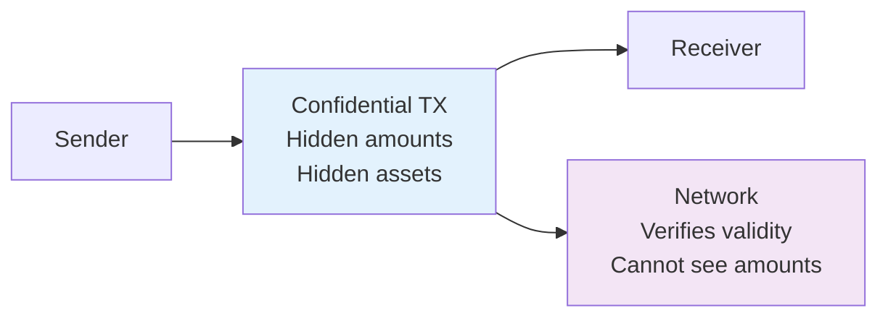
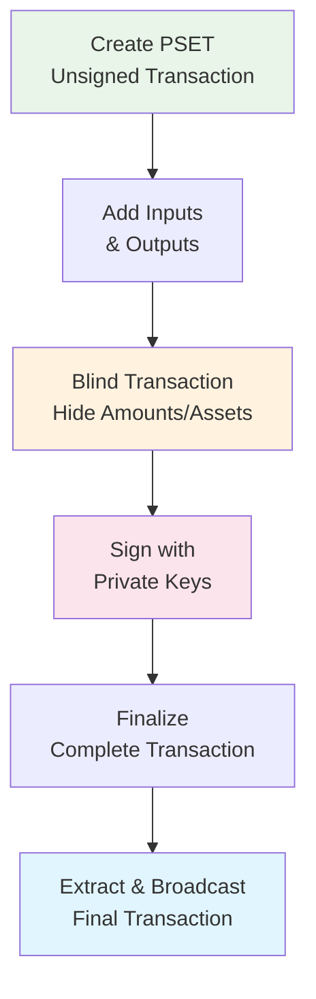
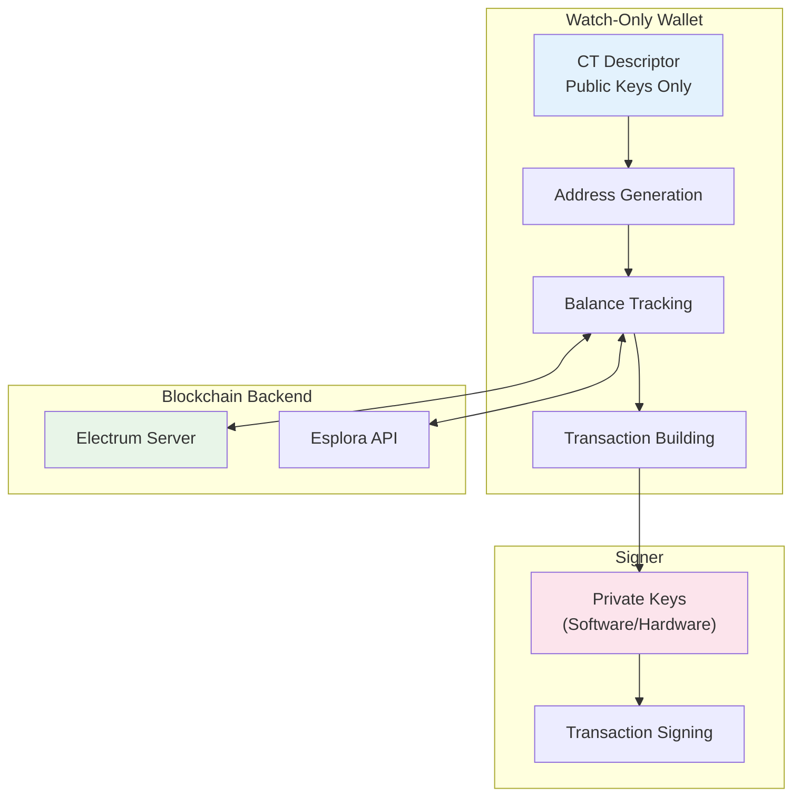

# Essential LWK Concepts

Understanding these core concepts is crucial for building successful Liquid applications with LWK. This guide explains the key technologies and patterns that make LWK powerful.

## Liquid Network Fundamentals

### What Makes Liquid Different

Liquid is a Bitcoin sidechain that extends Bitcoin's capabilities:

- **Faster settlements**: 1-minute block times vs Bitcoin's 10 minutes
- **Confidential Transactions**: Amount and asset type privacy by default  
- **Native asset issuance**: Create your own tokens on the network
- **Bitcoin-pegged**: 1:1 peg with Bitcoin through federation model

### Confidential Transactions (CT)

Liquid's privacy model hides transaction amounts and asset types while maintaining verifiability:



**Key Benefits:**
- Transaction amounts are hidden from public view
- Asset types are blinded (except to participants)
- Full network validation without revealing private data
- Stronger privacy than standard Bitcoin transactions

## CT Descriptors

CT (Confidential Transaction) descriptors extend Bitcoin's output descriptors with confidential transaction support. They define how to create addresses and handle the blinding keys needed for confidential transactions.

### Structure

CT descriptors follow this format:
```
ct(<blinding_key>, <output_descriptor>)
```

The blinding key component handles the cryptographic blinding required for confidential transactions, while the output descriptor defines the spending conditions (single-sig, multi-sig, etc.).

### Common Patterns

| Pattern | Description | Use Case |
|---------|-------------|----------|
| `elwpkh()` | Single-key P2WPKH | Personal wallets |
| `elwsh()` | Multi-signature | Corporate/shared wallets |
| `slip77()` | SLIP-77 blinding key | Standard privacy |
| `eltr()` | Taproot outputs | Advanced scripts |

### SLIP-77 Blinding Keys

SLIP-77 is the industry standard for hierarchical blinding key derivation. It allows deterministic generation of blinding keys from a master seed, similar to how Bitcoin uses BIP32 for address derivation. This ensures that wallets can consistently recreate the same blinding keys needed to view confidential transaction details.

## PSET (Partially Signed Elements Transaction)

PSET is Liquid's extension of Bitcoin's PSBT format, supporting confidential transactions and asset operations. It enables a flexible transaction creation workflow where transactions can be built, modified, and signed by multiple parties.

### PSET Workflow



### Key Differences from Bitcoin PSBT

- **Confidential Elements**: PSETs include blinding factors and proofs for confidential transactions
- **Multi-Asset Support**: Can handle multiple asset types in a single transaction
- **Issuance Operations**: Support for asset issuance, reissuance, and burning
- **Enhanced Privacy**: All amounts and asset types are blinded during construction

## Watch-Only Wallets

LWK uses a watch-only wallet model where private keys are separated from wallet functionality. This architecture enhances security by ensuring that the wallet can observe and build transactions without ever handling private keys directly.

### Architecture



### Benefits

- **Enhanced Security**: Private keys can be kept offline or on dedicated hardware
- **Scalability**: Multiple wallets can share the same signer component
- **Flexibility**: Easy integration with various hardware wallet types
- **Monitoring**: Can track balances and transactions without exposing keys
- **Separation of Concerns**: Clear boundary between observation and signing operations

### Watch-Only Capabilities

A watch-only wallet can:
- Generate receiving addresses deterministically
- Track balances across multiple assets
- Monitor transaction history
- Build unsigned transactions (PSETs)
- Sync with blockchain backends

However, it cannot sign transactions - this requires a separate signer component with access to private keys.

## Transaction Signing

LWK supports multiple signing approaches to accommodate different security requirements, from development environments to high-security production systems.

### Software Signing

Software signers store private keys in memory or encrypted storage. They're suitable for:
- Development and testing
- Consumer applications with appropriate key protection
- Scenarios where convenience is prioritized

### Hardware Signing

Hardware wallets store private keys on dedicated secure hardware. Benefits include:
- Private keys never leave the device
- Tamper-resistant hardware security
- User confirmation for all operations
- Suitable for high-value operations

Multisig transactions require multiple signatures from different participants. The PSET format enables this by allowing partial signatures to be collected and combined before finalization.

## Asset Management

Liquid supports native asset issuance and management alongside L-BTC. This enables complex financial applications and tokenization use cases.

### Asset Types

- **L-BTC**: The native currency, pegged 1:1 with Bitcoin
- **Issued Assets**: Custom tokens created on the network
- **Reissuance Tokens**: Special tokens that allow creating more units of an asset

### Asset Operations

| Operation | Description | Use Case |
|-----------|-------------|----------|
| **Issuance** | Create new asset | Initial token creation |
| **Reissuance** | Mint additional units | Controlled supply expansion |
| **Burning** | Permanently destroy units | Supply reduction |
| **Transfer** | Send between addresses | Standard transactions |

### Asset Registry

The Liquid network maintains an asset registry that maps asset IDs to human-readable names and metadata. This helps users identify assets in their wallets and applications.

## Next Steps

Now that you understand these essential concepts:

1. **[Create Your First Wallet](./first-wallet)** - Put concepts into practice
2. **[Core Components](../core-components)** - Deep dive into LWK architecture
3. **[Transaction Building](../transactions)** - Learn advanced transaction patterns
4. **[Asset Operations](../assets)** - Explore native asset capabilities
5. **[Hardware Integration](../core-components/hardware-wallets)** - Secure production setups