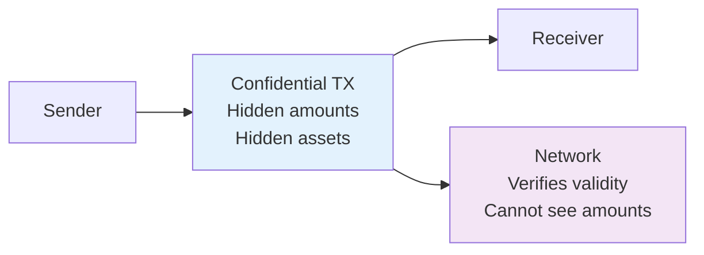
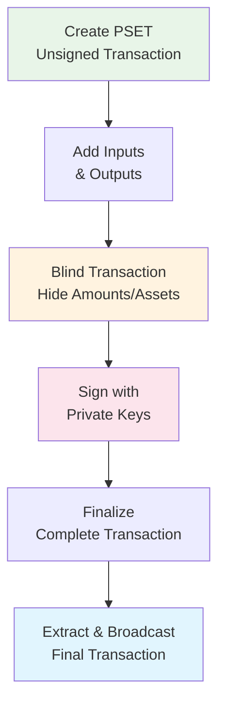
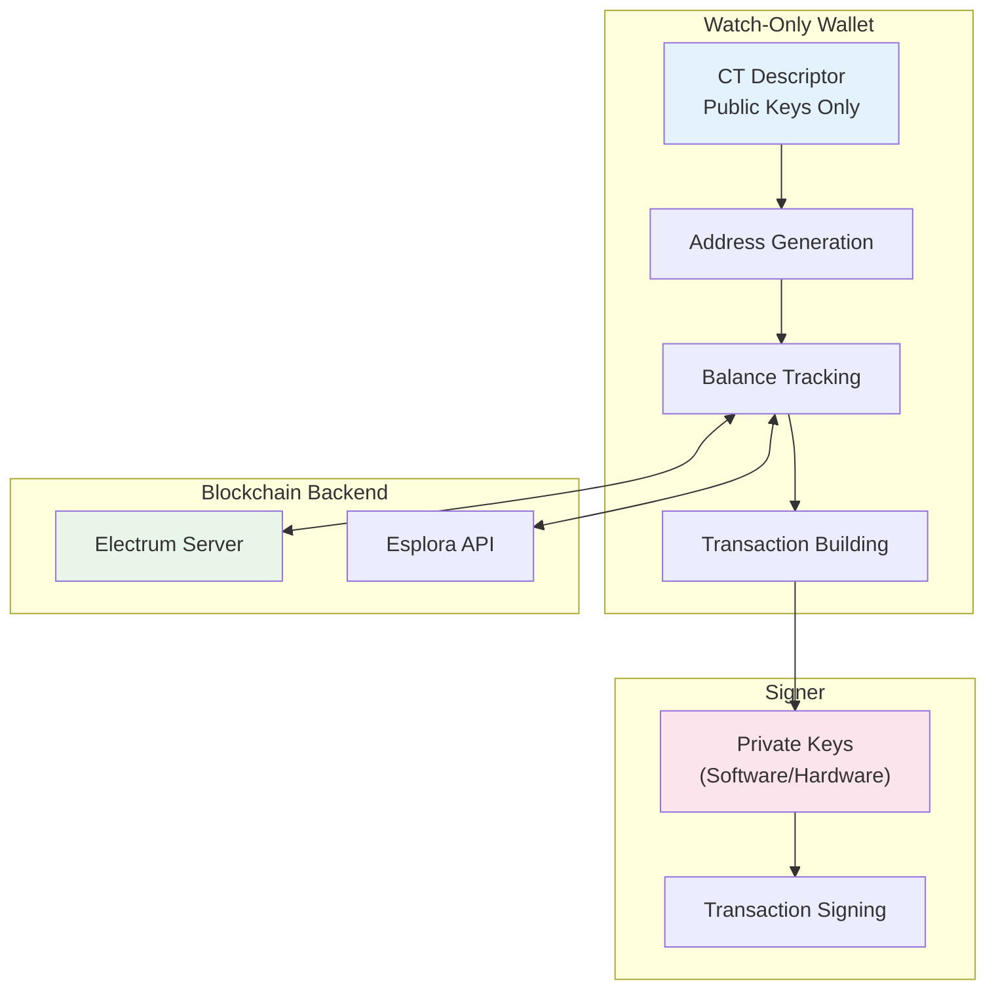

# LWK Concepts

Before you jump right into the code, understanding the underlying Liquid network and its core concepts is crucial for building secure and efficient applications. This guide explains the key technologies and patterns that make Liquid and LWK powerful.

## Liquid Network Fundamentals

### What Makes Liquid Different

Liquid is a Bitcoin sidechain that extends Bitcoin's capabilities:

- **Faster settlements**: 1-minute block times vs Bitcoin's 10 minutes
- **Confidential Transactions**: Amount and asset type privacy by default  
- **Native asset issuance**: Create your own tokens on the network
- **Bitcoin-pegged**: 1:1 peg with Bitcoin through federation model

### Confidential Transactions (CT)

Liquid's privacy model hides transaction amounts and asset types while maintaining verifiability:


```mermaid
graph LR
    A["Sender"] --> B["Confidential TX<br/>Hidden amounts<br/>Hidden assets"]
    B --> C["Receiver"]
    B --> D["Network<br/>Verifies validity<br/>Cannot see amounts"]
    
    style B fill:#e3f2fd
    style D fill:#f3e5f5
```

**Key Benefits:**
- Transaction amounts are hidden from public view
- Asset types are blinded (except to participants)
- Full network validation without revealing private data
- Stronger privacy than standard Bitcoin transactions

## CT Descriptors

CT (Confidential Transaction) descriptors extend Bitcoin's output descriptors with confidential transaction support. They define how to create addresses and handle the blinding keys needed for confidential transactions.

### Structure

CT descriptors follow this format:
```
ct(<blinding_key>, <output_descriptor>)
```

The blinding key component handles the cryptographic blinding required for confidential transactions, while the output descriptor defines the spending conditions (single-sig, multi-sig, etc.).

### Common Patterns

| Pattern | Description | Use Case |
|---------|-------------|----------|
| `elwpkh()` | Single-key P2WPKH | Personal wallets |
| `elwsh()` | Multi-signature | Shared wallets |
| `slip77()` | SLIP-77 blinding key | Standard privacy |
| `eltr()` | Taproot outputs | Advanced scripts |

### SLIP-77 Blinding Keys

SLIP-77 is the industry standard for hierarchical blinding key derivation. It allows deterministic generation of blinding keys from a master seed, similar to how Bitcoin uses BIP32 for address derivation. This ensures that wallets can consistently recreate the same blinding keys needed to view confidential transaction details.

## PSET (Partially Signed Elements Transaction)

PSET is Liquid's extension of Bitcoin's PSBT format, supporting confidential transactions and asset operations. It enables a flexible transaction creation workflow where transactions can be built, modified, and signed by multiple parties.

### PSET Workflow


```mermaid
graph TB
    A["Create PSET<br/>Unsigned Transaction"] --> B["Add Inputs<br/>& Outputs"]
    B --> C["Blind Transaction<br/>Hide Amounts/Assets"]
    C --> D["Sign with<br/>Private Keys"]
    D --> E["Finalize<br/>Complete Transaction"]
    E --> F["Extract & Broadcast<br/>Final Transaction"]
    
    style A fill:#e8f5e8
    style C fill:#fff3e0
    style D fill:#fce4ec
    style F fill:#e1f5fe
```

### Key Differences from Bitcoin PSBT

- **Confidential Elements**: PSETs include blinding factors and proofs for confidential transactions
- **Multi-Asset Support**: Can handle multiple asset types in a single transaction
- **Issuance Operations**: Support for asset issuance, reissuance, and burning
- **Enhanced Privacy**: All amounts and asset types are blinded during construction

## Watch-Only Wallets

LWK uses a watch-only wallet model where private keys are separated from wallet functionality. This architecture enhances security by ensuring that the wallet can observe and build transactions without ever handling private keys directly.

### Architecture


```mermaid
graph TB
    subgraph "Watch-Only Wallet"
        A["CT Descriptor<br/>Public Keys Only"]
        B["Address Generation"]
        C["Balance Tracking"]
        D["Transaction Building"]
    end
    
    subgraph "Signer"
        E["Private Keys<br/>(Software/Hardware)"]
        F["Transaction Signing"]
    end
    
    subgraph "Blockchain Backend"
        G["Electrum Server"]
        H["Esplora API"]
    end
    
    A --> B
    B --> C
    C --> D
    D --> E
    E --> F
    
    C <--> G
    C <--> H
    
    style A fill:#e3f2fd
    style E fill:#fce4ec
    style G fill:#e8f5e8
```

### Benefits

- **Enhanced Security**: Private keys can be kept offline or on dedicated hardware
- **Scalability**: Multiple wallets can share the same signer component
- **Flexibility**: Easy integration with various hardware wallet types
- **Monitoring**: Can track balances and transactions without exposing keys
- **Separation of Concerns**: Clear boundary between observation and signing operations

### Watch-Only Capabilities

A watch-only wallet can:
- Generate receiving addresses deterministically
- Track balances across multiple assets
- Monitor transaction history
- Build unsigned transactions (PSETs)
- Sync with blockchain backends

However, it cannot sign transactions - this requires a separate signer component with access to private keys.

## Transaction Signing

LWK supports multiple signing approaches to accommodate different security requirements, from development environments to high-security production systems.

This include:
- Software signers, which store private keys in memory or encrypted storage,
- Hardware signers, which store private keys on dedicated secure hardware,
- Multisig signers, which require multiple signatures from different participants.

The PSET format enables this by allowing partial signatures to be collected and combined before finalization.

## Asset Management

Liquid supports native asset issuance and management alongside L-BTC, enabling both permissionless and compliant financial applications with full confidentiality.

### Asset Types

The Liquid network supports two primary asset categories:

#### Standard Assets
Standard assets are permissionless and can be transferred freely without enforced restrictions:

- **L-BTC**: The native currency, pegged 1:1 with Bitcoin
- **USDT**: Tether's stablecoin on Liquid
- **Other Issued Assets**: Custom tokens with no transfer restrictions

These assets operate like traditional cryptocurrencies with Liquid's privacy benefits.

#### AMP Assets (Asset Management Platform)
AMP assets are compliance-focused assets issued by central authorities and distributed to investors. They enforce specific rules to meet regulatory requirements:

- **Issue, Reissue, Burn**: Issuers can issue, reissue and burn assets having full control over the asset's lifecycle
- **Whitelist/Blacklist Controls**: Restrict who can hold or transfer the asset
- **Freeze Capabilities**: Issuers can freeze specific wallets or UTXOs

AMP assets enable traditional finance applications to operate on Liquid while maintaining the network's confidential transaction benefits.

### Asset Registry

The Liquid network maintains an [open-source asset registry](https://github.com/Blockstream/asset_registry_db) that maps asset IDs to human-readable names and metadata. This registry is used by wallets, block explorers, and other Liquid services to display asset information to users.

The registry provides standardized asset metadata including names, tickers, and issuer information. For more details on asset registration and domain verification, see the [Blockstream Liquid Asset Registry documentation](https://docs.liquid.net/docs/blockstream-liquid-asset-registry).

## Next Steps

Now that you understand these essential concepts:

- **[Create Your First Wallet](./first-wallet)** - Put concepts into practice
- **[Core Components](../core-components)** - Deep dive into LWK architecture
- **[Transaction Building](../transactions/)** - Learn advanced transaction patterns
- **[Asset Operations](../assets/)** - Explore native asset capabilities
- **[Hardware Integration](../core-components/hardware-wallets)** - Secure production setups