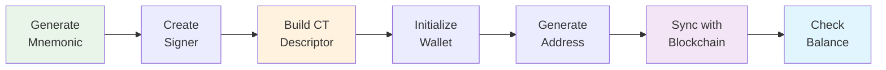

import Tabs from '@theme/Tabs';
import TabItem from '@theme/TabItem';

# Create Your First Wallet

Now that you understand the [essential concepts](./concepts) and have [LWK installed](./installation), let's create your first working Liquid wallet. This tutorial covers the core workflow in each supported programming language.

## What You'll Learn

- Generate a secure mnemonic phrase
- Create a CT descriptor for your wallet
- Generate receiving addresses
- Sync with the Liquid testnet
- Check your wallet balance

## Wallet Creation Flow



## Step-by-Step Tutorial

<Tabs groupId="language">
<TabItem value="python" label="Python" default>

### 1. Create and Run Your Script

```python title="my_first_wallet.py"
import lwk

def main():
    print("Creating your first LWK wallet...")
    
    # Step 1: Generate mnemonic (save this securely!)
    mnemonic = lwk.Mnemonic.generate()
    print(f"🔑 Your mnemonic: {mnemonic}")
    print("⚠️  Save this mnemonic phrase securely!")
    
    # Step 2: Create signer and descriptor
    network = lwk.Network.testnet()
    signer = lwk.Signer(mnemonic, network)
    descriptor = signer.wpkh_slip77_descriptor()
    print(f"📝 CT Descriptor: {descriptor}")
    
    # Step 3: Create wallet
    wallet = lwk.Wollet(network, descriptor, datadir=None)
    
    # Step 4: Generate first address
    address = wallet.address(0)
    print(f"📮 Your first address: {address.address()}")
    
    # Step 5: Connect to blockchain
    client = lwk.ElectrumClient(
        "ssl://elements-testnet.blockstream.info:50002",
        tls=True, validate_domain=True
    )
    
    # Step 6: Sync wallet
    print("🔄 Syncing with blockchain...")
    update = client.full_scan(wallet)
    wallet.apply_update(update)
    
    # Step 7: Check balance
    balance = wallet.balance()
    print("💰 Wallet balance:")
    for asset_id, amount in balance.items():
        print(f"   {asset_id}: {amount:,} satoshi")
    
    if not balance:
        print("   Empty - send some testnet L-BTC to get started!")

if __name__ == "__main__":
    main()
```

### 2. Run Your Wallet

```bash title="Run the script"
python my_first_wallet.py
```

### 3. Get Testnet Funds

Visit the [Liquid Testnet Faucet](https://liquidtestnet.com/faucet) and send some L-BTC to your address.

</TabItem>
<TabItem value="rust" label="Rust">

### 1. Create Your Project

```bash title="Setup new Rust project"
cargo new my-first-wallet
cd my-first-wallet
```

### 2. Add Dependencies

```toml title="Cargo.toml"
[dependencies]
lwk_wollet = "0.10.0"
lwk_signer = "0.10.0"
bip39 = "2.0"
tokio = { version = "1.0", features = ["full"] }
```

### 3. Write Your Wallet Code

```rust title="src/main.rs"
use lwk_wollet::{ElementsNetwork, Wollet, WolletDescriptor, NoPersist, ElectrumClient, full_scan_with_electrum_client};
use lwk_signer::SoftwareSigner;
use bip39::Mnemonic;

#[tokio::main]
async fn main() -> Result<(), Box<dyn std::error::Error>> {
    println!("Creating your first LWK wallet...");
    
    // Step 1: Generate mnemonic (save this securely!)
    let mnemonic = Mnemonic::generate(bip39::Language::English, 128)?;
    println!("🔑 Your mnemonic: {}", mnemonic);
    println!("⚠️  Save this mnemonic phrase securely!");
    
    // Step 2: Create signer and descriptor
    let signer = SoftwareSigner::new(&mnemonic, ElementsNetwork::LiquidTestnet)?;
    let descriptor_str = signer.wpkh_slip77_descriptor()?;
    println!("📝 CT Descriptor: {}", descriptor_str);
    
    // Step 3: Create wallet
    let descriptor: WolletDescriptor = descriptor_str.parse()?;
    let mut wallet = Wollet::new(
        ElementsNetwork::LiquidTestnet,
        NoPersist::new(),
        descriptor,
    )?;
    
    // Step 4: Generate first address
    let address = wallet.address(Some(0))?;
    println!("📮 Your first address: {}", address.address());
    
    // Step 5: Connect to blockchain and sync
    println!("🔄 Syncing with blockchain...");
    let electrum_url = "ssl://elements-testnet.blockstream.info:50002".parse()?;
    let mut client = ElectrumClient::new(&electrum_url)?;
    full_scan_with_electrum_client(&mut wallet, &mut client)?;
    
    // Step 6: Check balance
    let balance = wallet.balance()?;
    println!("💰 Wallet balance:");
    for (asset, amount) in balance {
        println!("   {}: {} satoshi", asset, amount);
    }
    
    if balance.is_empty() {
        println!("   Empty - send some testnet L-BTC to get started!");
    }
    
    Ok(())
}
```

### 4. Run Your Wallet

```bash title="Build and run"
cargo run
```

### 5. Get Testnet Funds

Visit the [Liquid Testnet Faucet](https://liquidtestnet.com/faucet) and send some L-BTC to your address.

</TabItem>
<TabItem value="cli" label="CLI">

### 1. Start LWK Server

```bash title="Start the server"
# Start in background
lwk_cli --network testnet server start &
SERVER_PID=$!
```

### 2. Create Your Wallet Script

```bash title="create_wallet.sh"
#!/bin/bash

echo "Creating your first LWK wallet..."

# Step 1: Generate mnemonic
echo "🔑 Generating mnemonic..."
MNEMONIC=$(lwk_cli signer generate | jq -r .mnemonic)
echo "Your mnemonic: $MNEMONIC"
echo "⚠️  Save this mnemonic phrase securely!"

# Step 2: Load signer
echo "📝 Creating signer..."
lwk_cli signer load-software \
  --persist true \
  --mnemonic "$MNEMONIC" \
  --signer my_signer

# Step 3: Create CT descriptor
echo "🔧 Generating CT descriptor..."
DESCRIPTOR=$(lwk_cli signer singlesig-desc \
  --signer my_signer \
  --descriptor-blinding-key slip77 \
  --kind wpkh | jq -r .descriptor)
echo "CT Descriptor: $DESCRIPTOR"

# Step 4: Load wallet
echo "👁️ Loading wallet..."
lwk_cli wallet load --wallet my_wallet --descriptor "$DESCRIPTOR"

# Step 5: Generate address
echo "📮 Generating address..."
ADDRESS=$(lwk_cli wallet address --wallet my_wallet | jq -r .address)
echo "Your first address: $ADDRESS"

# Step 6: Check balance
echo "💰 Checking balance..."
lwk_cli wallet balance --wallet my_wallet

echo ""
echo "🎉 Wallet created successfully!"
echo "📧 Send testnet L-BTC to: $ADDRESS"
echo "🌐 Faucet: https://liquidtestnet.com/faucet"
```

### 3. Run Your Script

```bash title="Execute the script"
chmod +x create_wallet.sh
./create_wallet.sh
```

### 4. Check Balance Later

```bash title="Check balance anytime"
lwk_cli wallet balance --wallet my_wallet
```

### 5. Stop Server When Done

```bash title="Cleanup"
kill $SERVER_PID
```

</TabItem>
<TabItem value="javascript" label="JavaScript/WASM">

### 1. Setup Your Project

```bash title="Create new project"
mkdir my-first-wallet
cd my-first-wallet
npm init -y
npm install lwk-wasm
```

### 2. Create Your Wallet Code

```javascript title="wallet.js"
import init, { Mnemonic, Network, Signer, Wollet } from 'lwk-wasm';

async function createWallet() {
    console.log("Creating your first LWK wallet...");
    
    // Initialize WASM module
    await init();
    
    // Step 1: Generate mnemonic (save this securely!)
    const mnemonic = Mnemonic.generate();
    console.log(`🔑 Your mnemonic: ${mnemonic.toString()}`);
    console.log("⚠️  Save this mnemonic phrase securely!");
    
    // Step 2: Create signer and descriptor
    const network = Network.testnet();
    const signer = new Signer(mnemonic, network);
    const descriptor = signer.wpkhSlip77Descriptor();
    console.log(`📝 CT Descriptor: ${descriptor}`);
    
    // Step 3: Create wallet
    const wallet = new Wollet(network, descriptor);
    
    // Step 4: Generate first address
    const address = wallet.address(0);
    console.log(`📮 Your first address: ${address.address()}`);
    
    // Note: Browser blockchain sync requires CORS setup
    console.log("💰 Balance: Use server-side code for blockchain sync");
    console.log("🌐 Faucet: https://liquidtestnet.com/faucet");
    
    return {
        mnemonic: mnemonic.toString(),
        address: address.address(),
        descriptor: descriptor
    };
}

// Run the wallet creation
createWallet()
    .then(result => {
        console.log("🎉 Wallet created successfully!");
        console.log(`📧 Send testnet L-BTC to: ${result.address}`);
    })
    .catch(console.error);
```

### 3. Add to package.json

```json title="package.json"
{
  "type": "module",
  "scripts": {
    "start": "node wallet.js"
  }
}
```

### 4. Run Your Wallet

```bash title="Execute the script"
npm start
```

</TabItem>
<TabItem value="kotlin" label="Kotlin">

### 1. Setup Android Project

Create a new Android project in Android Studio and add the dependency:

```kotlin title="build.gradle.kts (Module: app)"
dependencies {
    implementation("com.blockstream:lwk-android:0.10.0")
}
```

### 2. Create Wallet Class

```kotlin title="WalletManager.kt"
import com.blockstream.lwk.*
import android.util.Log

class WalletManager {
    
    fun createFirstWallet(): WalletResult {
        Log.d("LWK", "Creating your first LWK wallet...")
        
        // Step 1: Generate mnemonic (save this securely!)
        val mnemonic = Mnemonic.generate()
        Log.d("LWK", "🔑 Your mnemonic: $mnemonic")
        Log.w("LWK", "⚠️ Save this mnemonic phrase securely!")
        
        // Step 2: Create signer and descriptor
        val network = Network.testnet()
        val signer = Signer(mnemonic, network)
        val descriptor = signer.wpkhSlip77Descriptor()
        Log.d("LWK", "📝 CT Descriptor: $descriptor")
        
        // Step 3: Create wallet
        val wallet = Wollet(network, descriptor, datadir = null)
        
        // Step 4: Generate first address
        val address = wallet.address(0u)
        Log.d("LWK", "📮 Your first address: ${address.address()}")
        
        // Step 5: Connect and sync (in coroutine for network calls)
        val client = ElectrumClient(
            url = "ssl://elements-testnet.blockstream.info:50002",
            tls = true,
            validateDomain = true
        )
        
        try {
            val update = client.fullScan(wallet)
            wallet.applyUpdate(update)
            Log.d("LWK", "🔄 Wallet synced successfully")
        } catch (e: Exception) {
            Log.e("LWK", "Sync failed: ${e.message}")
        }
        
        // Step 6: Check balance
        val balance = wallet.balance()
        Log.d("LWK", "💰 Wallet balance:")
        for ((assetId, amount) in balance) {
            Log.d("LWK", "   $assetId: $amount satoshi")
        }
        
        if (balance.isEmpty()) {
            Log.d("LWK", "   Empty - send some testnet L-BTC to get started!")
        }
        
        return WalletResult(
            mnemonic = mnemonic.toString(),
            address = address.address(),
            descriptor = descriptor,
            balance = balance
        )
    }
}

data class WalletResult(
    val mnemonic: String,
    val address: String,
    val descriptor: String,
    val balance: Map<AssetId, ULong>
)
```

### 3. Use in Activity

```kotlin title="MainActivity.kt"
import androidx.lifecycle.lifecycleScope
import kotlinx.coroutines.launch

class MainActivity : AppCompatActivity() {
    private val walletManager = WalletManager()
    
    override fun onCreate(savedInstanceState: Bundle?) {
        super.onCreate(savedInstanceState)
        
        lifecycleScope.launch {
            val result = walletManager.createFirstWallet()
            
            // Display result in UI
            Toast.makeText(this@MainActivity, 
                "Wallet created! Address: ${result.address}", 
                Toast.LENGTH_LONG).show()
        }
    }
}
```

</TabItem>
<TabItem value="swift" label="Swift">

### 1. Setup iOS Project

Create a new iOS project in Xcode and add the Swift package dependency:
`https://github.com/Blockstream/lwk-swift.git`

### 2. Create Wallet Manager

```swift title="WalletManager.swift"
import Foundation
import LiquidWalletKit

class WalletManager: ObservableObject {
    
    func createFirstWallet() async -> WalletResult? {
        print("Creating your first LWK wallet...")
        
        do {
            // Step 1: Generate mnemonic (save this securely!)
            let mnemonic = Mnemonic.generate()
            print("🔑 Your mnemonic: \(mnemonic)")
            print("⚠️ Save this mnemonic phrase securely!")
            
            // Step 2: Create signer and descriptor
            let network = Network.testnet()
            let signer = try Signer(mnemonic: mnemonic, network: network)
            let descriptor = try signer.wpkhSlip77Descriptor()
            print("📝 CT Descriptor: \(descriptor)")
            
            // Step 3: Create wallet
            let wallet = try Wollet(network: network, descriptor: descriptor, datadir: nil)
            
            // Step 4: Generate first address
            let address = try wallet.address(index: 0)
            print("📮 Your first address: \(address.address())")
            
            // Step 5: Connect and sync
            let client = try ElectrumClient(
                url: "ssl://elements-testnet.blockstream.info:50002",
                tls: true,
                validateDomain: true
            )
            
            let update = try client.fullScan(wallet: wallet)
            try wallet.applyUpdate(update: update)
            print("🔄 Wallet synced successfully")
            
            // Step 6: Check balance
            let balance = try wallet.balance()
            print("💰 Wallet balance:")
            for (assetId, amount) in balance {
                print("   \(assetId): \(amount) satoshi")
            }
            
            if balance.isEmpty {
                print("   Empty - send some testnet L-BTC to get started!")
            }
            
            return WalletResult(
                mnemonic: mnemonic.toString(),
                address: address.address(),
                descriptor: descriptor,
                balance: balance
            )
            
        } catch {
            print("❌ Error creating wallet: \(error)")
            return nil
        }
    }
}

struct WalletResult {
    let mnemonic: String
    let address: String
    let descriptor: String
    let balance: [AssetId: UInt64]
}
```

### 3. Use in SwiftUI View

```swift title="ContentView.swift"
import SwiftUI

struct ContentView: View {
    @StateObject private var walletManager = WalletManager()
    @State private var walletResult: WalletResult?
    @State private var isCreating = false
    
    var body: some View {
        VStack(spacing: 20) {
            if let result = walletResult {
                Text("✅ Wallet Created!")
                    .font(.headline)
                
                Text("Address: \(result.address)")
                    .font(.caption)
                    .foregroundColor(.secondary)
                
                if result.balance.isEmpty {
                    Text("Send testnet L-BTC to get started!")
                }
            } else {
                Button("Create My First Wallet") {
                    createWallet()
                }
                .disabled(isCreating)
            }
        }
        .padding()
    }
    
    private func createWallet() {
        isCreating = true
        Task {
            let result = await walletManager.createFirstWallet()
            await MainActor.run {
                self.walletResult = result
                self.isCreating = false
            }
        }
    }
}
```

</TabItem>
</Tabs>

## Important Security Notes

### 🔐 Mnemonic Storage
- **NEVER** hardcode mnemonics in your source code
- Store mnemonics securely using platform-specific secure storage
- Consider using hardware wallets for production applications

### 🌐 Network Selection
- This tutorial uses **testnet** for safe experimentation
- Switch to **mainnet** only when you're ready for production
- Always double-check network configuration

### 🔒 Production Considerations
- Implement proper error handling
- Use secure key storage mechanisms
- Consider multisig setups for higher security
- Regularly backup wallet data

## Next Steps

Now that you have a working wallet:

1. **[Send Your First Transaction](../transactions/building-transactions)** - Learn to send L-BTC
2. **[Asset Operations](../assets/issuance)** - Issue your own tokens
3. **[Hardware Integration](../core-components/hardware-wallets)** - Connect hardware wallets
4. **[Multisig Setup](../multisig/overview)** - Create multi-signature wallets

 