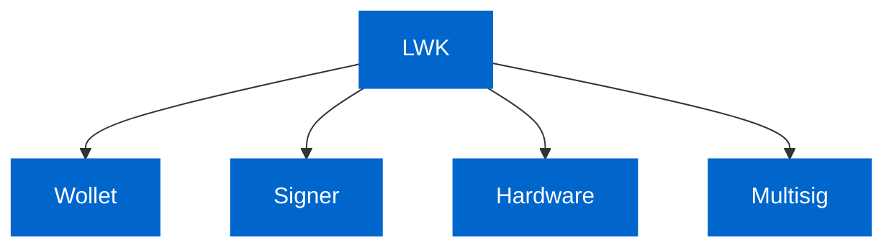
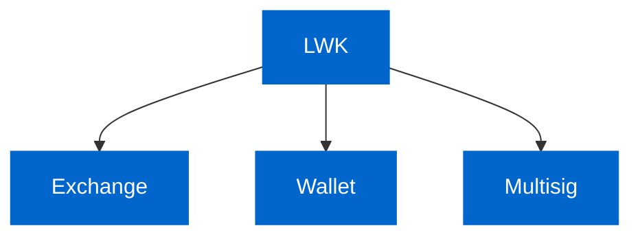

# Introduction to Liquid Wallet Kit (LWK)

## What is Liquid?

[Liquid](https://docs.liquid.net) is a Bitcoin sidechain that extends Bitcoin with features like confidential transactions, issued assets, and faster settlement times. Think of it as Bitcoin with enhanced privacy and the ability to create custom tokens (like USDT-Liquid) while maintaining Bitcoin's security model.

## What is LWK?

**Liquid Wallet Kit (LWK)** is a comprehensive Rust-based toolkit that lets developers build Liquid wallets and applications. Instead of building Liquid functionality from scratch, LWK provides battle-tested, modular components that handle the complex parts for you.

**Important**: LWK is **not** a wallet itself but rather the engine that powers wallets to use Liquid.

### Key Features

- **Watch-Only Wallets**: Track balances and generate addresses without storing private keys
- **Multi-Language Support**: 
  
  
  
  
  
  
- **Hardware Integration**: Built-in support for Jade and Ledger hardware wallets
- **Asset Management**: Handle Bitcoin, USDT, and any other Liquid assets

## Core Capabilities

### Wollet (Watch-Only Wallet)
- Create and manage watch-only wallets using descriptors
- Generate receiving addresses with privacy features
- Sync with the Liquid blockchain and track balances
- Handle any Liquid asset (L-BTC, USDT-Liquid, etc.)

### Signer
- Build and sign transactions using PSET format
- Software-based signing with private keys
- Integration with hardware wallets for secure signing
- Support for complex transaction types and asset transfers

### Hardware
- Native integration with Jade hardware wallets
- Support for Ledger devices
- Secure transaction signing with hardware devices
- Multi-device support for different signing scenarios

### Multisig
- Create and manage multi-signature wallets
- Support for various threshold configurations (2-of-3, 3-of-5, etc.)
- Hardware wallet integration for multisig signing
- Enterprise-grade security for treasury management

## Who Should Use LWK?

### Exchange
Building a cryptocurrency exchange that needs Liquid asset support? LWK provides:
- **Watch-Only Wallets**: Track user deposits without storing private keys
- **Asset Support**: Handle L-BTC, USDT-Liquid, and other issued assets
- **Batch Processing**: Efficiently process multiple transactions
- **Hot/Cold Separation**: Keep signing keys offline for security
- **Hardware Integration**: Use hardware wallets for cold storage signing

### Wallet
Creating mobile or web wallets for end users? LWK offers:
- **Cross-Platform**: Use the same codebase on iOS, Android, and web
- **Privacy**: Built-in confidential transactions for user privacy
- **Hardware Support**: Let users secure funds with Jade or Ledger devices
- **Simple APIs**: Abstract complex Liquid concepts behind easy-to-use interfaces
- **Asset Management**: Support any Liquid asset with unified wallet experience

### Multisig
Need secure multi-signature setups for treasury or enterprise use? LWK enables:
- **Flexible Thresholds**: Configure 2-of-3, 3-of-5, or any M-of-N setup
- **Hardware Signing**: Each signer can use their own Jade or Ledger device
- **Policy Enforcement**: Require multiple approvals for transactions
- **Enterprise Security**: Perfect for company treasuries holding USDT-Liquid
- **Audit Trail**: Complete transaction history and compliance reporting

**Example**: A company treasury holding USDT-Liquid in a 2-of-3 multisig where any two executives must approve transactions using their Jade hardware wallets.

## Quick Navigation

Ready to start building? Choose your path:

- **[Getting Started](./getting-started)** - New to LWK? Start here
- **[Installation](./getting-started/installation)** - Set up your environment  
- **[Core Components](./core-components)** - Understand the architecture
- **[Tutorials](./tutorials/)** - Learn by building
- **[API Reference](./reference/)** - Technical documentation

---

*LWK is developed and maintained by [Blockstream](https://blockstream.com) and the open-source community.* 