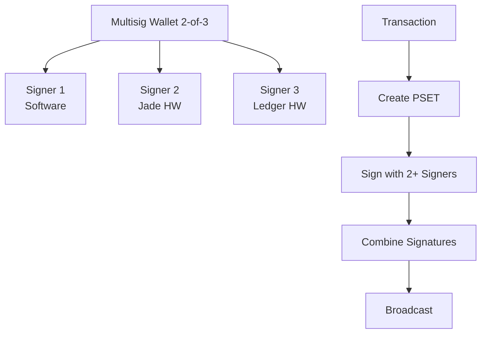

import Tabs from '@theme/Tabs';
import TabItem from '@theme/TabItem';

# Multisig Wallets in LWK

Multisig (M-of-N) wallets require multiple signatures to authorize transactions, providing enhanced security and distributed control. LWK supports multisig wallets with software and hardware signers, maintaining Liquid's confidential transaction privacy.

## Multisig Architecture



### Common Configurations

| Configuration | Use Case | Security vs Convenience |
|---------------|----------|------------------------|
| 2-of-2 | Joint custody, partnerships | High security, both parties required |
| 2-of-3 | Personal/small business | Good balance, backup key available |
| 3-of-5 | Corporate treasury | High security, multiple approvers |

## Supported Signer Types

LWK supports mixing different signer types in the same multisig wallet:

<Tabs groupId="language">
<TabItem value="rust" label="Rust" default>

```rust
use lwk_signer::SwSigner;
use lwk_jade::Jade;
use lwk_ledger::Ledger;

// Software signer
let software_signer = SwSigner::new(mnemonic, is_mainnet)?;

// Hardware signers
let jade = Jade::from_tcp("192.168.1.100:30121")?;
let ledger = Ledger::new(transport)?;

// Mixed 2-of-3 setup example
// Signer 1: Software (daily operations)
// Signer 2: Jade (secure approval)  
// Signer 3: Ledger (backup/recovery)
```

</TabItem>
<TabItem value="python" label="Python">

```python
from lwk import SwSigner, Jade, Ledger

# Software signer
software_signer = SwSigner(mnemonic, is_mainnet)

# Hardware signers
jade = Jade.from_tcp("192.168.1.100:30121")
ledger = Ledger(transport)

# Mixed 2-of-3 setup example
# Signer 1: Software (daily operations)
# Signer 2: Jade (secure approval)
# Signer 3: Ledger (backup/recovery)
```

</TabItem>
<TabItem value="kotlin" label="Kotlin">

```kotlin
import com.blockstream.lwk.*

// Software signer
val softwareSigner = SwSigner(mnemonic, isMainnet)

// Hardware signers
val jade = Jade.fromTcp("192.168.1.100:30121")
val ledger = Ledger(transport)

// Mixed 2-of-3 setup example
// Signer 1: Software (daily operations)
// Signer 2: Jade (secure approval)
// Signer 3: Ledger (backup/recovery)
```

</TabItem>
<TabItem value="swift" label="Swift">

```swift
import LiquidWalletKit

// Software signer
let softwareSigner = try SwSigner(mnemonic: mnemonic, isMainnet: isMainnet)

// Hardware signers
let jade = try Jade.fromTcp("192.168.1.100:30121")
let ledger = try Ledger(transport: transport)

// Mixed 2-of-3 setup example
// Signer 1: Software (daily operations)
// Signer 2: Jade (secure approval)
// Signer 3: Ledger (backup/recovery)
```

</TabItem>
</Tabs>

## Multisig Workflow

The basic multisig workflow involves four main steps:

### 1. Setup Phase

<Tabs groupId="language">
<TabItem value="rust" label="Rust" default>

```rust
// Collect XPubs from all signers
let xpubs = vec![
    format!("[{}]{}", signer1.fingerprint(), signer1.xpub()),
    format!("[{}]{}", signer2.fingerprint(), signer2.xpub()),
    format!("[{}]{}", signer3.fingerprint(), signer3.xpub()),
];

// Create multisig descriptor
let descriptor = multisig_desc(
    2, // threshold
    parsed_xpubs,
    Multisig::Wsh,
    DescriptorBlindingKey::Slip77Rand,
)?;

// Create wallet
let wollet = Wollet::new(network, descriptor, db)?;
```

</TabItem>
<TabItem value="python" label="Python">

```python
# Collect XPubs from all signers
xpubs = [
    f"[{signer1.fingerprint()}]{signer1.xpub()}",
    f"[{signer2.fingerprint()}]{signer2.xpub()}",
    f"[{signer3.fingerprint()}]{signer3.xpub()}",
]

# Create multisig descriptor
descriptor = multisig_desc(
    2,  # threshold
    parsed_xpubs,
    Multisig.WSH,
    DescriptorBlindingKey.SLIP77_RAND,
)

# Create wallet
wollet = Wollet(network, descriptor, db)
```

</TabItem>
<TabItem value="kotlin" label="Kotlin">

```kotlin
// Collect XPubs from all signers
val xpubs = listOf(
    "[${signer1.fingerprint()}]${signer1.xpub()}",
    "[${signer2.fingerprint()}]${signer2.xpub()}",
    "[${signer3.fingerprint()}]${signer3.xpub()}",
)

// Create multisig descriptor
val descriptor = multisigDesc(
    2, // threshold
    parsedXpubs,
    Multisig.WSH,
    DescriptorBlindingKey.SLIP77_RAND,
)

// Create wallet
val wollet = Wollet(network, descriptor, db)
```

</TabItem>
<TabItem value="swift" label="Swift">

```swift
// Collect XPubs from all signers
let xpubs = [
    "[\(signer1.fingerprint())]\(signer1.xpub())",
    "[\(signer2.fingerprint())]\(signer2.xpub())",
    "[\(signer3.fingerprint())]\(signer3.xpub())",
]

// Create multisig descriptor
let descriptor = try multisigDesc(
    threshold: 2,
    xpubs: parsedXpubs,
    scriptVariant: .wsh,
    blindingVariant: .slip77Rand
)

// Create wallet
let wollet = try Wollet(network: network, descriptor: descriptor, db: db)
```

</TabItem>
</Tabs>

### 2. Transaction Creation

<Tabs groupId="language">
<TabItem value="rust" label="Rust" default>

```rust
// Create transaction
let pset = wollet.tx_builder()
    .add_addressee(&recipient)
    .fee_rate(Some(1000))
    .finish()?;

// Check what signatures are needed
let details = wollet.get_details(&pset)?;
println!("Missing signatures: {}", 
         details.sig_details[0].missing_signature.len());
```

</TabItem>
<TabItem value="python" label="Python">

```python
# Create transaction
pset = wollet.tx_builder() \
    .add_addressee(recipient) \
    .fee_rate(1000) \
    .finish()

# Check what signatures are needed
details = wollet.get_details(pset)
print(f"Missing signatures: {len(details.sig_details[0].missing_signature)}")
```

</TabItem>
<TabItem value="kotlin" label="Kotlin">

```kotlin
// Create transaction
val pset = wollet.txBuilder()
    .addAddressee(recipient)
    .feeRate(1000UL)
    .finish()

// Check what signatures are needed
val details = wollet.getDetails(pset)
println("Missing signatures: ${details.sigDetails[0].missingSignature.size}")
```

</TabItem>
<TabItem value="swift" label="Swift">

```swift
// Create transaction
let pset = try wollet.txBuilder()
    .addAddressee(recipient)
    .feeRate(1000)
    .finish()

// Check what signatures are needed
let details = try wollet.getDetails(pset)
print("Missing signatures: \(details.sigDetails[0].missingSignature.count)")
```

</TabItem>
</Tabs>

### 3. Signature Collection

<Tabs groupId="language">
<TabItem value="rust" label="Rust" default>

```rust
// Each signer signs their copy
let mut pset1 = pset.clone();
let mut pset2 = pset.clone();

signer1.sign(&mut pset1)?;
signer2.sign(&mut pset2)?;

// Combine signatures
let combined = wollet.combine(&vec![pset1, pset2])?;
```

</TabItem>
<TabItem value="python" label="Python">

```python
# Each signer signs their copy
pset1 = pset.copy()
pset2 = pset.copy()

signer1.sign(pset1)
signer2.sign(pset2)

# Combine signatures
combined = wollet.combine([pset1, pset2])
```

</TabItem>
<TabItem value="kotlin" label="Kotlin">

```kotlin
// Each signer signs their copy
val pset1 = pset.copy()
val pset2 = pset.copy()

signer1.sign(pset1)
signer2.sign(pset2)

// Combine signatures
val combined = wollet.combine(listOf(pset1, pset2))
```

</TabItem>
<TabItem value="swift" label="Swift">

```swift
// Each signer signs their copy
let pset1 = pset.copy()
let pset2 = pset.copy()

try signer1.sign(&pset1)
try signer2.sign(&pset2)

// Combine signatures
let combined = try wollet.combine([pset1, pset2])
```

</TabItem>
</Tabs>

### 4. Finalization and Broadcast

<Tabs groupId="language">
<TabItem value="rust" label="Rust" default>

```rust
// Finalize when threshold is met
let tx = wollet.finalize(&mut combined)?;
println!("Transaction ready: {}", tx.txid());

// Broadcast to network
// electrum_client.broadcast(&tx)?;
```

</TabItem>
<TabItem value="python" label="Python">

```python
# Finalize when threshold is met
tx = wollet.finalize(combined)
print(f"Transaction ready: {tx.txid()}")

# Broadcast to network
# electrum_client.broadcast(tx)
```

</TabItem>
<TabItem value="kotlin" label="Kotlin">

```kotlin
// Finalize when threshold is met
val tx = wollet.finalize(combined)
println("Transaction ready: ${tx.txid()}")

// Broadcast to network
// electrumClient.broadcast(tx)
```

</TabItem>
<TabItem value="swift" label="Swift">

```swift
// Finalize when threshold is met
let tx = try wollet.finalize(combined)
print("Transaction ready: \(tx.txid())")

// Broadcast to network
// try electrumClient.broadcast(tx)
```

</TabItem>
</Tabs>

## Key Considerations

**Security Model**: Each signer independently validates transactions before signing. No single party can authorize transactions alone when threshold > 1.

**Coordination**: PSETs serve as the communication medium between signers. They can be transmitted via any secure channel (encrypted messaging, secure storage, etc.).

**Hardware Integration**: Hardware wallets must register multisig policies before they can sign transactions. This is a one-time setup per wallet.

**Confidential Transactions**: All multisig transactions maintain Liquid's privacy features - amounts and asset types remain confidential to outside observers.