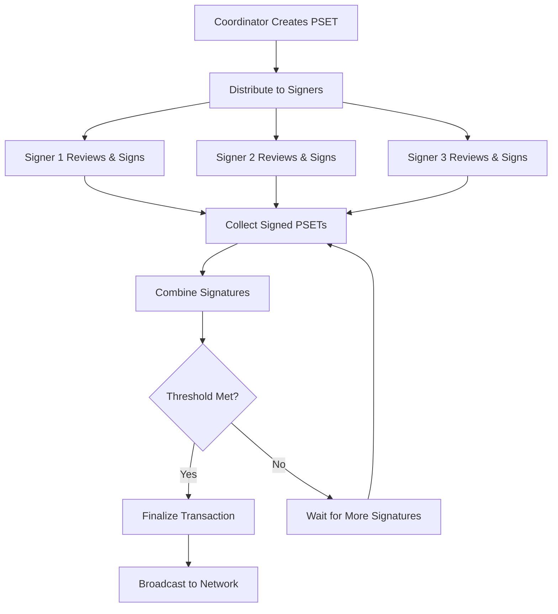

import Tabs from '@theme/Tabs';
import TabItem from '@theme/TabItem';

# Multisig Transaction Coordination

Creating and signing multisig transactions in LWK involves a coordinated workflow where multiple parties must collaborate to authorize transactions. This process requires careful orchestration of PSET (Partially Signed Elements Transaction) creation, distribution, signing, collection, and finalization.

## Understanding the Multisig Transaction Flow

The multisig transaction process differs significantly from single-signature transactions in its collaborative nature. Instead of one party creating and signing a transaction in isolation, multisig transactions require coordination among multiple independent signers, each contributing their signature piece by piece until the threshold requirement is met.

This coordination happens through PSETs, which serve as the communication medium between signers. A PSET contains all the necessary transaction information while allowing for incremental signature collection. Each signer receives the PSET, adds their signature if they approve the transaction, and passes it along until enough signatures are collected to meet the threshold requirement.



## Complete End-to-End Example

Let's walk through a complete multisig transaction from creation to broadcast using a realistic 2-of-3 setup:

### Setup: Creating the Multisig Wallet

<Tabs groupId="language">
<TabItem value="rust" label="Rust" default>

```rust
use lwk_signer::SwSigner;
use lwk_wollet::{Wollet, WolletDescriptor};
use lwk_common::{multisig_desc, Multisig, DescriptorBlindingKey};
use elements::bitcoin::Network;

// Step 1: Generate signers (in real scenario, each party does this independently)
let signer1 = SwSigner::new("abandon abandon abandon abandon abandon abandon abandon abandon abandon abandon abandon about", false)?;
let signer2 = SwSigner::new("abandon abandon abandon abandon abandon abandon abandon abandon abandon abandon abandon abandon", false)?;
let signer3 = SwSigner::new("abandon abandon abandon abandon abandon abandon abandon abandon abandon abandon abandon able", false)?;

// Step 2: Collect xpubs from all participants
let xpub1 = format!("[{}]{}", signer1.fingerprint(), signer1.xpub());
let xpub2 = format!("[{}]{}", signer2.fingerprint(), signer2.xpub());
let xpub3 = format!("[{}]{}", signer3.fingerprint(), signer3.xpub());

let keyorigin_xpubs = vec![xpub1, xpub2, xpub3];
let parsed_xpubs: Vec<_> = keyorigin_xpubs
    .iter()
    .map(|s| keyorigin_xpub_from_str(s))
    .collect::<Result<Vec<_>, _>>()?;

// Step 3: Create 2-of-3 multisig descriptor
let descriptor_str = multisig_desc(
    2, // 2-of-3 threshold
    parsed_xpubs,
    Multisig::Wsh,
    DescriptorBlindingKey::Slip77Rand,
)?;

println!("Multisig descriptor: {}", descriptor_str);

// Step 4: Create wallet from descriptor
let descriptor = WolletDescriptor::new(&descriptor_str)?;
let wollet = Wollet::new(Network::Regtest, descriptor, db)?;

println!("Multisig wallet created successfully");
```

</TabItem>
<TabItem value="python" label="Python">

```python
from lwk import SwSigner, Wollet, WolletDescriptor, multisig_desc, Multisig, DescriptorBlindingKey, Network, keyorigin_xpub_from_str

# Step 1: Generate signers (in real scenario, each party does this independently)
signer1 = SwSigner("abandon abandon abandon abandon abandon abandon abandon abandon abandon abandon abandon about", False)
signer2 = SwSigner("abandon abandon abandon abandon abandon abandon abandon abandon abandon abandon abandon abandon", False)
signer3 = SwSigner("abandon abandon abandon abandon abandon abandon abandon abandon abandon abandon abandon able", False)

# Step 2: Collect xpubs from all participants
xpub1 = f"[{signer1.fingerprint()}]{signer1.xpub()}"
xpub2 = f"[{signer2.fingerprint()}]{signer2.xpub()}"
xpub3 = f"[{signer3.fingerprint()}]{signer3.xpub()}"

keyorigin_xpubs = [xpub1, xpub2, xpub3]
parsed_xpubs = [keyorigin_xpub_from_str(s) for s in keyorigin_xpubs]

# Step 3: Create 2-of-3 multisig descriptor
descriptor_str = multisig_desc(
    2,  # 2-of-3 threshold
    parsed_xpubs,
    Multisig.WSH,
    DescriptorBlindingKey.SLIP77_RAND,
)

print(f"Multisig descriptor: {descriptor_str}")

# Step 4: Create wallet from descriptor
descriptor = WolletDescriptor(descriptor_str)
wollet = Wollet(Network.REGTEST, descriptor, db)

print("Multisig wallet created successfully")
```

</TabItem>
<TabItem value="kotlin" label="Kotlin">

```kotlin
import com.blockstream.lwk.*

// Step 1: Generate signers (in real scenario, each party does this independently)
val signer1 = SwSigner("abandon abandon abandon abandon abandon abandon abandon abandon abandon abandon abandon about", false)
val signer2 = SwSigner("abandon abandon abandon abandon abandon abandon abandon abandon abandon abandon abandon abandon", false)
val signer3 = SwSigner("abandon abandon abandon abandon abandon abandon abandon abandon abandon abandon abandon able", false)

// Step 2: Collect xpubs from all participants
val xpub1 = "[${signer1.fingerprint()}]${signer1.xpub()}"
val xpub2 = "[${signer2.fingerprint()}]${signer2.xpub()}"
val xpub3 = "[${signer3.fingerprint()}]${signer3.xpub()}"

val keyoriginXpubs = listOf(xpub1, xpub2, xpub3)
val parsedXpubs = keyoriginXpubs.map { keyoriginXpubFromStr(it) }

// Step 3: Create 2-of-3 multisig descriptor
val descriptorStr = multisigDesc(
    2, // 2-of-3 threshold
    parsedXpubs,
    Multisig.WSH,
    DescriptorBlindingKey.SLIP77_RAND,
)

println("Multisig descriptor: $descriptorStr")

// Step 4: Create wallet from descriptor
val descriptor = WolletDescriptor(descriptorStr)
val wollet = Wollet(Network.REGTEST, descriptor, db)

println("Multisig wallet created successfully")
```

</TabItem>
<TabItem value="swift" label="Swift">

```swift
import LiquidWalletKit

// Step 1: Generate signers (in real scenario, each party does this independently)
let signer1 = try SwSigner(mnemonic: "abandon abandon abandon abandon abandon abandon abandon abandon abandon abandon abandon about", isMainnet: false)
let signer2 = try SwSigner(mnemonic: "abandon abandon abandon abandon abandon abandon abandon abandon abandon abandon abandon abandon", isMainnet: false)
let signer3 = try SwSigner(mnemonic: "abandon abandon abandon abandon abandon abandon abandon abandon abandon abandon abandon able", isMainnet: false)

// Step 2: Collect xpubs from all participants
let xpub1 = "[\(signer1.fingerprint())]\(signer1.xpub())"
let xpub2 = "[\(signer2.fingerprint())]\(signer2.xpub())"
let xpub3 = "[\(signer3.fingerprint())]\(signer3.xpub())"

let keyoriginXpubs = [xpub1, xpub2, xpub3]
let parsedXpubs = try keyoriginXpubs.map { try keyoriginXpubFromStr($0) }

// Step 3: Create 2-of-3 multisig descriptor
let descriptorStr = try multisigDesc(
    threshold: 2, // 2-of-3 threshold
    xpubs: parsedXpubs,
    scriptVariant: .wsh,
    blindingVariant: .slip77Rand
)

print("Multisig descriptor: \(descriptorStr)")

// Step 4: Create wallet from descriptor
let descriptor = try WolletDescriptor(descriptorStr)
let wollet = try Wollet(network: .regtest, descriptor: descriptor, db: db)

print("Multisig wallet created successfully")
```

</TabItem>
</Tabs>

### Transaction Creation and Coordination

Now let's create and coordinate a multisig transaction:

<Tabs groupId="language">
<TabItem value="rust" label="Rust" default>

```rust
use lwk_wollet::{TxBuilder, AddressAmount};
use elements::{Address, AssetId};

// Step 1: Fund the wallet (this would happen through receiving funds)
// Assume the wallet has been funded and synced...

// Step 2: Create a transaction (typically done by a coordinator)
let recipient_address = Address::from_str("ert1qar0srrr7xfkvy5l643lydnw9re59gtzzwf5mdq")?;
let amount = 100_000; // 0.001 L-BTC

let recipient = AddressAmount {
    address: recipient_address,
    amount,
    asset: AssetId::LIQUID_BTC,
};

// Create the initial PSET
let mut pset = wollet.tx_builder()
    .add_addressee(&recipient)
    .fee_rate(Some(1000)) // 1000 sat/vB
    .finish()?;

println!("Created PSET for coordination");
println!("PSET (base64): {}", pset.to_string());

// Step 3: Get transaction details before signing
let details = wollet.get_details(&pset)?;
println!("Transaction details:");
println!("  Fee: {} sats", details.fee);
println!("  Inputs: {}", details.balances.len());
println!("  Outputs: {}", pset.outputs().len());

// Check signature requirements
for (input_idx, sig_detail) in details.sig_details.iter().enumerate() {
    println!("Input {} signature status:", input_idx);
    println!("  Has signatures: {}", sig_detail.has_signature.len());
    println!("  Missing signatures: {}", sig_detail.missing_signature.len());
    
    for (pk, (fingerprint, derivation_path)) in &sig_detail.missing_signature {
        println!("    Required from: {} (path: {:?})", fingerprint, derivation_path);
    }
}

// Step 4: Sign with first signer
let mut pset1 = pset.clone();
let signatures_added_1 = signer1.sign(&mut pset1)?;
println!("Signer 1 added {} signatures", signatures_added_1);

// Step 5: Sign with second signer  
let mut pset2 = pset.clone();
let signatures_added_2 = signer2.sign(&mut pset2)?;
println!("Signer 2 added {} signatures", signatures_added_2);

// In a real scenario, pset1 and pset2 would be transmitted between parties
// Here we simulate the collection process

// Step 6: Combine the signed PSETs
let combined_pset = wollet.combine(&vec![pset1, pset2])?;
println!("Successfully combined PSETs");

// Step 7: Check if we have enough signatures
let final_details = wollet.get_details(&combined_pset)?;
let mut threshold_met = true;

for (input_idx, sig_detail) in final_details.sig_details.iter().enumerate() {
    println!("Final input {} signature status:", input_idx);
    println!("  Has signatures: {}", sig_detail.has_signature.len());
    println!("  Missing signatures: {}", sig_detail.missing_signature.len());
    
    if sig_detail.has_signature.len() < 2 {
        threshold_met = false;
        println!("  ❌ Threshold not met for input {}", input_idx);
    } else {
        println!("  ✅ Threshold met for input {}", input_idx);
    }
}

if threshold_met {
    println!("🎉 All inputs have sufficient signatures!");
    
    // Step 8: Finalize and broadcast
    let mut finalized_pset = combined_pset;
    
    // Finalize the PSET
    let tx = wollet.finalize(&mut finalized_pset)?;
    println!("Transaction finalized. TXID: {}", tx.txid());
    
    // Broadcast to network (in real scenario)
    // let txid = electrum_client.broadcast(&tx)?;
    println!("Transaction ready for broadcast");
    println!("Raw transaction: {}", elements::encode::serialize_hex(&tx));
    
} else {
    println!("❌ Insufficient signatures. Need one more signer.");
    
    // In practice, you would wait for the third signer or handle the incomplete transaction
    // For demonstration, let's show what happens with the third signer:
    
    let mut pset3 = pset.clone();
    let signatures_added_3 = signer3.sign(&mut pset3)?;
    println!("Signer 3 added {} signatures", signatures_added_3);
    
    // Combine all three (though only two are needed)
    let final_combined = wollet.combine(&vec![pset1, pset2, pset3])?;
    let tx = wollet.finalize(&mut final_combined.clone())?;
    println!("Transaction with all three signatures. TXID: {}", tx.txid());
}
```

</TabItem>
<TabItem value="python" label="Python">

```python
from lwk import TxBuilder, AddressAmount, AssetId, Address

# Step 1: Fund the wallet (this would happen through receiving funds)
# Assume the wallet has been funded and synced...

# Step 2: Create a transaction (typically done by a coordinator)
recipient_address = Address("ert1qar0srrr7xfkvy5l643lydnw9re59gtzzwf5mdq")
amount = 100_000  # 0.001 L-BTC

recipient = AddressAmount(
    address=recipient_address,
    amount=amount,
    asset=AssetId.LBTC()
)

# Create the initial PSET
pset = wollet.tx_builder() \
    .add_addressee(recipient) \
    .fee_rate(1000) \
    .finish()

print("Created PSET for coordination")
print(f"PSET (base64): {pset}")

# Step 3: Get transaction details before signing
details = wollet.get_details(pset)
print("Transaction details:")
print(f"  Fee: {details.fee} sats")
print(f"  Inputs: {len(details.balances)}")
print(f"  Outputs: {len(pset.outputs())}")

# Check signature requirements
for input_idx, sig_detail in enumerate(details.sig_details):
    print(f"Input {input_idx} signature status:")
    print(f"  Has signatures: {len(sig_detail.has_signature)}")
    print(f"  Missing signatures: {len(sig_detail.missing_signature)}")
    
    for pk, (fingerprint, derivation_path) in sig_detail.missing_signature.items():
        print(f"    Required from: {fingerprint} (path: {derivation_path})")

# Step 4: Sign with first signer
pset1 = pset.copy()
signatures_added_1 = signer1.sign(pset1)
print(f"Signer 1 added {signatures_added_1} signatures")

# Step 5: Sign with second signer
pset2 = pset.copy()
signatures_added_2 = signer2.sign(pset2)
print(f"Signer 2 added {signatures_added_2} signatures")

# Step 6: Combine the signed PSETs
combined_pset = wollet.combine([pset1, pset2])
print("Successfully combined PSETs")

# Step 7: Check if we have enough signatures
final_details = wollet.get_details(combined_pset)
threshold_met = True

for input_idx, sig_detail in enumerate(final_details.sig_details):
    print(f"Final input {input_idx} signature status:")
    print(f"  Has signatures: {len(sig_detail.has_signature)}")
    print(f"  Missing signatures: {len(sig_detail.missing_signature)}")
    
    if len(sig_detail.has_signature) < 2:
        threshold_met = False
        print(f"  ❌ Threshold not met for input {input_idx}")
    else:
        print(f"  ✅ Threshold met for input {input_idx}")

if threshold_met:
    print("🎉 All inputs have sufficient signatures!")
    
    # Step 8: Finalize and broadcast
    tx = wollet.finalize(combined_pset)
    print(f"Transaction finalized. TXID: {tx.txid()}")
    print("Transaction ready for broadcast")
    
else:
    print("❌ Insufficient signatures. Need one more signer.")
    
    # Show what happens with the third signer
    pset3 = pset.copy()
    signatures_added_3 = signer3.sign(pset3)
    print(f"Signer 3 added {signatures_added_3} signatures")
    
    final_combined = wollet.combine([pset1, pset2, pset3])
    tx = wollet.finalize(final_combined)
    print(f"Transaction with all three signatures. TXID: {tx.txid()}")
```

</TabItem>
<TabItem value="kotlin" label="Kotlin">

```kotlin
import com.blockstream.lwk.*

// Step 1: Fund the wallet (this would happen through receiving funds)
// Assume the wallet has been funded and synced...

// Step 2: Create a transaction (typically done by a coordinator)
val recipientAddress = Address("ert1qar0srrr7xfkvy5l643lydnw9re59gtzzwf5mdq")
val amount = 100_000L // 0.001 L-BTC

val recipient = AddressAmount(
    address = recipientAddress,
    amount = amount,
    asset = AssetId.lbtc()
)

// Create the initial PSET
val pset = wollet.txBuilder()
    .addAddressee(recipient)
    .feeRate(1000UL)
    .finish()

println("Created PSET for coordination")
println("PSET (base64): $pset")

// Step 3: Get transaction details before signing
val details = wollet.getDetails(pset)
println("Transaction details:")
println("  Fee: ${details.fee} sats")
println("  Inputs: ${details.balances.size}")
println("  Outputs: ${pset.outputs().size}")

// Check signature requirements
details.sigDetails.forEachIndexed { inputIdx, sigDetail ->
    println("Input $inputIdx signature status:")
    println("  Has signatures: ${sigDetail.hasSignature.size}")
    println("  Missing signatures: ${sigDetail.missingSignature.size}")
    
    sigDetail.missingSignature.forEach { (pk, fingerPrintPath) ->
        val (fingerprint, derivationPath) = fingerPrintPath
        println("    Required from: $fingerprint (path: $derivationPath)")
    }
}

// Step 4: Sign with first signer
val pset1 = pset.copy()
val signaturesAdded1 = signer1.sign(pset1)
println("Signer 1 added $signaturesAdded1 signatures")

// Step 5: Sign with second signer
val pset2 = pset.copy()
val signaturesAdded2 = signer2.sign(pset2)
println("Signer 2 added $signaturesAdded2 signatures")

// Step 6: Combine the signed PSETs
val combinedPset = wollet.combine(listOf(pset1, pset2))
println("Successfully combined PSETs")

// Step 7: Check if we have enough signatures
val finalDetails = wollet.getDetails(combinedPset)
var thresholdMet = true

finalDetails.sigDetails.forEachIndexed { inputIdx, sigDetail ->
    println("Final input $inputIdx signature status:")
    println("  Has signatures: ${sigDetail.hasSignature.size}")
    println("  Missing signatures: ${sigDetail.missingSignature.size}")
    
    if (sigDetail.hasSignature.size < 2) {
        thresholdMet = false
        println("  ❌ Threshold not met for input $inputIdx")
    } else {
        println("  ✅ Threshold met for input $inputIdx")
    }
}

if (thresholdMet) {
    println("🎉 All inputs have sufficient signatures!")
    
    // Step 8: Finalize and broadcast
    val tx = wollet.finalize(combinedPset)
    println("Transaction finalized. TXID: ${tx.txid()}")
    println("Transaction ready for broadcast")
    
} else {
    println("❌ Insufficient signatures. Need one more signer.")
    
    // Show what happens with the third signer
    val pset3 = pset.copy()
    val signaturesAdded3 = signer3.sign(pset3)
    println("Signer 3 added $signaturesAdded3 signatures")
    
    val finalCombined = wollet.combine(listOf(pset1, pset2, pset3))
    val tx = wollet.finalize(finalCombined)
    println("Transaction with all three signatures. TXID: ${tx.txid()}")
}
```

</TabItem>
<TabItem value="swift" label="Swift">

```swift
import LiquidWalletKit

// Step 1: Fund the wallet (this would happen through receiving funds)
// Assume the wallet has been funded and synced...

// Step 2: Create a transaction (typically done by a coordinator)
let recipientAddress = try Address("ert1qar0srrr7xfkvy5l643lydnw9re59gtzzwf5mdq")
let amount: UInt64 = 100_000 // 0.001 L-BTC

let recipient = AddressAmount(
    address: recipientAddress,
    amount: amount,
    asset: AssetId.lbtc()
)

// Create the initial PSET
let pset = try wollet.txBuilder()
    .addAddressee(recipient)
    .feeRate(1000)
    .finish()

print("Created PSET for coordination")
print("PSET (base64): \(pset)")

// Step 3: Get transaction details before signing
let details = try wollet.getDetails(pset)
print("Transaction details:")
print("  Fee: \(details.fee) sats")
print("  Inputs: \(details.balances.count)")
print("  Outputs: \(pset.outputs().count)")

// Check signature requirements
for (inputIdx, sigDetail) in details.sigDetails.enumerated() {
    print("Input \(inputIdx) signature status:")
    print("  Has signatures: \(sigDetail.hasSignature.count)")
    print("  Missing signatures: \(sigDetail.missingSignature.count)")
    
    for (pk, fingerPrintPath) in sigDetail.missingSignature {
        let (fingerprint, derivationPath) = fingerPrintPath
        print("    Required from: \(fingerprint) (path: \(derivationPath))")
    }
}

// Step 4: Sign with first signer
let pset1 = pset.copy()
let signaturesAdded1 = try signer1.sign(&pset1)
print("Signer 1 added \(signaturesAdded1) signatures")

// Step 5: Sign with second signer
let pset2 = pset.copy()
let signaturesAdded2 = try signer2.sign(&pset2)
print("Signer 2 added \(signaturesAdded2) signatures")

// Step 6: Combine the signed PSETs
let combinedPset = try wollet.combine([pset1, pset2])
print("Successfully combined PSETs")

// Step 7: Check if we have enough signatures
let finalDetails = try wollet.getDetails(combinedPset)
var thresholdMet = true

for (inputIdx, sigDetail) in finalDetails.sigDetails.enumerated() {
    print("Final input \(inputIdx) signature status:")
    print("  Has signatures: \(sigDetail.hasSignature.count)")
    print("  Missing signatures: \(sigDetail.missingSignature.count)")
    
    if sigDetail.hasSignature.count < 2 {
        thresholdMet = false
        print("  ❌ Threshold not met for input \(inputIdx)")
    } else {
        print("  ✅ Threshold met for input \(inputIdx)")
    }
}

if thresholdMet {
    print("🎉 All inputs have sufficient signatures!")
    
    // Step 8: Finalize and broadcast
    let tx = try wollet.finalize(combinedPset)
    print("Transaction finalized. TXID: \(tx.txid())")
    print("Transaction ready for broadcast")
    
} else {
    print("❌ Insufficient signatures. Need one more signer.")
    
    // Show what happens with the third signer
    let pset3 = pset.copy()
    let signaturesAdded3 = try signer3.sign(&pset3)
    print("Signer 3 added \(signaturesAdded3) signatures")
    
    let finalCombined = try wollet.combine([pset1, pset2, pset3])
    let tx = try wollet.finalize(finalCombined)
    print("Transaction with all three signatures. TXID: \(tx.txid())")
}
```

</TabItem>
</Tabs>

## Advanced Multisig Scenarios

### Handling Hardware Wallet Integration

When one or more signers use hardware wallets, the process requires additional steps for registration and coordination:

<Tabs groupId="language">
<TabItem value="rust" label="Rust" default>

```rust
use lwk_jade::Jade;

// Example with Jade hardware wallet as one of the signers
let mut jade = Jade::from_tcp("192.168.1.100:30121")?;
jade.auth_user(auth_params)?;

// Register the multisig wallet with Jade (must be done once)
let jade_descriptor: JadeDescriptor = (&wollet.descriptor().as_inner()).try_into()?;
let register_params = RegisterMultisigParams {
    network: Network::Regtest,
    multisig_name: "company-treasury".to_string(),
    descriptor: jade_descriptor,
};
jade.register_multisig(register_params)?;

// Create transaction as before
let mut pset = wollet.tx_builder()
    .add_addressee(&recipient)
    .fee_rate(Some(1000))
    .finish()?;

// Sign with software signer
let mut pset_sw = pset.clone();
let sw_signatures = signer1.sign(&mut pset_sw)?;
println!("Software signer added {} signatures", sw_signatures);

// Sign with Jade hardware wallet
let mut pset_hw = pset.clone();
let hw_signatures = jade.sign(&mut pset_hw)?;
println!("Hardware signer added {} signatures", hw_signatures);

// Combine and finalize
let combined = wollet.combine(&vec![pset_sw, pset_hw])?;
let tx = wollet.finalize(&mut combined.clone())?;
println!("Transaction with mixed signers. TXID: {}", tx.txid());
```

</TabItem>
<TabItem value="python" label="Python">

```python
from lwk import Jade, RegisterMultisigParams, Network

# Example with Jade hardware wallet as one of the signers
jade = Jade.from_tcp("192.168.1.100:30121")
jade.auth_user(auth_params)

# Register the multisig wallet with Jade (must be done once)
jade_descriptor = wollet.descriptor().to_jade_descriptor()
register_params = RegisterMultisigParams(
    network=Network.REGTEST,
    multisig_name="company-treasury",
    descriptor=jade_descriptor,
)
jade.register_multisig(register_params)

# Create transaction as before
pset = wollet.tx_builder() \
    .add_addressee(recipient) \
    .fee_rate(1000) \
    .finish()

# Sign with software signer
pset_sw = pset.copy()
sw_signatures = signer1.sign(pset_sw)
print(f"Software signer added {sw_signatures} signatures")

# Sign with Jade hardware wallet
pset_hw = pset.copy()
hw_signatures = jade.sign(pset_hw)
print(f"Hardware signer added {hw_signatures} signatures")

# Combine and finalize
combined = wollet.combine([pset_sw, pset_hw])
tx = wollet.finalize(combined)
print(f"Transaction with mixed signers. TXID: {tx.txid()}")
```

</TabItem>
<TabItem value="kotlin" label="Kotlin">

```kotlin
import com.blockstream.lwk.*

// Example with Jade hardware wallet as one of the signers
val jade = Jade.fromTcp("192.168.1.100:30121")
jade.authUser(authParams)

// Register the multisig wallet with Jade (must be done once)
val jadeDescriptor = wollet.descriptor().toJadeDescriptor()
val registerParams = RegisterMultisigParams(
    network = Network.REGTEST,
    multisigName = "company-treasury",
    descriptor = jadeDescriptor,
)
jade.registerMultisig(registerParams)

// Create transaction as before
val pset = wollet.txBuilder()
    .addAddressee(recipient)
    .feeRate(1000UL)
    .finish()

// Sign with software signer
val psetSw = pset.copy()
val swSignatures = signer1.sign(psetSw)
println("Software signer added $swSignatures signatures")

// Sign with Jade hardware wallet
val psetHw = pset.copy()
val hwSignatures = jade.sign(psetHw)
println("Hardware signer added $hwSignatures signatures")

// Combine and finalize
val combined = wollet.combine(listOf(psetSw, psetHw))
val tx = wollet.finalize(combined)
println("Transaction with mixed signers. TXID: ${tx.txid()}")
```

</TabItem>
<TabItem value="swift" label="Swift">

```swift
import LiquidWalletKit

// Example with Jade hardware wallet as one of the signers
let jade = try Jade.fromTcp("192.168.1.100:30121")
try jade.authUser(authParams)

// Register the multisig wallet with Jade (must be done once)
let jadeDescriptor = try wollet.descriptor().toJadeDescriptor()
let registerParams = RegisterMultisigParams(
    network: .regtest,
    multisigName: "company-treasury",
    descriptor: jadeDescriptor
)
try jade.registerMultisig(registerParams)

// Create transaction as before
let pset = try wollet.txBuilder()
    .addAddressee(recipient)
    .feeRate(1000)
    .finish()

// Sign with software signer
let psetSw = pset.copy()
let swSignatures = try signer1.sign(&psetSw)
print("Software signer added \(swSignatures) signatures")

// Sign with Jade hardware wallet
let psetHw = pset.copy()
let hwSignatures = try jade.sign(&psetHw)
print("Hardware signer added \(hwSignatures) signatures")

// Combine and finalize
let combined = try wollet.combine([psetSw, psetHw])
let tx = try wollet.finalize(combined)
print("Transaction with mixed signers. TXID: \(tx.txid())")
```

</TabItem>
</Tabs>

## Multi-Asset Transactions

Multisig wallets can handle multiple asset types in a single transaction:

<Tabs groupId="language">
<TabItem value="rust" label="Rust" default>

```rust
// Create a multi-asset transaction
let lbtc_recipient = AddressAmount {
    address: Address::from_str("ert1qar0srrr7xfkvy5l643lydnw9re59gtzzwf5mdq")?,
    amount: 50_000, // 0.0005 L-BTC
    asset: AssetId::LIQUID_BTC,
};

let usdt_asset_id = AssetId::from_str("ce091c998b83c78bb71a632313ba3760f1763d9cfcffae02258ffa9865a37bd2")?;
let usdt_recipient = AddressAmount {
    address: Address::from_str("ert1qxpudg8nwhqg4cjp8z5dt2lz5k3q5k9k8tnr2s8")?,
    amount: 1000_00, // 10.00 USDT (2 decimal places)
    asset: usdt_asset_id,
};

// Create multi-asset transaction
let mut pset = wollet.tx_builder()
    .add_addressee(&lbtc_recipient)
    .add_addressee(&usdt_recipient)
    .fee_rate(Some(1000))
    .finish()?;

println!("Created multi-asset transaction");
println!("Outputs: {}", pset.outputs().len());

// Show output details
for (i, output) in pset.outputs().iter().enumerate() {
    if let Some(asset) = output.asset {
        println!("Output {}: Asset {}, Amount: {} (confidential)", i, asset, "hidden");
    }
}

// Sign with multiple signers
let mut pset1 = pset.clone();
let mut pset2 = pset.clone();

signer1.sign(&mut pset1)?;
signer2.sign(&mut pset2)?;

// Combine and finalize
let combined = wollet.combine(&vec![pset1, pset2])?;
let tx = wollet.finalize(&mut combined.clone())?;

println!("Multi-asset transaction finalized. TXID: {}", tx.txid());
```

</TabItem>
<TabItem value="python" label="Python">

```python
# Create a multi-asset transaction
lbtc_recipient = AddressAmount(
    address=Address("ert1qar0srrr7xfkvy5l643lydnw9re59gtzzwf5mdq"),
    amount=50_000,  # 0.0005 L-BTC
    asset=AssetId.LBTC()
)

usdt_asset_id = AssetId("ce091c998b83c78bb71a632313ba3760f1763d9cfcffae02258ffa9865a37bd2")
usdt_recipient = AddressAmount(
    address=Address("ert1qxpudg8nwhqg4cjp8z5dt2lz5k3q5k9k8tnr2s8"),
    amount=1000_00,  # 10.00 USDT (2 decimal places)
    asset=usdt_asset_id
)

# Create multi-asset transaction
pset = wollet.tx_builder() \
    .add_addressee(lbtc_recipient) \
    .add_addressee(usdt_recipient) \
    .fee_rate(1000) \
    .finish()

print("Created multi-asset transaction")
print(f"Outputs: {len(pset.outputs())}")

# Sign with multiple signers
pset1 = pset.copy()
pset2 = pset.copy()

signer1.sign(pset1)
signer2.sign(pset2)

# Combine and finalize
combined = wollet.combine([pset1, pset2])
tx = wollet.finalize(combined)

print(f"Multi-asset transaction finalized. TXID: {tx.txid()}")
```

</TabItem>
<TabItem value="kotlin" label="Kotlin">

```kotlin
// Create a multi-asset transaction
val lbtcRecipient = AddressAmount(
    address = Address("ert1qar0srrr7xfkvy5l643lydnw9re59gtzzwf5mdq"),
    amount = 50_000UL, // 0.0005 L-BTC
    asset = AssetId.lbtc()
)

val usdtAssetId = AssetId("ce091c998b83c78bb71a632313ba3760f1763d9cfcffae02258ffa9865a37bd2")
val usdtRecipient = AddressAmount(
    address = Address("ert1qxpudg8nwhqg4cjp8z5dt2lz5k3q5k9k8tnr2s8"),
    amount = 1000_00UL, // 10.00 USDT (2 decimal places)
    asset = usdtAssetId
)

// Create multi-asset transaction
val pset = wollet.txBuilder()
    .addAddressee(lbtcRecipient)
    .addAddressee(usdtRecipient)
    .feeRate(1000UL)
    .finish()

println("Created multi-asset transaction")
println("Outputs: ${pset.outputs().size}")

// Sign with multiple signers
val pset1 = pset.copy()
val pset2 = pset.copy()

signer1.sign(pset1)
signer2.sign(pset2)

// Combine and finalize
val combined = wollet.combine(listOf(pset1, pset2))
val tx = wollet.finalize(combined)

println("Multi-asset transaction finalized. TXID: ${tx.txid()}")
```

</TabItem>
<TabItem value="swift" label="Swift">

```swift
// Create a multi-asset transaction
let lbtcRecipient = AddressAmount(
    address: try Address("ert1qar0srrr7xfkvy5l643lydnw9re59gtzzwf5mdq"),
    amount: 50_000, // 0.0005 L-BTC
    asset: AssetId.lbtc()
)

let usdtAssetId = try AssetId("ce091c998b83c78bb71a632313ba3760f1763d9cfcffae02258ffa9865a37bd2")
let usdtRecipient = AddressAmount(
    address: try Address("ert1qxpudg8nwhqg4cjp8z5dt2lz5k3q5k9k8tnr2s8"),
    amount: 1000_00, // 10.00 USDT (2 decimal places)
    asset: usdtAssetId
)

// Create multi-asset transaction
let pset = try wollet.txBuilder()
    .addAddressee(lbtcRecipient)
    .addAddressee(usdtRecipient)
    .feeRate(1000)
    .finish()

print("Created multi-asset transaction")
print("Outputs: \(pset.outputs().count)")

// Sign with multiple signers
let pset1 = pset.copy()
let pset2 = pset.copy()

try signer1.sign(&pset1)
try signer2.sign(&pset2)

// Combine and finalize
let combined = try wollet.combine([pset1, pset2])
let tx = try wollet.finalize(combined)

print("Multi-asset transaction finalized. TXID: \(tx.txid())")
```

</TabItem>
</Tabs>

## Summary

The multisig transaction flow in LWK enables secure collaborative transaction management while maintaining Liquid's privacy features. The process involves creating PSETs, distributing them to signers, collecting signatures, and finalizing when the threshold is met.