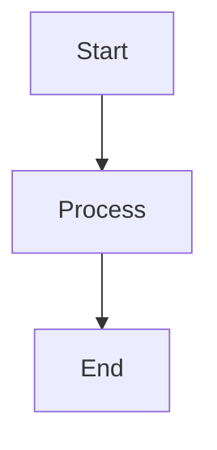
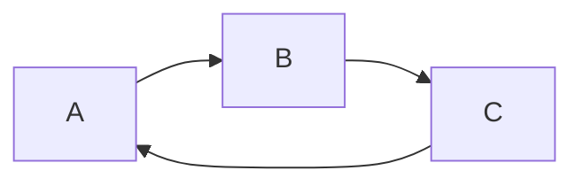
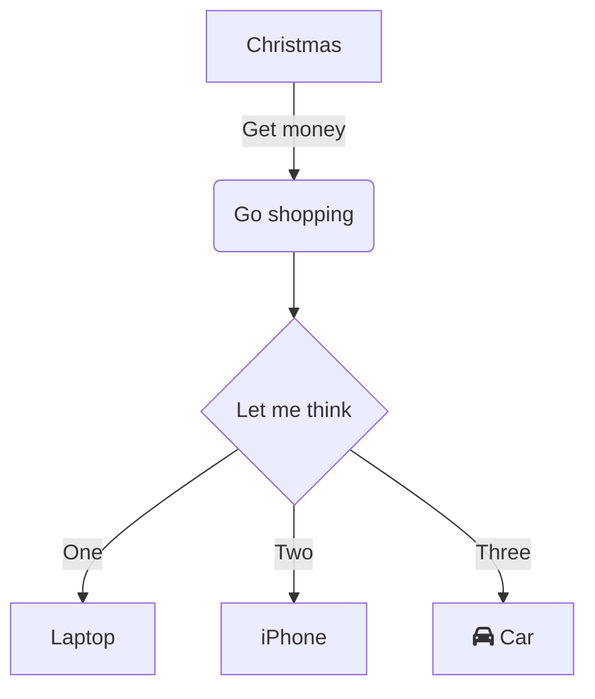

# Mermaid Test Page

## Simple Code Block Test

```bash
echo "Hello World"
ls -la
```

```python
def hello():
    print("Hello World")
```

## Simple Mermaid Test



## Another Mermaid Test



## Flowchart Test

