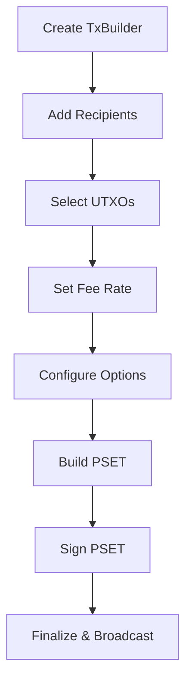

import Tabs from '@theme/Tabs';
import TabItem from '@theme/TabItem';

# Transaction Construction Process

Building transactions in LWK involves creating Partially Signed Elements Transactions (PSETs) that handle Liquid's unique features like confidential transactions and multiple assets. The transaction builder provides a flexible API for constructing various types of transactions.

## Transaction Builder Overview

The transaction builder follows a builder pattern, allowing you to incrementally construct transactions by adding recipients, selecting coins, and configuring options before finalizing the PSET.

## Basic Transaction Flow



## Creating a Transaction Builder

<Tabs groupId="language">
<TabItem value="rust" label="Rust" default>

```rust
use lwk_wollet::{TxBuilder, Wollet};

// Create a transaction builder
let mut tx_builder = TxBuilder::new(bitcoin::Network::Regtest);

// Or create from a wollet for automatic configuration
let tx_builder = wollet.tx_builder();
```

</TabItem>
<TabItem value="python" label="Python">

```python
from lwk import TxBuilder, Network

# Create a transaction builder
tx_builder = TxBuilder(Network.REGTEST)

# Or from a wallet
tx_builder = wollet.tx_builder()
```

</TabItem>
<TabItem value="kotlin" label="Kotlin">

```kotlin
import com.blockstream.lwk.TxBuilder
import com.blockstream.lwk.Network

// Create a transaction builder
val txBuilder = TxBuilder(Network.REGTEST)

// Or from a wallet
val txBuilder = wollet.txBuilder()
```

</TabItem>
<TabItem value="swift" label="Swift">

```swift
import LiquidWalletKit

// Create a transaction builder
let txBuilder = TxBuilder(network: .regtest)

// Or from a wallet
let txBuilder = wollet.txBuilder()
```

</TabItem>
</Tabs>

## Adding Recipients

Recipients define where assets should be sent and in what amounts:

<Tabs groupId="language">
<TabItem value="rust" label="Rust" default>

```rust
use lwk_wollet::{TxBuilder, AddressAmount};
use elements::{Address, AssetId};

let mut tx_builder = TxBuilder::new(bitcoin::Network::Regtest);

// Add L-BTC recipient
let lbtc_recipient = AddressAmount {
    address: Address::from_str("lq1qq...")?,
    amount: 100_000, // satoshis
    asset: AssetId::LIQUID_BTC, // L-BTC
};
tx_builder = tx_builder.add_addressee(&lbtc_recipient);

// Add asset recipient
let asset_id = AssetId::from_str("6f0279e9...")?;
let asset_recipient = AddressAmount {
    address: Address::from_str("lq1qq...")?,
    amount: 1000,
    asset: asset_id,
};
tx_builder = tx_builder.add_addressee(&asset_recipient);
```

</TabItem>
<TabItem value="python" label="Python">

```python
from lwk import TxBuilder, AddressAmount, AssetId

tx_builder = TxBuilder(Network.REGTEST)

# Add L-BTC recipient
lbtc_recipient = AddressAmount(
    address="lq1qq...",
    amount=100_000,  # satoshis
    asset=AssetId.LBTC()
)
tx_builder = tx_builder.add_addressee(lbtc_recipient)

# Add asset recipient
asset_id = AssetId("6f0279e9...")
asset_recipient = AddressAmount(
    address="lq1qq...",
    amount=1000,
    asset=asset_id
)
tx_builder = tx_builder.add_addressee(asset_recipient)
```

</TabItem>
<TabItem value="kotlin" label="Kotlin">

```kotlin
import com.blockstream.lwk.*

val txBuilder = TxBuilder(Network.REGTEST)

// Add L-BTC recipient
val lbtcRecipient = AddressAmount(
    address = "lq1qq...",
    amount = 100_000UL, // satoshis
    asset = AssetId.lbtc()
)
txBuilder.addAddressee(lbtcRecipient)

// Add asset recipient
val assetId = AssetId("6f0279e9...")
val assetRecipient = AddressAmount(
    address = "lq1qq...",
    amount = 1000UL,
    asset = assetId
)
txBuilder.addAddressee(assetRecipient)
```

</TabItem>
<TabItem value="swift" label="Swift">

```swift
import LiquidWalletKit

let txBuilder = TxBuilder(network: .regtest)

// Add L-BTC recipient
let lbtcRecipient = AddressAmount(
    address: "lq1qq...",
    amount: 100_000, // satoshis
    asset: AssetId.lbtc()
)
try txBuilder.addAddressee(lbtcRecipient)

// Add asset recipient
let assetId = try AssetId("6f0279e9...")
let assetRecipient = AddressAmount(
    address: "lq1qq...",
    amount: 1000,
    asset: assetId
)
try txBuilder.addAddressee(assetRecipient)
```

</TabItem>
</Tabs>

## UTXO Selection

You can either let LWK automatically select UTXOs or manually specify which ones to use:

### Automatic Selection

<Tabs groupId="language">
<TabItem value="rust" label="Rust" default>

```rust
// LWK will automatically select appropriate UTXOs
// No additional configuration needed - happens during build
let pset = tx_builder.finish(&wollet)?;
```

</TabItem>
<TabItem value="python" label="Python">

```python
# LWK will automatically select appropriate UTXOs
pset = tx_builder.finish(wollet)
```

</TabItem>
<TabItem value="kotlin" label="Kotlin">

```kotlin
// LWK will automatically select appropriate UTXOs
val pset = txBuilder.finish(wollet)
```

</TabItem>
<TabItem value="swift" label="Swift">

```swift
// LWK will automatically select appropriate UTXOs
let pset = try txBuilder.finish(wollet)
```

</TabItem>
</Tabs>

### Manual Selection

<Tabs groupId="language">
<TabItem value="rust" label="Rust" default>

```rust
use elements::OutPoint;

// Manually specify UTXOs to use
let outpoint1 = OutPoint::from_str("abcd1234...:0")?;
let outpoint2 = OutPoint::from_str("efgh5678...:1")?;

let tx_builder = tx_builder
    .add_utxo(outpoint1)
    .add_utxo(outpoint2);

let pset = tx_builder.finish(&wollet)?;
```

</TabItem>
<TabItem value="python" label="Python">

```python
from lwk import OutPoint

# Manually specify UTXOs to use
outpoint1 = OutPoint("abcd1234...:0")
outpoint2 = OutPoint("efgh5678...:1")

tx_builder = tx_builder.add_utxo(outpoint1).add_utxo(outpoint2)
pset = tx_builder.finish(wollet)
```

</TabItem>
<TabItem value="kotlin" label="Kotlin">

```kotlin
import com.blockstream.lwk.OutPoint

// Manually specify UTXOs to use
val outpoint1 = OutPoint("abcd1234...:0")
val outpoint2 = OutPoint("efgh5678...:1")

val txBuilder = txBuilder.addUtxo(outpoint1).addUtxo(outpoint2)
val pset = txBuilder.finish(wollet)
```

</TabItem>
<TabItem value="swift" label="Swift">

```swift
import LiquidWalletKit

// Manually specify UTXOs to use
let outpoint1 = try OutPoint("abcd1234...:0")
let outpoint2 = try OutPoint("efgh5678...:1")

try txBuilder.addUtxo(outpoint1).addUtxo(outpoint2)
let pset = try txBuilder.finish(wollet)
```

</TabItem>
</Tabs>

## Fee Configuration

Configure transaction fees using fee rates or absolute amounts:

<Tabs groupId="language">
<TabItem value="rust" label="Rust" default>

```rust
// Set fee rate (satoshis per vbyte)
let tx_builder = tx_builder.fee_rate(Some(100));

// Or set absolute fee amount
let tx_builder = tx_builder.absolute_fee(1000);

// Let LWK estimate optimal fee
let tx_builder = tx_builder.fee_rate(None); // Uses default estimation
```

</TabItem>
<TabItem value="python" label="Python">

```python
# Set fee rate (satoshis per vbyte)
tx_builder = tx_builder.fee_rate(100)

# Or set absolute fee amount
tx_builder = tx_builder.absolute_fee(1000)

# Let LWK estimate optimal fee
tx_builder = tx_builder.fee_rate(None)  # Uses default estimation
```

</TabItem>
<TabItem value="kotlin" label="Kotlin">

```kotlin
// Set fee rate (satoshis per vbyte)
txBuilder.feeRate(100UL)

// Or set absolute fee amount
txBuilder.absoluteFee(1000UL)

// Let LWK estimate optimal fee
txBuilder.feeRate(null)  // Uses default estimation
```

</TabItem>
<TabItem value="swift" label="Swift">

```swift
// Set fee rate (satoshis per vbyte)
try txBuilder.feeRate(100)

// Or set absolute fee amount
try txBuilder.absoluteFee(1000)

// Let LWK estimate optimal fee
try txBuilder.feeRate(nil)  // Uses default estimation
```

</TabItem>
</Tabs>

## Best Practices

1. **Validate Inputs**: Always validate addresses and amounts before building
2. **Fee Estimation**: Use appropriate fee rates for network conditions
3. **Asset Verification**: Confirm asset IDs before including in transactions
4. **UTXO Management**: Consider UTXO consolidation for optimal efficiency
5. **Error Handling**: Implement comprehensive error handling for edge cases
6. **Privacy**: Use fresh addresses for each transaction when possible 