import Tabs from '@theme/Tabs';
import TabItem from '@theme/TabItem';

# Building a Single-sig Wallet App

Learn how to create a complete single-signature Liquid wallet from scratch using LWK. This tutorial covers the essential workflow from generating a secure mnemonic to sending transactions, with examples in all supported programming languages.

## What You'll Build

By the end of this tutorial, you'll have a working single-sig wallet that can:

- Generate and securely store mnemonic phrases
- Create CT descriptors for Liquid confidential transactions
- Generate receiving addresses
- Sync with the Liquid blockchain
- Display balances for multiple assets
- Create and send transactions

## Architecture Overview

```mermaid
graph LR
    subgraph "Step 1: Setup"
        A[Mnemonic Generation] --> B[Software Signer]
        B --> C[CT Descriptor Creation]
    end
    
    subgraph "Step 2: Wallet Creation"
        D[Wallet Initialization] --> E[Address Generation]
    end
    
    subgraph "Step 3: Blockchain Integration"
        F[Blockchain Sync] --> G[Balance Display]
    end
    
    subgraph "Step 4: Transaction Operations"
        H[Transaction Creation] --> I[Transaction Signing]
        I --> J[Broadcast]
    end
    
    C --> D
    E --> F
    G --> H
    
    style A fill:#e8f5e8
    style C fill:#fff3e0
    style F fill:#f3e5f5
    style J fill:#e1f5fe
```



## Prerequisites

- LWK installed for your platform ([Installation Guide](../getting-started/installation))
- Basic understanding of Bitcoin descriptors
- Development environment set up for your chosen language

## Step 1: Project Setup

<Tabs groupId="language">
<TabItem value="rust" label="Rust" default>

Create a new Rust project with LWK dependencies:

```bash title="Terminal"
cargo new my-liquid-wallet
cd my-liquid-wallet
```

```toml title="Cargo.toml"
[dependencies]
lwk_wollet = "0.10.0"
lwk_signer = "0.10.0"
tokio = { version = "1.0", features = ["full"] }
bip39 = "2.0"
anyhow = "1.0"
```

</TabItem>
<TabItem value="python" label="Python">

Set up a Python project with LWK:

```bash title="Terminal"
mkdir my-liquid-wallet
cd my-liquid-wallet
python -m venv venv
source venv/bin/activate  # On Windows: venv\Scripts\activate
pip install lwk
```

```python title="requirements.txt"
lwk>=0.10.0
```

</TabItem>
<TabItem value="kotlin" label="Kotlin">

Create a new Android Studio project and add the LWK dependency:

```kotlin title="build.gradle.kts (Module: app)"
dependencies {
    implementation("com.blockstream:lwk-android:0.10.0")
    implementation("androidx.lifecycle:lifecycle-viewmodel-ktx:2.7.0")
    implementation("androidx.lifecycle:lifecycle-livedata-ktx:2.7.0")
}
```

</TabItem>
<TabItem value="swift" label="Swift">

Create a new iOS project in Xcode and add the Swift package:

1. File → Add Package Dependencies
2. Enter: `https://github.com/Blockstream/lwk-swift.git`
3. Select your target and add LiquidWalletKit

</TabItem>
<TabItem value="javascript" label="JavaScript/WASM">

Set up a Node.js project with LWK WASM:

```bash title="Terminal"
mkdir my-liquid-wallet
cd my-liquid-wallet
npm init -y
npm install lwk-wasm
```

```json title="package.json"
{
  "type": "module",
  "dependencies": {
    "lwk-wasm": "^0.10.0"
  }
}
```

</TabItem>
</Tabs>

## Step 2: Generate Mnemonic and Create Signer

The foundation of any wallet is a secure mnemonic phrase. Let's generate one and create a software signer:

<Tabs groupId="language">
<TabItem value="rust" label="Rust" default>

```rust title="src/main.rs"
use lwk_signer::SwSigner;
use lwk_wollet::{ElementsNetwork, Wollet, WolletDescriptor, NoPersist};
use bip39::Mnemonic;
use anyhow::Result;

#[tokio::main]
async fn main() -> Result<()> {
    println!("Building Liquid Wallet...");
    
    // Generate a secure 12-word mnemonic
    let mnemonic = Mnemonic::generate(bip39::Language::English, 128)?;
    println!("Generated mnemonic: {}", mnemonic);
    println!("SAVE THIS MNEMONIC SECURELY!");
    
    // Create software signer for testnet
    let signer = SwSigner::new(&mnemonic.to_string(), false)?; // false = testnet
    println!("Software signer created");
    println!("Signer fingerprint: {}", signer.fingerprint()?);
    
    Ok(())
}
```

</TabItem>
<TabItem value="python" label="Python">

```python title="wallet.py"
import lwk

def create_wallet():
    print("Building Liquid Wallet...")
    
    # Generate a secure 12-word mnemonic
    mnemonic = lwk.Mnemonic.from_random(12)
    print(f"Generated mnemonic: {mnemonic}")
    print("SAVE THIS MNEMONIC SECURELY!")
    
    # Create software signer for testnet
    network = lwk.Network.testnet()
    signer = lwk.Signer(mnemonic, network)
    print("Software signer created")
    
    return signer, mnemonic

if __name__ == "__main__":
    signer, mnemonic = create_wallet()
```

</TabItem>
<TabItem value="kotlin" label="Kotlin">

```kotlin title="WalletManager.kt"
import com.blockstream.lwk.*
import android.util.Log

class WalletManager {
    
    fun createWallet(): Pair<Signer, Mnemonic> {
        Log.d("LWK", "Building Liquid Wallet...")
        
        // Generate a secure 12-word mnemonic
        val mnemonic = Mnemonic.fromRandom(12u)
        Log.d("LWK", "Generated mnemonic: $mnemonic")
        Log.w("LWK", "SAVE THIS MNEMONIC SECURELY!")
        
        // Create software signer for testnet
        val network = Network.testnet()
        val signer = Signer(mnemonic, network)
        Log.d("LWK", "Software signer created")
        
        return Pair(signer, mnemonic)
    }
}
```

</TabItem>
<TabItem value="swift" label="Swift">

```swift title="WalletManager.swift"
import Foundation
import LiquidWalletKit

class WalletManager: ObservableObject {
    
    func createWallet() throws -> (signer: Signer, mnemonic: Mnemonic) {
        print("Building Liquid Wallet...")
        
        // Generate a secure 12-word mnemonic
        let mnemonic = try Mnemonic.fromRandom(wordCount: 12)
        print("Generated mnemonic: \(mnemonic)")
        print("SAVE THIS MNEMONIC SECURELY!")
        
        // Create software signer for testnet
        let network = Network.testnet()
        let signer = try Signer(mnemonic: mnemonic, network: network)
        print("Software signer created")
        
        return (signer: signer, mnemonic: mnemonic)
    }
}
```

</TabItem>
<TabItem value="javascript" label="JavaScript/WASM">

```javascript title="wallet.js"
import init, { Mnemonic, Network, Signer } from 'lwk-wasm';

async function createWallet() {
    console.log("Building Liquid Wallet...");
    
    // Initialize WASM module
    await init();
    
    // Generate a secure 12-word mnemonic
    const mnemonic = Mnemonic.fromRandom(12);
    console.log(`Generated mnemonic: ${mnemonic}`);
    console.log("SAVE THIS MNEMONIC SECURELY!");
    
    // Create software signer for testnet
    const network = Network.testnet();
    const signer = new Signer(mnemonic, network);
    console.log("Software signer created");
    
    return { signer, mnemonic };
}

export { createWallet };
```

</TabItem>
</Tabs>

:::warning Mnemonic Security
The mnemonic phrase is the master key to your wallet. In production:
- Never log or display mnemonics in plain text
- Use secure storage (keychain, hardware security modules)
- Implement proper backup and recovery flows
:::

## Step 3: Create CT Descriptor

A Confidential Transaction (CT) descriptor defines how your wallet generates addresses and handles blinding keys for privacy:

<Tabs groupId="language">
<TabItem value="rust" label="Rust" default>

```rust title="Add to main.rs"
// Add after creating the signer
use lwk_common::{singlesig_desc, Singlesig, DescriptorBlindingKey};

// Generate CT descriptor with SLIP-77 blinding
let descriptor_str = singlesig_desc(
    &signer,
    Singlesig::Wpkh,                           // Native SegWit
    DescriptorBlindingKey::Slip77,             // SLIP-77 deterministic blinding
)?;

println!("CT Descriptor: {}", descriptor_str);

// Parse descriptor for wallet creation
let descriptor: WolletDescriptor = descriptor_str.parse()?;
println!("Descriptor parsed successfully");
```

</TabItem>
<TabItem value="python" label="Python">

```python title="Add to wallet.py"
# Add after creating the signer
def create_descriptor(signer):
    # Generate CT descriptor with SLIP-77 blinding
    descriptor = signer.wpkh_slip77_descriptor()
    print(f"CT Descriptor: {descriptor}")
    print("Descriptor created successfully")
    return descriptor

# In your main function:
descriptor = create_descriptor(signer)
```

</TabItem>
<TabItem value="kotlin" label="Kotlin">

```kotlin title="Add to WalletManager.kt"
// Add to createWallet method after signer creation
fun createDescriptor(signer: Signer): WolletDescriptor {
    // Generate CT descriptor with SLIP-77 blinding
    val descriptor = signer.wpkhSlip77Descriptor()
    Log.d("LWK", "CT Descriptor: $descriptor")
    Log.d("LWK", "Descriptor created successfully")
    return descriptor
}

// In createWallet method:
val descriptor = createDescriptor(signer)
```

</TabItem>
<TabItem value="swift" label="Swift">

```swift title="Add to WalletManager.swift"
// Add to createWallet method after signer creation
func createDescriptor(signer: Signer) throws -> WolletDescriptor {
    // Generate CT descriptor with SLIP-77 blinding
    let descriptor = try signer.wpkhSlip77Descriptor()
    print("CT Descriptor: \(descriptor)")
    print("Descriptor created successfully")
    return descriptor
}

// In createWallet method:
let descriptor = try createDescriptor(signer: signer)
```

</TabItem>
<TabItem value="javascript" label="JavaScript/WASM">

```javascript title="Add to wallet.js"
// Add after creating the signer
function createDescriptor(signer) {
    // Generate CT descriptor with SLIP-77 blinding
    const descriptor = signer.wpkhSlip77Descriptor();
    console.log(`CT Descriptor: ${descriptor}`);
    console.log("Descriptor created successfully");
    return descriptor;
}

// In createWallet function:
const descriptor = createDescriptor(signer);
```

</TabItem>
</Tabs>

### Understanding CT Descriptors

The descriptor format `ct(slip77(...),elwpkh(...))` consists of:
- **`ct()`**: Confidential Transaction wrapper
- **`slip77(...)`**: Deterministic blinding key derivation ([SLIP-77](https://github.com/satoshilabs/slips/blob/master/slip-0077.md))
- **`elwpkh(...)`**: Elements witness pubkey hash (native SegWit for Liquid)

## Step 4: Initialize Wallet

Now create the watch-only wallet using the descriptor:

<Tabs groupId="language">
<TabItem value="rust" label="Rust" default>

```rust title="Add to main.rs"
// Create watch-only wallet (no persistence for this example)
let mut wallet = Wollet::new(
    ElementsNetwork::LiquidTestnet,
    Arc::new(NoPersist::new()),
    descriptor,
)?;

println!("Wallet initialized");
println!("Network: {:?}", wallet.network());
```

</TabItem>
<TabItem value="python" label="Python">

```python title="Add to wallet.py"
def initialize_wallet(descriptor):
    # Create watch-only wallet (no persistence for this example)
    network = lwk.Network.testnet()
    wallet = lwk.Wollet(network, descriptor, datadir=None)
    
    print("Wallet initialized")
    print(f"Network: testnet")
    return wallet

# In your main function:
wallet = initialize_wallet(descriptor)
```

</TabItem>
<TabItem value="kotlin" label="Kotlin">

```kotlin title="Add to WalletManager.kt"
fun initializeWallet(descriptor: WolletDescriptor): Wollet {
    // Create watch-only wallet (no persistence for this example)
    val network = Network.testnet()
    val wallet = Wollet(network, descriptor, datadir = null)
    
    Log.d("LWK", "Wallet initialized")
    Log.d("LWK", "Network: testnet")
    return wallet
}

// In createWallet method:
val wallet = initializeWallet(descriptor)
```

</TabItem>
<TabItem value="swift" label="Swift">

```swift title="Add to WalletManager.swift"
func initializeWallet(descriptor: WolletDescriptor) throws -> Wollet {
    // Create watch-only wallet (no persistence for this example)
    let network = Network.testnet()
    let wallet = try Wollet(network: network, descriptor: descriptor, datadir: nil)
    
    print("Wallet initialized")
    print("Network: testnet")
    return wallet
}

// In createWallet method:
let wallet = try initializeWallet(descriptor: descriptor)
```

</TabItem>
<TabItem value="javascript" label="JavaScript/WASM">

```javascript title="Add to wallet.js"
function initializeWallet(descriptor) {
    // Create watch-only wallet (no persistence for this example)
    const network = Network.testnet();
    const wallet = new Wollet(network, descriptor);
    
    console.log("Wallet initialized");
    console.log("Network: testnet");
    return wallet;
}

// In createWallet function:
const wallet = initializeWallet(descriptor);
```

</TabItem>
</Tabs>

## Step 5: Generate Addresses

Generate receiving addresses for your wallet:

<Tabs groupId="language">
<TabItem value="rust" label="Rust" default>

```rust title="Add to main.rs"
// Generate first receiving address
let address_result = wallet.address(Some(0))?;
println!("First receiving address: {}", address_result.address());
println!("Address index: {}", address_result.index());

// Generate a few more addresses
for i in 1..=3 {
    let addr = wallet.address(Some(i))?;
    println!("Address {}: {}", i, addr.address());
}
```

</TabItem>
<TabItem value="python" label="Python">

```python title="Add to wallet.py"
def generate_addresses(wallet):
    # Generate first receiving address
    address_result = wallet.address(0)
    print(f"First receiving address: {address_result.address()}")
    print(f"Address index: {address_result.index()}")
    
    # Generate a few more addresses
    for i in range(1, 4):
        addr = wallet.address(i)
        print(f"Address {i}: {addr.address()}")
    
    return address_result.address()

# In your main function:
first_address = generate_addresses(wallet)
```

</TabItem>
<TabItem value="kotlin" label="Kotlin">

```kotlin title="Add to WalletManager.kt"
fun generateAddresses(wallet: Wollet): String {
    // Generate first receiving address
    val addressResult = wallet.address(0u)
    Log.d("LWK", "First receiving address: ${addressResult.address()}")
    Log.d("LWK", "Address index: ${addressResult.index()}")
    
    // Generate a few more addresses
    for (i in 1u..3u) {
        val addr = wallet.address(i)
        Log.d("LWK", "Address $i: ${addr.address()}")
    }
    
    return addressResult.address()
}

// In createWallet method:
val firstAddress = generateAddresses(wallet)
```

</TabItem>
<TabItem value="swift" label="Swift">

```swift title="Add to WalletManager.swift"
func generateAddresses(wallet: Wollet) throws -> String {
    // Generate first receiving address
    let addressResult = try wallet.address(index: 0)
    print("First receiving address: \(addressResult.address())")
    print("Address index: \(addressResult.index())")
    
    // Generate a few more addresses
    for i in 1...3 {
        let addr = try wallet.address(index: UInt32(i))
        print("Address \(i): \(addr.address())")
    }
    
    return addressResult.address()
}

// In createWallet method:
let firstAddress = try generateAddresses(wallet: wallet)
```

</TabItem>
<TabItem value="javascript" label="JavaScript/WASM">

```javascript title="Add to wallet.js"
function generateAddresses(wallet) {
    // Generate first receiving address
    const addressResult = wallet.address(0);
    console.log(`First receiving address: ${addressResult.address()}`);
    console.log(`Address index: ${addressResult.index()}`);
    
    // Generate a few more addresses
    for (let i = 1; i <= 3; i++) {
        const addr = wallet.address(i);
        console.log(`Address ${i}: ${addr.address()}`);
    }
    
    return addressResult.address();
}

// In createWallet function:
const firstAddress = generateAddresses(wallet);
```

</TabItem>
</Tabs>

## Security Best Practices

### Mnemonic Protection

:::danger Never Store Mnemonics in Plain Text
- **Development**: Use environment variables or secure test fixtures
- **Production**: Use platform keychain (iOS Keychain, Android Keystore)
- **Enterprise**: Consider Hardware Security Modules (HSMs)
:::

### Network Security

- Always use TLS connections (`ssl://` for Electrum)
- Validate server certificates in production
- Consider running your own Electrum server for better privacy

### Error Handling

Implement proper error handling for production applications:

<Tabs groupId="language">
<TabItem value="rust" label="Rust" default>

```rust title="Error Handling Example"
use anyhow::{Context, Result};

async fn create_wallet_safe() -> Result<String> {
    let mnemonic = Mnemonic::generate(bip39::Language::English, 128)
        .context("Failed to generate mnemonic")?;
    
    let signer = SwSigner::new(&mnemonic.to_string(), false)
        .context("Failed to create signer")?;
    
    // ... rest of wallet creation
    
    Ok("Wallet created successfully".to_string())
}
```

</TabItem>
<TabItem value="python" label="Python">

```python title="Error Handling Example"
import logging

def create_wallet_safe():
    try:
        mnemonic = lwk.Mnemonic.from_random(12)
        network = lwk.Network.testnet()
        signer = lwk.Signer(mnemonic, network)
        # ... rest of wallet creation
        return "Wallet created successfully"
    
    except Exception as e:
        logging.error(f"Wallet creation failed: {e}")
        raise
```

</TabItem>
<TabItem value="kotlin" label="Kotlin">

```kotlin title="Error Handling Example"
import kotlinx.coroutines.CoroutineExceptionHandler

private val errorHandler = CoroutineExceptionHandler { _, exception ->
    Log.e("LWK", "Wallet error: ${exception.message}", exception)
}

fun createWalletSafe() {
    lifecycleScope.launch(errorHandler) {
        try {
            val mnemonic = Mnemonic.fromRandom(12u)
            val network = Network.testnet()
            val signer = Signer(mnemonic, network)
            // ... rest of wallet creation
        } catch (e: Exception) {
            Log.e("LWK", "Wallet creation failed", e)
        }
    }
}
```

</TabItem>
<TabItem value="swift" label="Swift">

```swift title="Error Handling Example"
func createWalletSafe() {
    Task {
        do {
            let mnemonic = try Mnemonic.fromRandom(wordCount: 12)
            let network = Network.testnet()
            let signer = try Signer(mnemonic: mnemonic, network: network)
            // ... rest of wallet creation
        } catch {
            print("Wallet creation failed: \(error.localizedDescription)")
            // Handle error appropriately
        }
    }
}
```

</TabItem>
</Tabs>

## Next Steps

Congratulations! You've built a working single-sig Liquid wallet. Here's what to explore next:

### Enhanced Features
1. **[Transaction Building](../transactions/building-transactions)** - Send L-BTC and assets
2. **[Asset Operations](../assets/issuance)** - Issue your own Liquid assets  
3. **[Hardware Integration](../core-components/hardware-wallets)** - Add Jade/Ledger support
4. **[Multisig Setup](../multisig/overview)** - Create multi-signature wallets

### Production Considerations
- Implement secure storage for mnemonics
- Add comprehensive error handling
- Set up proper logging and monitoring
- Consider using the [LWK app server](../core-components/app-server) for web applications

### Platform-Specific Guides
- **Mobile**: [Building Mobile Wallets](./mobile-wallet)
- **Web**: [Building Web Wallets](./web-wallet)  
- **Exchange**: [Exchange Integration](./exchange-integration)

### Advanced Topics
- [Custom Descriptors](../advanced-topics/custom-descriptors)
- [Covenants](../advanced-topics/covenants)
- [Performance Optimization](../deployment/production-considerations)

## Troubleshooting

### Common Issues

**Connection Problems**
```bash
# Test Electrum server connectivity
curl -v ssl://electrum-liquidtestnet.blockstream.info:50002
```

**Persistence Issues**
- Ensure write permissions for datadir
- Check available disk space
- Verify network connectivity for sync

**Descriptor Errors**
- Verify mnemonic phrase is valid
- Check network selection (mainnet vs testnet)
- Ensure proper SLIP-77 key generation

### Getting Help

- **Documentation**: [Core Components](../core-components/)
- **Examples**: [GitHub Repository](https://github.com/Blockstream/lwk)
- **Issues**: [Report Bugs](https://github.com/Blockstream/lwk/issues)

---

**Achievement Unlocked**: You've successfully created a single-signature Liquid wallet! This foundation enables you to build more advanced Liquid applications and explore the broader ecosystem.
